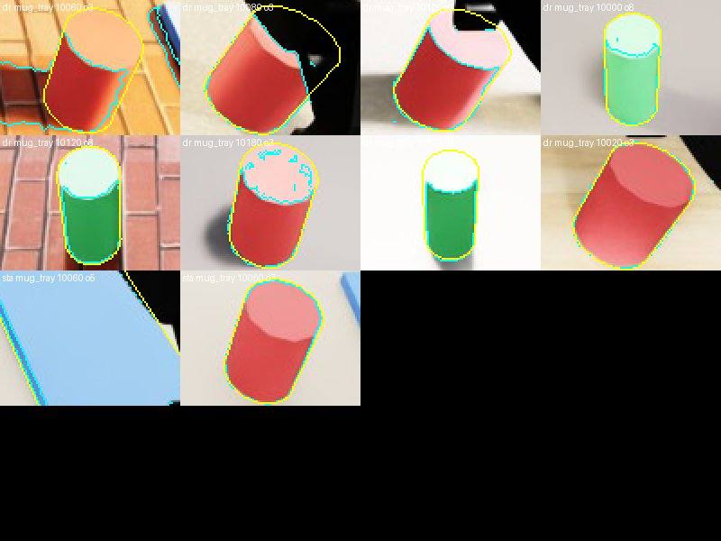
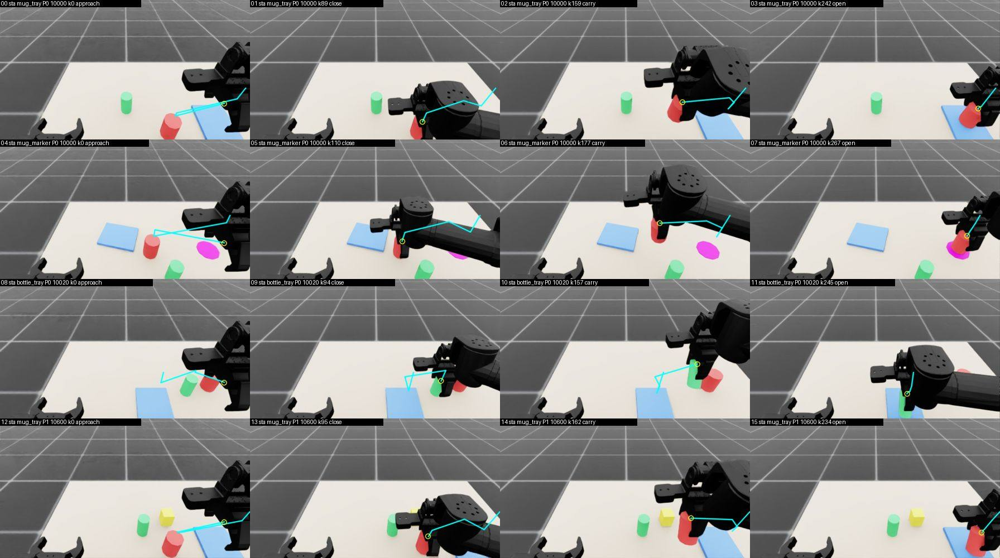
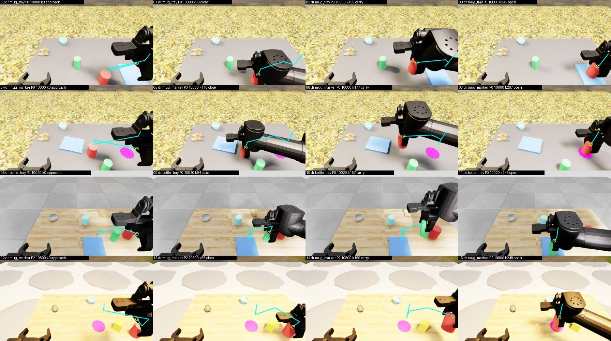
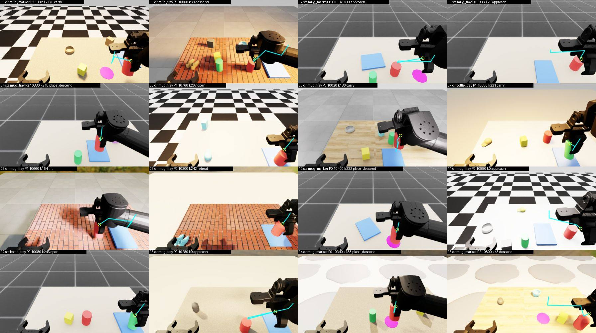
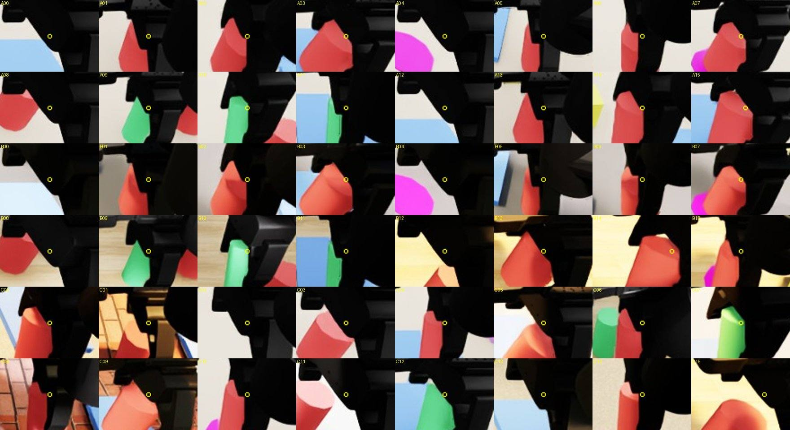

# MolmoAct 이식 준비·검증 — R2에서 성립 조건을 관문으로 확인 (E-MAR 준비 단계)

작성 MolmoAct 준비 에이전트, 2026-09-26 UTC(시작 02:30Z, 관문 고정 02:35:47Z, 문서 02:52Z–). **학습 없음, GPU 0 사용, 유료 API 0원.**
사용자 지시(user-log 95 원문): "나는 몰모엑트가 우리가 제대로 준비를 안해놔서 도움이 안되는 교훈ㅇ,로 작동한듯" / "준비를 아ㅖ제대로해서 검증 필요. 시간 걸려두되니까". 함정 P81(성립 조건 목록을 먼저 적고 관문으로 확인).
근거 문서: `docs/research/molmoact_deepdive_2026-09-26.md`, `docs/stage3/results/{ma1,ma1b,ma2,ma3,sr0,r2_datagen,r2_train_gen}.md`, `docs/research/decision_adherence_0p8_2026-09-26.md`(E-SR1c 초안), 정본 §84–§87.
원문: MolmoAct arXiv 2508.07917 v4 HTML 전문(`D:\tools\scratch_qdd\molmoact\paper.txt`, 연구 문서 에이전트가 2026-09-26 내려받은 사본을 이번에 다시 읽음), 공식 저장소 `allenai/molmoact`@`a5cf980`(2026-09-26 GitHub API; 이번에 직접 받은 파일: `olmo/data/custom_lerobot_dataset.py`·`image_preprocessor.py`·`robot_datasets.py`, `olmo/train/trainer.py`, `SteerSimplerEnv/{molmoact_model_test,maniskill2_evaluator_steer,main_inference,traj_interface}.py`, 작업 폴더 `D:\tools\scratch_qdd\mar2\src\`), 전처리 코드(`preprocess/processors.py`·`line_utils.py`·`action_reasoning_data.py`)는 연구 문서 에이전트 사본.

## 0. 요약

- **성립 조건 14개**를 원문·코드에서 뽑았다(1절). 출처 칸: 논문 본문 / 부록 / 코드 / 미확인.
- **R2에서 이미 갖춘 것**: 카메라 투영이 정확하다(G-cam: 탁상 표지 중심 오차 중앙값 **0.21 px**, 65장), 궤적 라벨을 모든 프레임에 만들 수 있다(G-trace: 평가 249편 72,243프레임, 현재 손끝이 영상 안 **99.4 %**, 5점 규칙 코드 확인), 눈으로 본 48장에서 p1이 그리퍼(또는 쥔 물체) 위 **48/48**, 덧그림이 VLA 전처리를 살아남는다(G-res: 머리 영상 672×384 원해상도 252토큰, 선 대비 97.6 % 유지).
- **아직 없는 것(이것 때문에 앞선 이식이 교훈으로만 작동했다)**: (1) 관측과 독립으로 궤적이 달라지는 데이터 — 경로 다양화 시연·같은 장면 두 대상 시연(MolmoAct 부록 D.7)이 R2에 없다(오라클 계획기 = 장면마다 직선 경로 하나); (2) 궤적 조건 1:1 학습 데이터 자체; (3) 행동 손실이 덧그림을 읽는 표현까지 닿는 기울기 경로 — 우리 기본은 KI stop(`stageb_train.py:738 --ki stop`)이라 흐름 손실이 백본에 안 간다(MolmoAct는 행동 토큰 CE가 모델 전체를 학습); (4) MolmoAct식 조종 평가(대체 대상으로 끌기) 전용 평가 집합 — 지금 E-SR0 집합으론 해당 스냅샷이 **16개**뿐; (5) 덧그림 색 — MolmoAct의 청록(0,255,255)이 R2 dr 학습 방해물 색 `col_cyan`(0.30, 0.85, 0.95)과 겹친다; (6) 궤적 끝 정의 — R2 편은 놓은 뒤 22 cm 위로 물러나는 retreat가 있어 "편 끝까지" 규칙이면 끝점이 놓을 곳 위 110 px(영상)에 찍힌다.
- **실패·주의 관문**: G-fk(URDF FK 대 시뮬 손끝) 잔차 중앙값 **9.5 mm**(머리 영상 6 px) — R2 라벨은 시뮬 손끝을 쓰면 되지만, 런타임에 URDF FK로 이력 덧그림을 그리면 어긋난다. G-cam 머그 기준(사전 고정 색 규칙)은 **측정 도구 결함**(밝게 비친 윗면이 채도 낮음)으로 불성립 — 변경 1 뒤 standard 0.75 px, 눈으로 10장 확인.
- **다음**: 6절의 없는 것을 만든 뒤 7절 사전 등록 초안(E-MAR-A 궤적 보조 × E-MAR-O 이력 덧그림, E-MAR-S 궤적 조건 조종 1:1)을 등록한다. 실행은 **E-SR1c 결과와 메인 지시 뒤**.

## 1. MolmoAct 성립 조건 (원문·코드에서)

| # | 조건 | 원문·코드 내용 | 출처 |
|---|---|---|---|
| C1 | 궤적 정의 | 손끝 2D 폴리라인 1 ≤ L ≤ 5점, p₁ = 지금 손끝, 나머지 = 지금부터 **편 끝(terminal frame)**까지 고르게 뽑은 미래 손끝(끝점 포함, e − t < 4면 남은 점 전부, t = e면 1점), 좌표 = 영상 크기로 정규화한 정수 0–255 | 논문 §2.3 식 3, §3.1 / 코드 `processors.Trace.subsample_to_line`(None 제거, `np.linspace(0, m−1, k, int)`) |
| C1′ | 좌표 표기의 불일치 | 논문은 0–255, 공개 전처리 `line_utils.point_at_gripper`는 영상 픽셀(`round(pct/100·w)`)을 낸다 — 256 px 영상(LIBERO·SimplerEnv)에서만 같다. 학습·추론 그리기 코드는 0–255를 가정(`(w−1)/255` 배율) | 코드(두 파일 대조) |
| C2 | 라벨 출처·품질 | 프레임마다 Molmo-7B-D에 "point to the robot gripper"(양팔은 left/right), 실패(None)는 버림, 평활화 없음; 상자 검출기는 점이 상자 중심으로 뭉쳐 조종이 나빠지고 VLM 포인팅이 "markedly" 낫다 — **정확하면서 다양한** 궤적 | 논문 §3.1, 부록 G / 코드 `line_utils.py` |
| C3 | 카메라 | 공간 추론은 **측면(외부) 카메라**, 궤적·깊이는 측면 영상에서만, 손목은 추가 정보; 측면에서 손끝이 가리면 궤적·성능 저하 | 논문 §4.2·§4.3, 부록 G / README 5.4(탁상 = 고정 외부 카메라) |
| C4 | 궤적 조건 데이터 비율 1:1 | 사전학습 행동 추론 10.5M 대 궤적 조건 10.5M, 중간학습 1M 대 1M, 사후학습도 같은 방식; 사후학습 코드는 **표본마다 r < 0.5**로 둘 중 하나 | 논문 §4.1–§4.3, 그림 3 / 코드 `custom_lerobot_dataset.get` |
| C5 | 궤적 조건 표본의 궤적 = 같은 프레임의 **정답(시연 자신의 미래)** | "the ground truth Visual Reasoning Trace" — 일반 데이터에서 궤적은 관측과 독립이 **아니다**(시연이 여러 갈래인 만큼만 정보를 더함) | 논문 §3.1 / 코드 `format_trajectory_conditioned`(annotation = trace) |
| C6 | 덧그림 형식 | RGB 배열에 (0, 255, 255) = 청록, 두께 2 px, `cv2.LINE_AA`, 점 표지 없는 폴리라인, 2점 이상일 때만, 크기 줄인 영상 위에; 조종 실행 때 3 px; 질문문 "Notice that the trajectory of the end effector is annotated on the first image. Based on the trajectory annotated on the image, … what is the action" | 코드 `image_preprocessor.load_image`, `SteerSimplerEnv/molmoact_model_test.draw_user_trajectory`, `format_trajectory_conditioned` |
| C7 | 조종용 데이터 | 조종 과제는 시연 절반을 "exploring alternative paths towards the same target"로 모음(그릇별 50 + 50, 합 200; 본문은 100) — "helps the model to learn more about how visual traces correlate with physical actions"; 조종에는 사후학습 데이터가 "as many action compositions as possible"을 덮어야 | 부록 D.7, 부록 G |
| C8 | 조종 평가·지표 | `pick_up_bowl`, 그릇 둘(둘 다 학습한 목표), 모호한 지시로 한쪽을 향하게 한 뒤 **다른 그릇 쪽으로** 사용자가 5점을 그림(= 지지 안의 대체 목표), 진행 점수 방향 0.5·쥠 0.85·듦 1.0, 모델당 15회, 폐루프(스텝마다 궤적 재사용/다시 그림) → 궤적 0.747(완전 성공 7/15) 대 언어 0.413 | 논문 §5.6, 부록 D.7·표 23 / 코드 `maniskill2_evaluator_steer`(스텝마다 "Reuse previous trajectory?") |
| C9 | 조종 때 추론 경로 | 덧그린 영상 → 행동 토큰만 생성(깊이·궤적 생성 안 함, 식 5); 한계 = 영상 평면 안은 따르나 **카메라 깊이축 방향이 부정확** | 논문 §2.4 식 5, 부록 G |
| C10 | 학습 단계·손실 | 사전학습(전체 파라미터 100k 스텝·배치 512) → 중간학습(50k) → 사후학습(LoRA r32·α16, 청크 8); 손실 = 답 토큰 CE(깊이·궤적·행동 토큰에 따로 가중 없음) — **행동 손실이 영상을 보는 모델 전체를 학습**(같은 LM이 행동을 냄) | 논문 §4, 부록 B / 코드 `trainer.py`(loss_masks·CE; 부분별 가중을 찾지 못함 — 표본별 mask 값은 추적 안 함: 부분 확인) |
| C11 | 깊이 토큰 역할 | DA-V2 → VQ-VAE 100코드, 궤적보다 먼저 생성; **조종(식 5)에는 쓰이지 않음**; 깊이 절제 없음 | 논문 §2.3, §3.1, 식 5 / 연구 문서 2.8 |
| C12 | 편 규모·지평 | MolmoAct Dataset 평균 112스텝(15–20 Hz, 약 6–7 s), 궤적은 편 끝까지 | 논문 §3.2, 부록 E |
| C13 | 입력 해상도 | 사후학습 영상 320×240, SimplerEnv 조종 256×256 — 2–3 px 선이 모델 입력에서 보임 | 연구 문서 2.4(표 인용, 이번에 재확인 안 함) / 코드 `molmoact_model_test`(image_size [256, 256]) |
| C14 | 절제 근거의 범위 | 사슬(깊이·궤적) 요소 절제 없음; 조종 이득은 1과제 15회 | 연구 문서 2.8·2.6(원문 재계산) |

## 2. 성립 조건 → R2 대응·관문·결과 (증거는 `docs/stage3/results/mar2_gates.json`과 그림)

| 조건 | R2 상태 | 관문 | 결과 | 증거 |
|---|---|---|---|---|
| C1 궤적 정의 | 모든 프레임에 만들 수 있음(시뮬 손끝 `tcp` = 손가락 링크2 중점, 머리 카메라 투영) | G-trace 통계 | **통과**: 249편·72,243프레임, 현재점 영상 안 0.994, L = min(5, 유효 미래점) 규칙 1.00, 궤적 길이 중앙값 229 px | `mar2_gates.json` `gtrace` |
| C1 궤적 끝 | R2 편은 놓은 뒤 retreat(약 0.6 s, 19프레임)·done 포함 | G-trace 눈 검사(끝점) | **미달(규칙대로 적음)**: 편 끝 손끝은 놓을 곳에서 xy 0.25 cm지만 탁상 위 22.0 cm → 영상에서 놓을 곳 중심 위 110 px; 놓기 끝(open 끝)으로 자르면 12.7 cm·52 px | `gtrace_end` |
| C1′ 좌표 | 0–255 정수 = MolmoAct 그리기 코드의 역변환 | 시험 `tests/test_mar2_lib.py` | 통과: 왕복 오차 ≤ 반 칸(가로 1.32 px·세로 0.74 px) | 시험 8개 |
| C2 라벨 품질 | 포인팅 대신 시뮬 참값 투영(떨림·실패 없음) | G-cam, p1 눈 검사 | **통과**(카메라): 탁상 표지 중심 0.21 px(p90 0.38, 65장, standard 0.22·dr 0.19); p1이 그리퍼 위 44/48, 쥔 물체 위(손가락이 그 뒤) 4/48, 벗어남 0/48 | `gcam`, `mar2_trace_p1_crops.jpg` |
| C2 (3D 물체) | 기록 물체 자세로 윤곽 투영 | G-cam 머그·병 | 사전 고정 규칙 **불성립**(색 분할 결함, 12.4 px) → 변경 1 뒤 standard 머그 0.75 px·병 0.65 px, dr는 조명·방해물로 분할 실패(6–9 px) — 눈으로 윤곽 일치 확인 | `gcam_v2`, `mar2_gcam_diag.jpg` |
| C2 (런타임 FK) | 실행 때는 관절각 → URDF FK(`ffw_bg2_rev4`) | G-fk | **실패**: 시험 60편 잔차 중앙값 9.5 mm·p95 12.7 mm(머리 영상 6.0/9.7 px); 기저 회전을 풀어도 10.3 mm → 상수 변환 문제가 아니라 기구학 차 | `gfk` |
| C3 카메라 | 머리 카메라(자기 중심, 약 40° 내려봄, 고정) = 측면 카메라 역할 | G-cam·G-trace·눈 검사 | 손끝 영상 안 0.994; 손가락 자체는 대개 그리퍼 몸체 뒤(뒤·위에서 봄) — 그리퍼는 48/48 보임; k0에서 물체 윤곽이 영상 밖으로 걸침 머그 35/249·표지 18/94 | `gtrace`, `gcam` |
| C4 1:1 데이터 | 없음. 로더는 표본 50 % 결정적 선택을 이미 지원(`r2_ma2.give`) | — | 만들어야 함(6절 M2) | — |
| C5·C7 관측과 독립인 궤적 | 계획기가 장면마다 직선 경로 하나; P1(대상 이동)만 미래를 흔듦; 같은 장면 두 대상 시연 없음(`task_layout`이 과제별로 배치를 따로 뽑음) | G-branch | **대기**: E-SR1c G-br 미실행(02:50Z 파드 `logs/sr1c` 비어 있음). E-SR1c 분기는 관측 그대로 0.5 s 행동만 바꾸는 분기라 C7(관측이 따라 바뀌는 대체 경로 편)과 다르다 | 6절 M3·M4 |
| C6 덧그림 형식 | 그리기 재현(`cv2` LINE_AA 2 px) | G-trace 눈 검사(색) | **미달**: dr 학습 방해물 `col_cyan`(0.30, 0.85, 0.95)·random 평가 `col_teal`(0, 0.55, 0.55)이 청록과 헷갈림(시트 B 00·08, C 05에서 봄) | `harvest/sim/randomization_pools.json`, `mar2_trace_B_dr.jpg` |
| C6·C13 해상도 | Qwen3-VL-4B 처리기 | G-res | **통과**: 672×376 → 672×384(배율 1.0), 252토큰, 2 px 선 대비 97.6 % 유지 | `gres` |
| C8 조종 평가 기준선 | 지금 모델(E-MA2 C0, R2)에 궤적 입력 없음 | G-cond | (a) E-SR0 A_xy 재집계 **0.4306**(9,220쌍 = 0.431 재현); (b) 지지 안 대체 대상 조종(결정 경유) **0.50 [0.25, 0.75], n = 16** — 가를 수 없음, 전용 평가 집합 필요; (c) E-MA2 C2(화살표 학습) 제자리 명령 e0 0.470 대 돌린 명령 e90 0.002·e180 0.000 | `gcond_b`, `results/ma2.md` 2절 |
| C9·C10 기울기 경로 | 융합 VLA: 영상 → 백본 → expert 교차 주의; 기본 KI stop이라 흐름 손실이 백본에 안 감, 백본 LoRA는 L_dec·L_aux로만 | G-grad(코드 확인) | **불일치**: 덧그림을 읽을 압력은 결정 라벨이 덧그림에 의존할 때만(E-MA2 C2가 그 방식 — 제자리에서만 읽음) | `harvest/train/stageb_model.py:138`, `stageb_train.py:738` |
| C10 학습 규모 | Qwen3-VL-4B + LoRA r32, 2,000스텝(§56 소규모), 로봇 사전학습 없음 | — | 규모 차는 해석 한계로 적음(MolmoAct 사전학습 21M 표본) | — |
| C11 깊이 | 조종에 불필요, R2는 정확한 깊이를 렌더로 얻을 수 있음(기록 안 함) | — | 조건 아님(보류 유지) | — |
| C12 편 규모 | R2 유효 편 평균 293프레임(30 Hz, 9.7 s) — MolmoAct 중간학습 평균 112스텝과 같은 급 | G-trace | 5점 간격 약 2.4 s | `gtrace`, `results/r2_train_gen.md` |

## 3. 관문 정의 (측정 전 고정 2026-09-26T02:35:47Z) 와 변경 기록

- 데이터: R2_TRAIN(`/data/harvest/r2/train`, 코드 e8e1864) 유효 편, 평가 분할 = 시드 % 20 == 0(249편). 카메라 모델 = `harvest/train/r2_ma2.py` `HEAD_POS`·`HEAD_R`(상수) + cam_head fx = fy = 367·cx 336·cy 188(672×376), 투영 = `harvest/perception/geom.py`의 `project`(연속 픽셀 좌표).
- **G-cam**: k0 프레임에서 표지 o11(배치 자세)·머그 o3·쟁반 o5(standard만)·병 o8의 볼록 윤곽 투영(볼록체의 정확한 실루엣) 대 고정 HSV 색 분할. 윤곽이 영상 안이고 분할 면적이 윤곽의 0.5–1.5배일 때만 잰다. **통과 ⇔ 표지·머그(각 n ≥ 30) 중심 거리 중앙값 ≤ 1.5 px·p90 ≤ 3.0 px·IoU 중앙값 ≥ 0.85**. 쟁반·병은 보고.
- **G-fk**: fit 분할 60편으로 상수 병진(기저 회전 = 단위 가정)과 말단 좌표계 상수 오프셋을 맞추고 eval 60편에서 잔차. **통과 ⇔ 중앙값 ≤ 2 mm·p95 ≤ 5 mm**.
- **G-trace**: 라벨 = 시뮬 `tcp` 투영, 영상 밖 점 = None(포인팅 실패와 같게 버림), `subsample(points[t:], 5, fallback = points[t])`, 0–255 = `round((u − 0.5)·255/(W − 1))`. 통계 **통과 ⇔ 현재점 영상 안 ≥ 0.95 그리고 L 규칙 1.00**. 눈 검사 48장(시트 3장: 과제 3 × {standard, dr} × {P0, P1, P2} × {approach, close, carry, open} + 시드 0 무작위 16장) — **통과 ⇔ p1 '벗어남' ≤ 2/48·계통 어긋남 없음, 성공 편 approach 칸의 궤적 끝이 놓을 곳에 ≥ 90 %, 색 혼동 없음**.
- **G-res**: 처리기 입력 배율 ≥ 0.9 그리고 2 px 선 대비 ≥ 50 % 유지.
- **G-cond**: (a) E-SR0 A_xy 인용·재현 확인, (b) 먼 구간(approach, 자기 대상까지 xy ≥ 10 cm)·다른 학습 대상(머그 ↔ 병)이 탁상에 있고 두 방향 사이 각 ≥ 75°인 스냅샷에서 대체 대상 쪽 8방향 결정을 강제한 청크가 그쪽으로 가는 비율(cos > 0.5, xy ≥ 0.1 mm) — MolmoAct 진행 점수 0.5 "맞는 방향"의 오프라인 대응, 문턱 없음(기준선), (c) E-MA2 인용.
- **G-branch**: E-SR1c G-br 재사용(읽기만).
- **변경 기록**
  - 변경 1(2026-09-26T02:44:01Z, G-cam 첫 결과를 본 뒤): 첫 판에서 머그·병 중심 오차 12.4·9.9 px, IoU 0.54·0.56, 세로 치우침 +10 px. 시트(`gcam_sheet.jpg`)를 보니 투영 윤곽은 물체 가장자리와 맞고 **밝게 비친 윗면이 채도 낮은 분홍·연두**라 색 규칙이 윗면을 뺐다(분할 결함). 머그·병 색 규칙만 넓힌 v2(o3 색상 [340°, 25°]·채도 ≥ 0.20, o8 [95°, 170°]·≥ 0.15)로 다시 쟀다. **사전 고정 판정(머그 불성립)은 그대로 기록**하고, v2는 진단 값으로만 쓴다.
  - 결과 뒤 추가(판정 밖 진단): G-fk 기저 회전 자유 적합·0.5 s 변위 일치, 궤적 끝 위치(`traceend`), p1 확대 시트(`p1crops`), 분할 실패 사례 확대(`camdiag`), G-cond의 A_xy 재집계.

## 4. 관문 결과

### 4.1 G-cam — 카메라는 정확하다 (표지로 판정), 머그 기준은 도구 결함
| 물체 | 규칙 | n(후보) | 중심 오차 중앙값 / p90 (px) | IoU 중앙값 | 제외(영상 밖 / 면적비) |
|---|---|---|---|---|---|
| 표지 o11 | v1 | 65 (94) | **0.212 / 0.378** (standard 0.222, dr 0.190) | 0.909 | 18 / 11 |
| 머그 o3 | v1 | 132 (249) | 12.40 / 15.17 | 0.537 | 35 / 82 |
| 병 o8 | v1 | 92 (169) | 9.90 / 11.49 | 0.556 | 16 / 61 |
| 쟁반 o5 | v1 | 0 (101) | — | — | 46 / 55(연한 파랑 — 채도 부족) |
| 머그 o3 | v2 | standard 100 / dr 87 | 0.748 / 10.0 · 6.24 / 15.2 | 0.967 · 0.759 | — |
| 병 o8 | v2 | standard 68 / dr 65 | 0.653 / 7.13 · 8.71 / 11.8 | 0.964 · 0.664 | — |

- 사전 고정 판정: 표지 **통과**, 머그 **불성립**, 쟁반·병 불성립 → 규칙상 G-cam `PASS: false`. **해석**: 평면 표지 65개(작업 영역 전체에 퍼짐)가 0.2 px로 맞으면 탁상 평면의 투영(호모그래피)이 맞고, fx를 알 때 이것은 카메라 자세를 정한다 — 카메라 모델은 정확하다. 3D 물체의 큰 오차는 색 분할 탓이다: `mar2_gcam_diag.jpg` 10장(dr 머그·병 8장, standard 쟁반·머그 2장)에서 노란 투영 윤곽이 물체 가장자리와 1 px 안팎으로 겹치고, 청록 분할 경계가 과노출 윗면(흰색), 주황 나무 탁자(빨강 규칙으로 샘), 검은 방해물 가림에서 어긋난다.
- 따라서 **R2에서 손끝 투영 궤적의 오차는 카메라가 아니라 손끝 점 정의와 가림이 정한다**(4.3절).

### 4.2 G-fk — URDF FK는 시뮬 손끝과 약 1 cm 어긋난다
- 시험 17,405프레임: 잔차 중앙값 **9.52 mm**, p95 12.73, 최대 20.6; 열림 9.69·닫힘 9.25; 머리 영상 6.0 px(p95 9.7). 맞춘 오프셋(말단 좌표) (0.024, 0.053, 0.069) m는 물리적으로 큰 값 — 모델 차를 오프셋이 흡수하려 한 흔적. 기저 회전을 풀면 회전 1.96°·잔차 10.3 mm로 나아지지 않음 → **상수 변환이 아닌 기구학 차**(URDF `ffw_bg2_rev4_follower` 대 시뮬 `ffw_sg2` USD로 추정, 확인 안 함).
- 0.5 s(15프레임) 변위 일치(판정 밖): 오차 중앙값 2.4 mm, p95 14.3 mm, 1 cm 넘게 움직인 구간 상대 4 %.
- **뜻**: (1) R2 궤적 라벨은 시뮬 `tcp`로 만들면 이 문제가 없다. (2) R2 폐루프(런타임)에서 이력 덧그림을 그리려면 URDF FK가 아니라 시뮬 env의 손가락 위치(`Env.finger_mid`)를 써야 학습과 같은 점이 된다. (3) S-E2E·실물은 이 기구학 차와 카메라 보정을 따로 풀어야 한다(E-MA1 G0 실패와 같은 계열). (4) E-SR1c 분기 생성(`sr1c_branch.py`: URDF FK·IK, 시작점은 측정 손끝 + FK 변위)에 참고 — 변위의 p95 오차가 1.4 cm라 G-br 재생 관문(손끝 추종 중앙값 ≤ 3 mm·90분위 ≤ 8 mm)이 이 차를 잡을 것이다(읽기만, 알림).

### 4.3 G-trace — 라벨은 만들 수 있고 p1은 그리퍼 위, 끝 정의와 색이 문제
- 통계(평가 249편 72,243프레임): 현재점 영상 안 **0.9942**(approach 0.991, descend 0.985, 나머지 ≥ 0.993), L 분포 0점 6·1–4점 각 249·5점 71,241(규칙과 일치), 미래점 일부가 영상 밖인 프레임 2,262, 궤적 길이 중앙값 229 px(p10 61·p90 314), 손끝 깊이 0.37–0.61 m(중앙 0.50 m, 1 cm ≈ 7.4 px), 0–255 양자화 반 칸 가로 1.32·세로 0.74 px. **통계 조건 통과.**
- **눈 검사 기록**(시트 `mar2_trace_A_standard.jpg`, `mar2_trace_B_dr.jpg`, `mar2_trace_C_random.jpg` 각 4×4, 확대 `mar2_trace_p1_crops.jpg` 48칸; 노란 고리 = p1, 청록 = MolmoAct 그대로 그린 궤적). 직접 보고 적은 것:
  - p1: 48칸 모두 그리퍼 실루엣 안 또는 쥔 물체 위. 쥔 물체 위 4칸(A15·B14·C09·C15 — 손가락이 머그 뒤). 손가락 자체는 거의 모든 칸에서 그리퍼 몸체 뒤라 안 보인다(카메라가 뒤·위에서 봄) — MolmoAct의 "그리퍼를 가리키는 점"과 같은 뜻으로는 맞고, "손가락 끝"으로는 가려진 점이다. 계통적 어긋남은 못 봤다. **p1 조건 통과**(벗어남 0/48).
  - 궤적 모양: approach 칸(A00·A04·A08·A12, B 같은 칸)에서 선이 대상으로 갔다가 위로 들린 뒤 놓을 곳 **위 공중**을 지나 더 위(retreat)에서 끝난다. 높이가 영상에서 위쪽 이동으로 보여(카메라가 약 40° 내려봄) 놓을 곳 자체에는 닿지 않는다. 5점이 약 10 s를 덮어 쥐는 점·놓는 점이 뽑히지 않는 칸이 많다. **끝점 조건(놓을 곳 ≥ 90 %) 미달** — 수치는 `gtrace_end`(편 끝: xy 0.25 cm·높이 22.0 cm·영상 110 px, 놓기 끝: 0.09 cm·12.7 cm·52 px).
  - 색: standard는 흰 탁자·회색 바닥이라 청록이 잘 보이고 검은 그리퍼 위에서는 약하다. **dr에 연한 청록 컵·신발·그릇 방해물**(B00·B04·B08, C05·C09·C15)과 random 평가 풀의 teal이 있어 **색 조건 미달**.

  - P1(A12–15)·P2(B12–15): 섭동 뒤 궤적이 바뀐 대상 쪽으로 이어진다(P1은 미래가 관측으로 예측 안 되는 유일한 원천).
- 판정: 통계 통과, p1 통과, 끝점·색 **미달** → 라벨 파이프라인은 준비됨, **끝 정의와 색은 등록 전에 정해야 함**(6절 M1·M5).

### 4.4 G-res — 덧그림은 입력에서 살아남는다
- Qwen3-VL-4B 처리기(CPU): 672×376 → 672×384(배율 1.0), 패치 16·병합 2 → **252토큰**(E-CAM3 기록 356 − 손목 104와 같음), 2 px 청록 선 대비 원 276 → 크기 조정 뒤 269(97.6 %). **통과.**

### 4.5 G-cond — 지금 모델의 조종 기준선
- (a) E-SR0 R2 C0 A_xy: 같은 기록에서 **0.4306**(9,220쌍) — `sr0.md` 0.431 재현.
- (b) MolmoAct식(지지 안의 대체 대상 쪽으로) 조종, 결정 토큰 경유: **0.50 [0.25, 0.75], n = 16**, 참 결정일 때 그쪽으로 새는 비율 0.19. 평가 1,200 중 먼 구간이 아닌 것 816·대체 대상이 탁상에 없음 328·각이 좁음 40으로 빠졌다(approach 스냅샷 자체가 151개). **가를 수 없다** — 전용 평가 집합이 필요(6절 M6).
- (c) E-MA2(`results/ma2.md` 2절) C2 화살표: 되짚기(장면과 같은 쪽) 명령 e0 결정·청크 둘 다 0.470(결정 0.610·청크 0.754), 돌린 명령 e90 0.002·e180 0.000 — MolmoAct와 같은 "그린 대로 따르기"는 **장면과 어긋나는 궤적에서 한 번도 확인되지 않았다**. MolmoAct도 지지 밖(임의 방향)이 아니라 학습한 다른 목표로 끄는 것을 쟀다(C8).
- 궤적(5점 폴리라인)으로 학습한 R2 모델은 아직 없다 → MolmoAct식 궤적 준수 기준선은 7절 실험의 기준 칸에서 처음 잰다.

### 4.6 G-branch — 대기
- E-SR1c(작업 트리의 커밋 전 파일 harvest/train/sr1c_branch.py·tools/sr1c/replay_check.py를 읽기만 함 — 증거가 아니라 설계 이해용)는 관측을 그대로 두고 먼 구간에서 0.5 s 직선 IK 청크만 바꾸는 분기를 만든다. 2026-09-26 02:50 UTC 파드 `/data/harvest/logs/sr1c/`는 비어 있었다(G-br 미실행). 결과가 나오면 이 문서 2절 해당 칸을 채운다.
- 차이: MolmoAct C7은 **관측이 따라 바뀌는 대체 경로 편 전체**(그 편의 모든 프레임에 궤적 라벨)다. 분기는 궤적 조건 표본으로 쓸 때 "현재점 → 0.5 s 뒤 점" 2점 궤적만 줄 수 있다. 둘은 보완 관계이고, 경로 다양화 편은 따로 생성해야 한다(6절 M3).

## 5. 앞선 이식이 어느 조건에서 빠졌나

| 실험 | 빠진 조건 | 결과 |
|---|---|---|
| E-MA1(S-E2E) | C2·C3: 카메라 보정·머리 관절 없음 | G0 실패(명목 101 px) — 이번 G-cam으로 R2에서는 0.2 px |
| E-MA1b | C1 아님(영상 궤적 대신 3D, 결정 라벨과 같은 정보 — P66) | +0.003, 불채택 |
| E-MA2 | C4(1:1 궤적 조건 데이터 대신 되짚기 2점 화살표)·C5/C7(명령이 늘 장면과 같은 쪽 — 경로 다양화 없음)·C8(평가가 지지 밖 90°·180°)·C9/C10(KI stop) | NONE(0.001–0.177) |
| E-MA3 | MolmoAct2 부품(층별 KV) — 조종 조건과 무관 | +2.2 %, 불채택 |

## 6. 아직 없는 것과 만드는 법

| # | 없는 것 | 만드는 법 | 관문(등록 전) |
|---|---|---|---|
| M1 | 궤적 끝 정의 | MolmoAct 규칙("편 끝") 그대로 두면 retreat 끝(놓을 곳 위 22 cm)이 끝점 → **과제 끝 = open 단계 끝(놓기 완료)**으로 자르는 판을 기본으로, 편 끝 판을 비교 칸이 아닌 기록으로 | 끝점이 놓을 곳 xy ≤ 1 cm인 편 ≥ 95 %(지금 놓기 끝 기준 p90 0.17 cm) |
| M2 | 1:1 궤적 조건 학습 데이터 | R2 단계 B 표본의 50 %(`r2_ma2.give`와 같은 결정적 선택, 새 salt)에 정답 궤적(M1 끝)을 머리 영상에 그리고 질문문에 MolmoAct 문장("…the trajectory of the end effector is annotated on the head image…")을 더함; 새 옵션 파일(P24) | 그린 영상 48장 눈 검사(이번 시트 방식), 표본 비율 0.5 ± 0.01 |
| M3 | 경로 다양화 편(C7) | 오라클 계획기에 경유점 옵션: approach·carry 중간에 대상 방향과 수직으로 ±4–8 cm 벌어진 경유점(무작위, 시드 고정)을 넣어 같은 목표로 다른 경로; 같은 시드의 기본 편과 짝 | 성공률 ≥ 기본 편 − 5 %p, 짝 편 궤적의 최대 영상 거리 중앙값 ≥ 40 px, 재생 비트 동일(§78) |
| M4 | 같은 장면 두 대상 편(C8의 그릇 둘) | 머그·병이 함께 있는 배치에서 과제만 바꿔(머그 → 쟁반 / 병 → 쟁반) 두 편을 생성 — `task_layout`에 배치 고정 옵션(생성기 코드 변경); 모호한 지시문("Put the object on the blue tray.") 판을 함께 | 두 편 모두 성공인 배치 ≥ 60 %(병 수율 58.5 % 감안), 두 대상 영상 거리 ≥ 60 px |
| M5 | 덧그림 색 | 청록 대신 R2 모든 풀·물체 색과 거리가 먼 색(후보: 밝은 연두 (170, 255, 0) + 1 px 검정 테두리)을 고르고 색 거리 검사 | 모든 풀 색·물체 색과 RGB 거리 ≥ 120, dr·random 표본 48장 눈 검사 |
| M6 | 조종 전용 평가 집합 | R2 eval 분할에서 approach 구간(자기 대상 xy ≥ 10 cm)·대체 대상 있음·각 ≥ 75°인 스냅샷을 **프레임 단위로** 뽑음(결정 프레임만이 아니라) — 편마다 최대 3장, n ≥ 300 | n ≥ 300, 편 수 ≥ 100 |
| M7 | 기울기 경로 | 궤적 조건 표본에서만 KI를 끄는 옵션(`--ki none`은 전역), 또는 궤적 조건 표본의 결정 라벨을 궤적 첫 구간 방향으로(E-MA2 C2 방식) — 두 안을 요인으로 | 20스텝 사전 실행에서 백본 기울기 노름(흐름 손실 몫) > 0 확인 |
| M8 | 폐루프 조종 평가(C8 지표) | Inspect Robots 폐루프에서 모호한 지시로 시작 → 대체 대상 쪽 5점 궤적을 코드가 그려 주고(스텝마다 현재점부터 다시 그림) 진행 점수 0.5 방향·0.85 쥠·1.0 듦 | 기준 모델(궤적 없음) 20판 스모크로 점수 계산기 확인 |
| M9 | 런타임 손끝 점 | R2 폐루프: env `finger_mid`; 실물: 기구학 차(G-fk 9.5 mm) 보정 | G-fk 재측정(보정 뒤 중앙값 ≤ 2 mm) |

- **다른 작업에 알릴 것(읽기만, 고치지 않음)**: 결합 구현 Task 8의 Astra 영상 덧그림(harvest/couple/overlay.py, 2026-09-26 02:57 UTC 작업 트리에서 읽음 — 그 에이전트의 커밋 전)이 청록(0, 255, 255) 화살표·자홍(255, 0, 255) 교정 화살표를 쓴다 — 청록은 dr 방해물 `col_cyan`, 자홍은 mug_marker 표지와 겹친다(P77·M5). 손끝 점도 URDF FK를 쓰면 시뮬에서 약 6 px 어긋난다(G-fk).

## 7. 사전 등록 초안 — E-MAR (실행하지 않음: E-SR1c 결과·메인 지시 뒤)

**성격**: R2 학습 실험, 기준 파일 무수정(새 옵션 파일), 유료 API 0. 6절 M1–M7 관문을 모두 통과한 뒤 등록 커밋 → 학습. 규모는 §56 소규모(2,000스텝)로 먼저, 채택되면 본 학습 설계로.

### 7.1 E-MAR-AO — 궤적 보조 × 이력 덧그림 (R2 판 E-MA1)
- **바뀌는 결정**: A 채택 → 단계 B 레시피에 궤적 보조 머리(학습 때만, 실행 지연 0); O 채택 → 머리 영상에 과거 2 s 손끝 이력(M5 색, 과거만 — 정답 누수 금지) 런타임 추가·`question_id@vN` 새 판.
- 칸 2×2(움직임 줄 켬): A = 5점 궤적(M1 끝, 0–255 → [0, 1]) 회귀 + 영상 안 마스크, λ 0.1, 기존 `AuxGeomHead` 출력 확장; O = 과거 60프레임(30 Hz, 2 s) 폴리라인, 학습 드롭아웃 0.3.
- 데이터 R2_TRAIN fit, 평가 eval 1,200(E-MA2 집합 sha `61b2bce64ee1`), 시드 0(통과 요인만 시드 1).
- 채택 ⇔ 주효과 결정 정확도 ≥ +0.02·전이 층 ≥ −0.01·FULL p95 ≤ +10 %(E-TC 틀). 판정 밖: 청크 MSE, 궤적 보조 오차(px).
- **가를 수 있나**: E-MA2 기준 결정 정확도 0.939(천장 근처) → +0.02는 오답 1/3 감소라 크다; 정확도 대신 전이 층·청크 MSE를 주 지표로 바꿀지 등록 때 결정 [결정 필요: 메인]. P66 경고: A의 목표가 결정 라벨과 같은 정보인가 — 5점 궤적은 편 끝까지의 장기 정보(놓을 곳)를 담아 0.33 s 결정 라벨에 없는 정보다(E-MA1b 3D와 다름).

### 7.2 E-MAR-S — 궤적 조건 조종 1:1 (MolmoAct 핵심)
- **질문**: 정답 궤적을 1:1로 덧그려 학습하고(C4·C5), 경로 다양화·두 대상 편(C7)을 섞으면, 융합 VLA가 **그려 준 궤적으로 지지 안의 다른 대상에 끌려가는가**(C8) — 결정 토큰 없이 영상 조건만으로.
- 칸: S0 궤적 없음(기준, 평가 때 궤적을 그려 넣어 영점 기준선) / S1 1:1 정답 궤적(M2, R2_TRAIN만) / S2 S1 + M3·M4 편(표본의 20 % [가정 — 등록 때 편 수로 확정]) / 선택 요인 K: S2에 M7(궤적 표본 KI 끔 또는 결정 = 궤적 방향).
- 지표(고정할 것): (i) **오프라인 조종 적중**(M6 집합, 대체 대상 쪽 5점 궤적을 그려 준 입력, 청크 xy가 대체 대상 쪽 cos > 0.5) — MolmoAct 0.5 "맞는 방향"의 오프라인 대응; (ii) **폐루프 진행 점수**(M8, 칸마다 30판, 0.5/0.85/1.0) — MolmoAct 지표 그대로; (iii) 스트레스(E-SR0식 임의 방향 궤적) A_xy — 판정 밖; (iv) 궤적 없는 입력 비열등(결정 정확도 ≥ −0.01, 청크 MSE ≤ +5 %).
- 채택(초안): S2 ⇔ (i) ≥ 0.80(user-log 91 목표) 그리고 하한 > S0 + 0.2, (ii) 평균 ≥ 0.70(MolmoAct 0.747 급) 그리고 S0 + 0.3 이상, (iv) 통과. S1만 통과하면 "경로 다양화 없이도 됨"(MolmoAct 사전학습 방식으로 충분)으로 기록.
- **가를 수 있나**: (i) n ≥ 300이면 표준오차 ≤ 0.029; (ii) 30판이면 진행 점수 표준오차 약 0.07 — S0와 0.3 차는 가르나 0.70 문턱 근처는 약함 → 경계 규칙(±0.07이면 30판 추가)을 등록에 넣는다.
- **E-SR1c와의 관계**: E-SR1c가 먼 구간 결정 경유 준수 0.8을 넘으면, E-MAR-S는 "영상 궤적 경유 조종"을 결정 경유와 비교하는 판(같은 평가 집합)으로 좁힌다. 넘지 못하면 E-MAR-S가 조종 경로의 주 후보가 된다. 분기 데이터(E-SR1c)를 S2에 2점 궤적 표본으로 섞을지는 G-br 결과 뒤 결정.
- **비용 추정**: M3·M4 생성 약 1,200편 × 30 s ≈ 10 Isaac 프로세스-시간(GPU 0·1 렌더), 학습 3–4칸 × 약 45분 ≈ 3 GPU-h(+ 시드 1), 폐루프 90–120판 ≈ 2–3 h(Isaac), 유료 0.
- **해석 한계**: 오라클 계획기 시연, 시뮬만, 2,000스텝, 머리 카메라 깊이축(C9 — 카메라가 40° 내려봐 앞·아래 이동이 한 방향으로 겹친다).

## 8. 자체 검사 (user-log 87)

| 시점 | 항목 | 답 |
|---|---|---|
| 시작 전 | 이 작업으로 바뀌는 결정 | MolmoAct 이식 실험을 지금 등록할지 — 결과: **아직 아님**(M1–M8 없음), 등록 전 만들 것 목록 확정 |
| 시작 전 | 표본으로 가를 수 있나 | G-cam 표지 65·머그 132, G-trace 72,243프레임, 눈 검사 48장으로 각 관문을 가름; G-cond(b)는 n = 16이라 **가를 수 없음**을 결과 전 정의대로 확인 → M6으로 넘김 |
| 시작 전 | 더 싼 사전 실행 | 전부 CPU·기존 녹화 위(렌더·학습 없음, GPU 0 사용) |
| 도중 | 관문 결함 | G-cam 첫 판에서 도구 결함 발견 → 멈추고 원인(윗면 채도)을 그림으로 확인 → 변경 1 기록 뒤 재측정, 사전 판정은 그대로 둠 |
| 끝 | 검증 | 로컬 전체 시험 1,350 통과·25 건너뜀(다른 에이전트의 커밋 전 sr1c 시험 포함, 02:59–03:04Z); 시험 `tests/test_mar2_lib.py` 8개 통과(MolmoAct 부분표집·좌표 왕복·투영 = `perception.geom`·HSV = colorsys), G-cam 기록을 따로 다시 셈(`cam_strata.py`, 같은 값), A_xy 재집계 0.4306 = E-SR0 |
| 끝 | 비용 | 파드 CPU 약 2분(실행 합), GPU 0, 유료 0원 |

- **절차 이탈(P03 기록 의무)**: 파드에서 `python -c` 2회(환경 확인 — numpy·PIL·cv2 판 출력, 읽기 전용), 로컬에서 빈 `python -` heredoc 1회(아무것도 실행 안 됨, 백그라운드로 넘어가 TaskStop으로 멈춤). 결과와 무관.
- **커밋 경합(P80 반대 방향)**: 책 04 두 행·06 02:58 줄·draft-log 02:58 줄을 공유 작업 트리에 쓴 사이(02:58–02:59Z) 결합 Task 8 에이전트가 경로 커밋해 그 줄들이 8350c7e에 먼저 들어갔다. 그 사이 내 인덱스 조작(내 줄만 담은 blob 올리기)이 그 에이전트가 올려 둔 공유 파일 blob을 잠시 덮었으나, 커밋 전 그 에이전트의 blob(06 `cef6221`·draft-log `eabf51f` — 작업 트리 해시와 같음)으로 되돌렸다. 이 문서·01·02는 다음 커밋.

## 9. 실행 기록

| 항목 | 값 |
|---|---|
| 코드 | 파드 `/data/harvest/code_mar2` = `git -c core.autocrlf=false archive ad85725`(harvest·tools/sr0·third_party 카메라 모듈만, `CODE_VERSION` JSON), 관문 도구 `/data/harvest/logs/mar2/tools/`(= 이 커밋의 `tools/mar2/`) |
| 환경 | `source /data/harvest/env.sh`, `OMP_WAIT_POLICY=PASSIVE`, 스레드 4, `nice 10`; `venv_e3st`(cv2·PIL), G-res만 `venv_train`(transformers) |
| 시각(UTC) | 관문 고정 02:35:47, G-cam 02:40, 변경 1 02:44:01, G-fk 02:45, G-trace 02:46, 끝점 02:48, G-res 02:49, G-cond 02:49–02:50 |
| 출력 | 파드 `/data/harvest/logs/mar2/`(`gcam*.json`·`gcam*_records.jsonl`·`gfk.json`·`gtrace.json`·`gtrace_end.json`·`gres.json`·`gcond_b.json`·`gcond_b_rows.jsonl`·`trace_sheets.json`·시트 JPEG), 합본 `docs/stage3/results/mar2_gates.json`, 그림 `docs/stage3/results/mar2_*.jpg`, 로컬 `D:\tools\scratch_qdd\mar2\fetched\` |
| 건드리지 않은 것 | E-SR1b(x2 GPU 0·1, 메인 GPU 2·3)·E-SR1c 프로세스·파일, R2 데이터(읽기만), 기준 파일(`stageb_*`·`r2_ma2`·`harvest/runtime`) |
