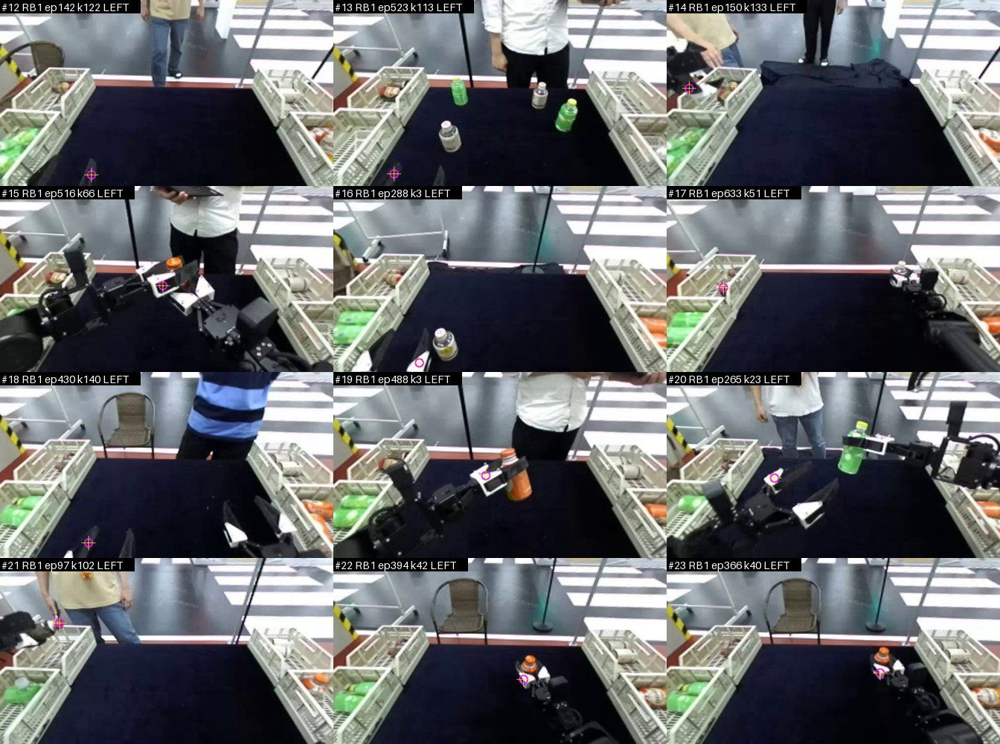
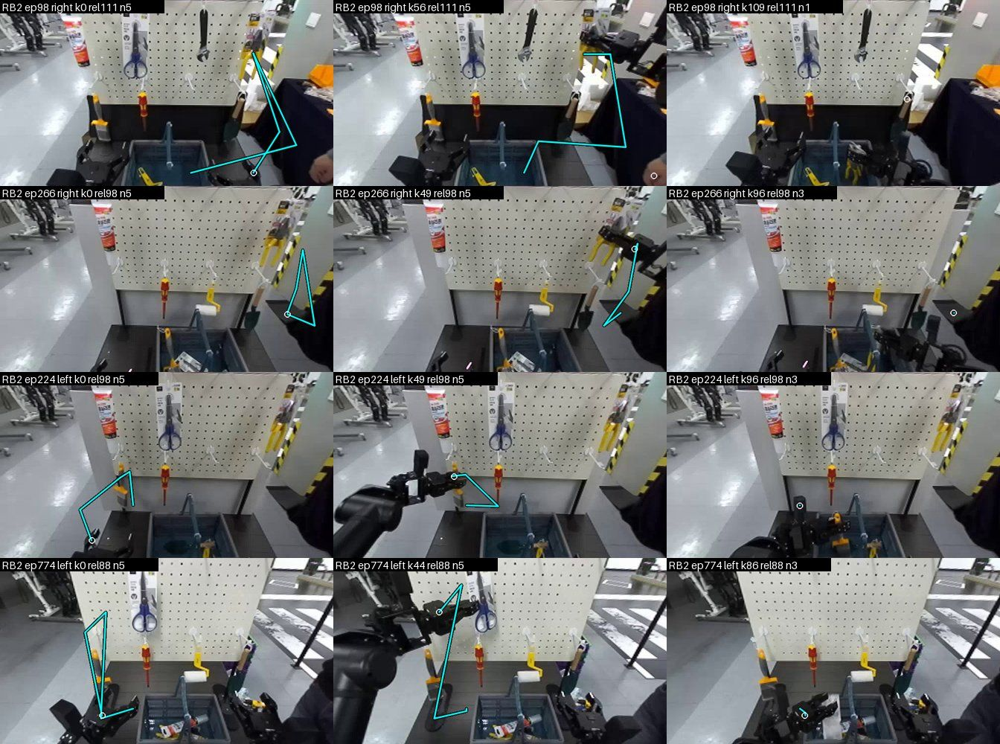
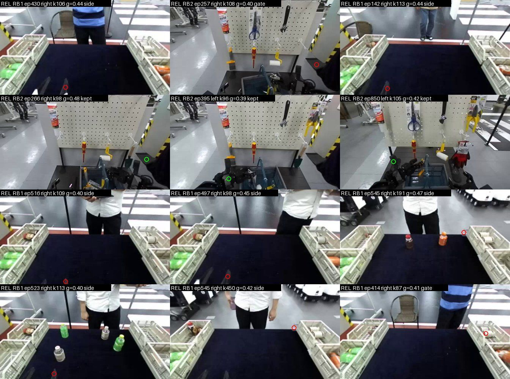

# MolmoAct 실데이터 이식 준비·검증 — S-E2E 머리 영상 + Molmo2-ER 포인팅 라벨 (E-MAR-real 준비, 학습 없음)

작성 MolmoAct 데이터 준비 에이전트, 2026-09-26 UTC(시작 05:30Z, 계획 커밋 `27ade09` 05:34Z, 문서 06:16Z–). **학습 없음, 유료 API 0원, GPU 0.37 GPU-h(메인 파드 GPU 0, Molmo2-ER 추론).**
사용자 지시: user-log 95("준비를 아ㅖ제대로해서 검증 필요. 시간 걸려두되니까"), **user-log 99**("시뮬거쳤다오는건 절대 반대 몰모엑트 참고해") → 정본 §89: MolmoAct 이식은 **실데이터(S-E2E·ROBOTIS) + 모델 라벨**. 계획 `docs/superpowers/plans/2026-09-26-molmoact-real-readiness.md`(관문·표본·거르개를 측정 전에 고정, 변경 1·2 기록). 앞선 준비 문서(시뮬 판): `docs/stage3/molmoact_r2_readiness.md`(성립 조건 C1–C14, M1–M9).
증거: `docs/stage3/results/marr_gates.json`(관문 수치 합본), 눈 검사 판정 `results/marr_eye.json`(표본 1)·`results/marr_eye_s2.json`(표본 2), 그림 `results/marr_*.jpg`, 파드 `/data/harvest/logs/marr/`·`/data/harvest/data/marr/`.

## 0. 요약

- **R2 시뮬 MolmoAct 데이터 생성은 중단했다**(user-log 99). 이미 커밋한 생성기 옵션(`--layout pair`·`--waypoints`)은 MolmoAct에 쓰지 않는다. 기본 생성 경로는 무변경임을 확인했다: 배치·DR digest 시험 + 새 코드로 R2_TRAIN 5편을 다시 녹화해 물리 배열 **비트 동일 5/5**(G-default 3/3, x2 파드 GPU 1 렌더 시험 G-x2 2/2). 파일럿(경유점 편 8편)은 멈추고 산출물을 지웠다(1절).
- **포인팅 라벨의 원시 품질(G-rate)**: S-E2E 48편 5,417프레임 × 두 팔 = 10,834회 Molmo2-ER 포인팅, 실패(점 없음) 2.0 %. 눈 검사 두 표본(144 + 96장, 결과를 보기 전 판정)에서 **틀린 점 21–30 %**(그리퍼가 보이는 프레임 기준; 보수 = 팔 판단 불가 `u`도 오류), 대부분이 **다른 팔 그리퍼**(17–20 %; E-MA1 G0 14/119 = 12 %보다 많음). RB1(병 분류, 그리퍼가 영상 아래 가장자리에 걸림) 39–41 %, RB2(공구 담기) 17–22 %.
- **거르개**: 측정 전에 고정한 v1(좌우 충돌·시간 튐·편별 DLT)은 **G-filter 실패** — 남긴 점 오류 5.6 %는 문턱 근처였지만 **올바른 점 유지 18 %**(문턱 80 %). 변경 1로 만든 v2(명목 머리 카메라 투영 + 편별 오프셋으로 **좌우 배정** + 150 px 관문)는 **새 검증 표본 2에서 G-filter 통과**: 남긴 점 오류 **3.7 %**(2/54, 95 % 구간 0–9.3 %), 올바른 점 유지 **94.5 %**. 개발 표본 1에서는 6.6 %·91 %, 두 표본 합 5.5 %. **영상 밖 그리퍼인데 남은 점**까지 오류로 치면 7.1 %(표본 2)·9.6 %(표본 1). 원천별로 RB2 2.2 %(합), RB1 10.9 %(합).
- **궤적 라벨(M1 번역)**: MolmoAct 5점·0–255 규칙(`harvest/datagen/trace.py`), 구간 끝 = 그 팔의 다음 **놓기**(변경 2: 편 시작부터 닫혀 있던 그리퍼가 쥐기 전에 여는 것은 놓기가 아님 — 놓기 49 → 32). v2로 남긴 점 59.8 %, 활성 팔 라벨이 있는 프레임 49.9 %(RB1 48.2 %·RB2 52.1 %), 놓기 프레임 점이 남은 비율 RB2 **78.6 %**·RB1 **16.7 %**. 시트 눈 검사: RB2 궤적은 그리퍼 → 집을 공구 → 상자(놓는 곳)로 이어지나 점 떨림으로 지그재그가 있고, **RB1은 놓는 순간 그리퍼가 대개 머리 영상 아래 밖**(성립 조건 C3 '측면 카메라에서 손끝이 보여야' 위반).
- **덧그림 색(G-colour)**: 실영상 192장에서 MolmoAct 청록 (0, 255, 255)과 비슷한(RGB 거리 < 60) 화소 **0 %** → 실데이터에서는 MolmoAct 색 그대로 쓴다(시뮬 dr 방해물 충돌은 실데이터에 없음).
- **조종 데이터(C7·C8)**: (a) 같은 원천·지시문·팔에서 시작·끝이 40 px 안인 구간 쌍 = 3쌍(RB1)뿐, 경로 차 중앙값 74 px — 자연 경로 다양성은 있으나 표본이 너무 작다; (b) RB2는 공구 벽 장면이 거의 같고 **지시문이 대상을 고른다**(11종) — MolmoAct '그릇 둘'과 같은 구조가 이미 있다(첫 프레임이 거의 같은(MAD ≤ 8) 편 쌍 중 지시문이 다른 쌍 426 — 문턱에 민감); (c) **같은 장면·다른 경로 시연은 없다** → MolmoAct D.7식 새 실물 수집이 필요(4.6절 설계). 조종 평가는 실물 폐루프가 필요하고, 오프라인 대체는 RB2 검증 분할에서 가능(5절).
- **판단**: RB2(+ 거르개 v2)는 E-MAR-real의 **A(미래 궤적 보조) × O(이력 덧그림)** 2×2를 등록할 만큼 준비됐다(6절 초안). RB1은 C3 위반으로 궤적 라벨에서 빼거나 따로 보고. **E-MAR-S(궤적 조건 조종)는 실데이터로는 아직 불가** — 대체 경로 시연이 없다.

## 1. 범위 전환과 시뮬 작업 처리

| 시각(UTC) | 일 |
|---|---|
| 05:12 | R2 시뮬 계획 `5b6c815`(M1·M3·M4·M5·M6, 관문·크기 고정) |
| 05:18–05:22 | Task 1 `8016973`(두 대상 배치 `tasks.pair_layout`, DR 다중 경로 keep-out, `Env.set_seed(layout=)` — 기본 배치·DR digest 고정 시험), Task 2 `4e4536f`(`harvest/sim/waypoint.py`, `gen --waypoints / --layout pair`, P0만) |
| 05:22:51 | 파일럿·관문 시작(메인 GPU 0 × 3, x2 GPU 1 × 1, 코드 사본 `/data/harvest/code_mar2d_4e4536f`) |
| 05:27:44 | 메인 PAUSE 지시 → `/data/harvest/mar2d/STOP`(새 작업 시작 안 함) |
| 05:29 | user-log 99·정본 §89 커밋 → 우리 프로세스만 PID로 종료(`tools/mar2d/stop_mar2d.sh`, `IR_INST=mar2d_*` 환경으로 식별, 05:29:51Z 0개 남음 확인), 파일럿 산출물(264 MB)·kitcache(837 MB)·임시 파일 삭제, 관문 JSON만 보존 |
| 05:30 | 계획에 중단 기록 `2e06ebc`, `trace.py` 실데이터용으로 정리 `124ff63` |

- **기본 경로 무변경 증거**(버린 옵션이 남아 있어도 기존 생성이 그대로인지): 로컬 시험(`tests/sim/test_mar2d_layout.py` 기본 digest `1aa6be6c…` 고정, `tests/datagen/test_mar2d_gen_opts.py` 기본 `set_seed` 호출·계획기 클래스) + 파드 재녹화 — G-default(standard 시드 10001 × 3과제, 메인 GPU 0) **3/3**, G-x2(standard 시드 10002 × 2과제, x2 GPU 1) **2/2** 모두 R2_TRAIN과 npz 물리 배열 15종 비트 동일·meta 키 동일(`/data/harvest/mar2d/gates/{gdefault,gx2}.json`). x2 GPU 1 렌더 프레임도 눈으로 정상 확인(병을 쥔 손목·머리 영상).
- 파일럿에서 녹화된 경유점 편 8편(표준·dr 각 4)은 판정 전에 멈췄다 — 수치는 쓰지 않는다.

## 2. MolmoAct 성립 조건 → 실데이터(S-E2E) 대응

| # | 조건(원문·코드, R2 문서 1절) | 실데이터에서 | 이 작업의 관문·결과 |
|---|---|---|---|
| C1 | 손끝 2D 폴리라인 ≤ 5점, 0–255, 편 끝까지 | `trace.labels_segments` — 구간 끝 = 그 팔의 다음 놓기(M1 번역, 변경 2) | 라벨 있는 활성 팔 프레임 49.9 %, 5점 2,534·1–4점 169 |
| C2 | 프레임별 VLM 포인팅("point to the robot gripper"), 실패 버림, 평활 없음 | Molmo2-ER `dab2256`, "point to the {left\|right} robot gripper"(E-MA1 G0 문장), 일괄 16(일괄 1과 점 차 ≤ 1.9 px, 16개 확인) | 원시 오류 21–30 %(4.1), 거르개 v2 통과(4.2) |
| C3 | 측면 카메라에서 손끝이 보여야 | 머리 카메라(ZED 왼쪽 672×376); RB1은 그리퍼가 아래 가장자리에 걸리고 놓을 때 영상 밖 | **RB1 위반**(놓기 점 16.7 %만 남음), RB2 78.6 % |
| C4 | 궤적 조건 데이터 1:1 | 라벨이 생기면 로더가 표본 50 %에 덧그림(M2) — 이 작업 범위 밖 | — |
| C5·C7 | 궤적이 관측과 독립으로 달라지는 시연(대체 경로) | 원격조작 시연 — 대체 경로 시연 없음, 자연 변동만 | 4.6 |
| C6 | 청록 2 px LINE_AA | 실영상에서 청록 비슷한 화소 0 % | MolmoAct 색 그대로(4.5) |
| C8 | 두 목표 조종 평가(진행 점수, 폐루프) | RB2: 같은 공구 벽 장면·지시문이 대상 선택 | 폐루프는 실물 필요, 오프라인 대체 5절 |
| C9·C10 | 덧그림 → 행동, 행동 CE가 모델 전체 학습 | 우리 KI stop(흐름 손실이 백본에 안 감) — R2 문서 M7 그대로 | 6절 요인에 적음 |
| C12 | 편 평균 112스텝 | S-E2E 10 Hz, 편 33–778프레임 | 구간(쥐기 → 놓기) 단위로 자름 |

## 3. 방법 (계획대로, 변경 1·2 포함)

- **표본**: RB1 24편 + RB2 24편(시드 0 무작위, RB2 ep 46 제외), `cam_head` **모든 프레임** 10 Hz = 5,417프레임(영상·행 수 일치 48/48), 두 팔 FK 말단(URDF `ffw_bg2_rev4_follower`, `arm_base_link`)·그리퍼 관절값(`tools/marr/select_decode.py`, 5 s).
- **포인팅**(`tools/marr/point.py`): GPU 0, bf16, 탐욕 복호, 최대 64토큰, 일괄 16, 05:46:38–06:00:54Z(호출당 0.06 s), 실패 212/10,834(2.0 %).
- **거르개 v1(측정 전 고정)**: F1 실패, F2 좌우 두 점 < 25 px면 둘 다 버림, F3 ±2프레임 이웃 중앙값에서 > 40 px, F4 두 팔 점을 함께 RANSAC DLT(15 px, 1,000회)로 맞춰 잔차 > 20 px 버림·정상점 < 50 %면 편(`dlt_episode`)이나 팔(`dlt_arm`) 전부 버림(`se2e_molmo.filter_episode`).
- **거르개 v2(변경 1)**: 명목 URDF 머리 카메라(E-MA1 `se2e_trace`, 머리 (0.5492, 0)) 투영 + **편별 2-D 오프셋**(지정 팔 쪽으로 40 px 넘게 가까운 내부 점의 (점 − 명목) 중앙값, 2회 반복) → 다른 팔 투영에 더 가까우면 `side`, 지정 팔에서 > 150 px면 `gate`(`se2e_molmo.filter_nominal`). 궤적 라벨은 남긴 **포인팅 점**(명목 투영은 오차가 커서 거르기에만).
- **눈 검사**: 원천 × 팔 층화, 한 칸에 전체 머리 영상 + 자홍 고리(점)·지정 팔 글자, **거르개 결과를 보기 전에** Read 도구로 판정 — 표본 1(시드 0, 144장, v1·v2 개발), 표본 2(시드 1, 96장, 표본 1 프레임 제외, v2 검증 — v2와 표본 규칙을 먼저 커밋 `febe4f1` 06:10:09Z 뒤 그림 생성). 부호: g 지정 팔 그리퍼, o 다른 팔 그리퍼, x 그 밖(지정 그리퍼는 보임), n 지정 그리퍼가 안 보임, u 그리퍼 위지만 팔 판단 불가(표본 1 판정 중 추가 — 보수 오류율에서 오류).
- 판정 코드 `tools/marr/analyze.py`(`main`·`eye`·`camfit`·`nominal`), 부트스트랩 10,000회 95 % 백분위.

## 4. 결과

### 4.1 G-rate — 원시 포인팅은 네 번에 한 번꼴로 틀린다

| 표본 | 보이는 프레임 | g / o / x / u (n) | 오류율(보수) [95 %] | 오류율(u = 맞음) | 다른 팔 | RB1 / RB2 오류(보수) |
|---|---|---|---|---|---|---|
| 1 (시드 0) | 127 / 144 | 93 / 22 / 5 / 7 (17) | **0.268** [0.189, 0.347] | 0.213 | 0.173 | 0.386 / 0.171 |
| 2 (시드 1) | 79 / 96 | 55 / 16 / 1 / 7 (17) | **0.304** [0.203, 0.405] | 0.215 | 0.203 | 0.412 / 0.222 |

- 틀린 점의 대부분은 **다른 팔**: 지정 그리퍼가 안 보이거나 작게 보이면 보이는 그리퍼를 가리킨다(표본 1 #22·#23·#24: 왼팔을 물었는데 오른팔 그리퍼). RB1은 그리퍼가 아래 가장자리에 손끝만 걸려 팔 판단 자체가 어렵다(u 7장). E-MA1 G0(다른 팔 14/119)와 같은 방향, 더 많다(프레임을 무작위로 뽑아 안 보이는·작은 그리퍼가 섞임).
- MolmoAct는 실패(None)만 버렸다(C2). 우리 원시 라벨을 그대로 쓰면 궤적의 약 1/4이 다른 팔을 따라간다 → **거르개가 필수**.

### 4.2 G-filter — v1 실패, v2 검증 통과

| 거르개 | 표본 | 남긴 점(보이는) | 남긴 점 오류(보수) [95 %] | 올바른 점 유지 [95 %] | 판정 |
|---|---|---|---|---|---|
| v1(사전 고정) | 1 | 18 | 0.056 [0, 0.167] | **0.183** [0.108, 0.269] | **실패** |
| v1 | 2 | 14 | 0.214 | 0.200 | (참고) |
| v2 | 1(개발) | 91 | 0.066 [0.022, 0.121] | 0.914 [0.850, 0.968] | (개발) |
| **v2** | **2(검증)** | **54** | **0.037** [0, 0.093] | **0.945** [0.873, 1.0] | **통과** |

- v1이 맞는 점을 버린 이유(표본 1, 맞는 점 93개 중): 편 DLT 실패 29·좌우 충돌 17·시간 튐 16·DLT 잔차 6·팔 전체 8. 진단(`camfit`): 한 편 안에서도 포인팅이 손끝·몸통·가장자리 잘림 사이를 오가 DLT 하나에 15 px로 맞는 점이 12–71 %뿐이고, 원천 전체 한 카메라로는 1–16 %(RB2 머리가 고정인데도) — 3×4 DLT로 포인팅과 FK를 묶는 방식이 이 데이터에 맞지 않았다.
- v2의 근거(표본 1 진단, `nominal_diag`): 보정된 명목 투영에서 맞는 점은 지정 팔까지 중앙값 **51 px**·다른 팔까지 301 px, 다른 팔 점은 323 / **57 px** → 좌우 배정이 명확히 갈린다. 절대 정확도(51 px)는 라벨로 쓰기엔 나빠 거르기에만 쓴다.
- **주의(보고 의무)**: (1) 오류율 분모는 계획대로 '지정 그리퍼가 보이는' 프레임이다. 안 보이는데 남은 점(n)까지 오류로 치면 표본 2 **0.071**(4/56), 표본 1 0.096(9/94). (2) 원천별 v2 남긴 점 오류(보수, 두 표본 합) **RB1 0.109(6/55)·RB2 0.022(2/90)**. (3) 검증 구간 상한 9.3 % — 5 % 문턱을 확실히 넘는다고는 못 한다. → **RB2에는 쓸 만하고, RB1은 따로 다룬다.**

### 4.3 라벨 통계 (v2, 변경 2 반영)

| | RB1 | RB2 | 합 |
|---|---|---|---|
| 포인팅 점 | 6,002 | 4,832 | 10,834 |
| 실패 / 좌우 / 관문 / 남김 | 2.2 / 38.3 / 11.6 / **48.0 %** | 1.7 / 15.1 / 8.7 / **74.5 %** | 2.0 / 28.0 / 10.3 / **59.8 %** |
| 놓기(쥐기 뒤) | 18 | 14 | 32 (변경 2 전 49) |
| 놓기 프레임 점이 남은 비율 | **0.167** | **0.786** | 0.438 |
| 활성 팔 라벨 있는 프레임 | 0.482 | 0.521 | 0.499 |
| 라벨 점 수(5 / 4 / 3 / 2 / 1) | 1,338 / 17 / 21 / 42 / 27 | 1,196 / 17 / 13 / 14 / 18 | 2,534 / 34 / 34 / 56 / 45 |

- 라벨이 없는 프레임 약 절반: 마지막 놓기 뒤(되돌아가기·대기), 첫 쥐기 전에 편이 끝나는 짧은 편, 그리고 남은 점이 없는 구간.

### 4.4 G-trace — 시트 눈 검사

- RB2(위 그림, 행 = 편·팔, 열 = 구간 시작·중간·놓기 3프레임 전): ep98 오른팔은 그리퍼 → 벽의 노란 펜치 → 상자(놓는 곳)로 이어지고, ep224·ep774 왼팔도 공구 → 상자. **끝점이 상자 쪽**이다(M1 번역이 뜻대로). 흰 고리(현재 원 포인팅)가 선 시작과 떨어진 칸은 그 프레임 점이 걸러져 다음 남은 점부터 선이 시작한 경우. 점 떨림으로 **지그재그**(ep266 k0)가 있다 — MolmoAct도 평활하지 않는다(C2).
- RB1(`results/marr_trace_RB1.jpg`): 병 → 옆 상자로 가는 궤적(ep41 왼팔)도 있으나, 팔이 영상 아래로 내려가는 구간이 많다. 한 칸(ep497 오른팔 k0)은 선 시작이 **왼팔 그리퍼**에 있다 — 남은 오류의 실례.

- 놓기 프레임(변경 2 뒤, 초록 = 남은 점, 빨강 = 버린 점): RB2 세 칸은 상자 위 그리퍼에 초록. **RB1 여덟 칸은 그리퍼가 영상 아래 밖이라 점이 사람·상자·가장자리에 찍혀 버려졌다**(C3 위반). 변경 2 전 시트에서는 RB1 ep366 k11·RB2 ep524 k49처럼 '쥐기 전에 여는 것'이 놓기로 잡혀 궤적 끝이 집을 물체에 있었다 → 변경 2.

### 4.5 G-colour — 실영상에서는 MolmoAct 청록이 안전

| 후보(RGB) | 거리 < 60 화소 비율 평균 / 최대 (192장) |
|---|---|
| MolmoAct 청록 (0, 255, 255) | **0.0 / 0.0** |
| R2 연두 (110, 255, 0) | 0.0 / 0.0 |
| 자홍 (255, 0, 255) | 0.0 / 0.0 |
| 노랑 (255, 255, 0) | 3.3e-5 / 9.6e-4 |

- 규칙(≤ 0.1 %) 통과 중 가장 낮은 첫 후보 = **청록** → 실데이터 덧그림은 MolmoAct 형식 그대로(청록 2 px LINE_AA). 시트 눈 검사(4.4)에서도 청록이 장면 물체와 헷갈리지 않았다. 시뮬 판의 색 문제(dr `col_cyan`)는 실데이터에 해당하지 않는다(R2 연두 `trace.TRACE_RGB`는 시뮬 전용으로 남긴다).

### 4.6 G-diversity — 조종 데이터가 얼마나 모자라나

- **(a) 같은 목표·다른 경로(자연 변동)**: v2 라벨로 만든 구간(쥐기 → 놓기, 남은 점 ≥ 5) 32개 중 같은 원천·지시문·팔이고 시작·끝이 각각 40 px 안인 편 쌍 **3쌍(RB1)**, 경로 차(양방향 하우스도르프) 중앙값 74 px(p90 96 px). RB2는 0쌍(지시문 11종이 24편에 흩어짐). → 자연 경로 차는 있어 보이나 48편으로는 셀 수 없다. 전량(211,220프레임 ≈ 42만 포인팅 ≈ 7 GPU-h)을 라벨링하면 다시 잴 수 있다.
- **(b) 같은 장면·다른 대상(지시문이 고름)**: 전 편 첫 프레임(84×47 흑백) 평균 절대 차로 가장 가까운 편 거리 중앙값 RB1 9.5·RB2 6.9. MAD ≤ 5인 편 쌍: RB1 1,963쌍(지시문 1종), RB2 895쌍 중 **지시문이 다른 쌍 6**, ≤ 8이면 RB2 3,222쌍 중 **426**. RB2는 같은 공구 벽 앞에서 지시문으로 공구를 고르는 과제라 **MolmoAct '두 그릇'(C8)과 같은 구조가 이미 있다** — 단 문턱에 민감하고 물체 배치가 같은지 사람이 확인하지 않았다.
- **(c) 없는 것**: MolmoAct 부록 D.7의 **"같은 목표로 다른 경로를 탐색하는 시연"(시연의 절반)** 은 S-E2E에 없다. 원격조작자는 목표마다 비슷한 경로로 간다. 궤적 조건 학습(C4·C5)만으로는 궤적이 관측과 독립으로 바뀌는 신호가 약하다(R2 문서 C5).
- **새 실물 수집 설계(제안, 비용 추정만)**: AI Worker, RB2식 공구 벽 장면 1개, 대상 공구 2개(예: 노란 펜치·파란 가위 — 벽 좌우로 떨어진 것), 대상마다 **직접 경로 50편 + 대체 경로 50편**(원격조작자가 왼쪽/오른쪽으로 크게 돌아 같은 공구를 집어 상자에 넣음) = **200편**(MolmoAct D.7과 같은 수), 편당 약 10 s → 약 0.6 h 순수 녹화(준비 포함 반나절 추정). 조종 평가: 같은 장면 모호 지시문("Put the tool into the crate.")으로 시작해 대체 공구 쪽 5점 궤적을 그려 주는 **폐루프 15–30회/모델**(MolmoAct 15회 + 우리 경계 규칙). 수집 전 결정 필요: 실물 로봇 사용 가능 시기·안전 절차 [결정 필요: 사용자].

## 5. 조종 평가 집합 — 실데이터에서 가능한 것

- **폐루프(C8 그대로)**: 실물 로봇이 있어야 한다. 이 작업에서는 설계만(4.6 (c)).
- **오프라인 대체**(준비만, 만들지 않음): RB2 검증 분할(`se2e_data.split_of`, 약 5 %)의 접근 구간 프레임에서, Molmo2-ER로 **다른 공구를 가리키게 해**("point to the blue scissors") 대체 대상 점을 얻고, 현재 그리퍼 점 → 대체 대상 점 5점 직선 궤적을 그려 준 입력으로 청크 방향이 대체 대상 쪽(cos > 0.5, 두 방향 각 ≥ 75°)인지 잰다(R2 M6 규칙의 실데이터 번역). 표본 크기: RB2 검증 약 40편 × 편당 최대 3장 ≈ 120 < 300 → **n ≥ 300을 채우려면 검증 분할을 따로 늘려야 한다**(예: RB2 편 해시 15 % → 약 130편 × 3 ≈ 390; 학습 표본이 그만큼 준다) [결정 필요: 메인].

## 6. 사전 등록 초안 — E-MAR-real (A 궤적 보조 × O 이력 덧그림, S-E2E RB2, 2×2)

**성격**: §56 소규모 입력·보조 목표 절제(E-TC·E-MA1 틀). 학습 전 등록 커밋 → 학습. **이 문서는 초안 — 등록·실행은 메인 지시 뒤.** 유료 0.

### 6.0 자체 검사 (user-log 87)
- **바뀌는 결정**: A 채택 → 단계 B 레시피에 궤적 보조 머리(학습 때만, 실행 비용 0); O 채택 → 런타임 머리 영상에 과거 2 s 손끝 덧그림(런타임 손끝 점이 필요 — 아래 한계) + `question_id@vN` 새 판. 둘 다 불채택이면 MolmoAct 이식은 조종 데이터(4.6 (c)) 수집 뒤 E-MAR-S로만.
- **표본으로 가를 수 있나**: E-MA1 틀(검증 300 스냅샷, 표준오차 0.02–0.03)에서 주효과 문턱 +0.02는 시드 1 반복으로 가른다. RB2만 쓰면 학습 표본이 RB1 + RB2의 약 35 %로 준다 — 기준 칸도 같은 데이터로 새로 학습해 비교(칸 사이 공정).
- **더 싼 사전 실행**: 이 준비 작업(포인팅 48편, 0.37 GPU-h)이 그것 — 라벨 품질·거르개·색·구간 끝을 먼저 확인했다. 등록 전 추가: RB2 전량 포인팅(약 17만 호출 ≈ 3 GPU-h)과 거르개 v2 적용 뒤 **새 눈 검사 표본 96장**으로 전량 라벨 품질 재확인(G-filter 같은 문턱).

### 6.1 데이터
- RB2 657편(머리·손목 있는 편), 프레임별 Molmo2-ER 두 팔 포인팅, 거르개 v2(이 문서 고정값: 오프셋 40 px·관문 150 px·가장자리 12 px), 구간 끝 = 다음 놓기(`require_grasp`), 5점·0–255(`trace.labels_segments`). RB1은 C3 위반으로 빼고, RB1 포함 판은 판정 밖 보고.
- 새 데이터 판본 `mar_real_c1`(행 키 = `se2e_c1` RB2 행, 라벨 없는 행은 A 손실 마스크 0).

### 6.2 요인
- **A = `aux: trace5-point@v1`**: E-MA1 `trace5@v1`(FK 명목 투영, G0 실패로 못 씀)를 **포인팅 라벨**로 바꾼 것 — 지금 프레임의 활성 팔 궤적(1–5점, 0–255 → [0, 1]), 없는 점 마스크 0, `AuxGeomHead` 회귀 10 + 마스크 5, λ 0.1, 기울기 백본까지(§58). P66 확인: 5점 궤적은 놓는 곳(장기 목표)을 담아 0.3 s 결정 라벨에 없는 정보다.
- **O = 카메라 배치 `D27v1+eetrace-point@v1`**: 과거 2 s(20프레임) 활성 팔 **남은 포인팅 점**을 현재 머리 영상에 청록 2 px LINE_AA 폴리라인(오래될수록 흐림), 학습 드롭아웃 0.3, 평가는 항상 그림. **런타임 한계**: 실행 때 포인팅을 매 스텝 부르면 지연(호출당 약 0.5 s, 일괄 없음)이 커서, O 채택 시 런타임 손끝 점 = (a) 편 시작 때 포인팅 몇 번으로 명목 투영 오프셋을 맞춘 FK 투영(v2와 같은 방식, 절대 오차 중앙값 51 px — 덧그림으로 쓰기엔 큼) 또는 (b) 실물 카메라 보정(R2 문서 M9) — 등록 때 정하고, 학습(포인팅 점)과 실행(투영 점)의 차를 **판정 밖 지표로 잰다**(O 칸을 투영 점 덧그림으로 평가했을 때의 하락).

### 6.3 칸·스케줄·지표·채택
- 칸: `none+none` / `A+none` / `none+O` / `A+O`, E-MA1 7절 스케줄 그대로(2,000스텝, 묶음 8, 시드 0, 통과 요인만 시드 1, 검증 300 스냅샷 — RB2만이라 `--val-per-kind 300`).
- 주 지표 `dec_acc`(전체·전이 층), 판정 밖: 청크 MSE, 궤적 보조 오차(px), O 덧그림 제거·투영 점 덧그림 평가 하락, 원천별(RB1 포함 판).
- 채택: 요인 주효과 전체 ≥ +0.02 그리고 전이 층 ≥ −0.01 그리고 결정 FULL p95 ≤ +10 %(E-MA1 7.1·7.2 그대로, CMP_EPS 1e-12).
- 비용: 4칸 × 약 40분 ≈ 2.7 GPU-h + 포인팅 약 3 GPU-h + 시드 1 ≈ 2 GPU-h, 유료 0.
- 해석 한계: 라벨 오류 약 2–7 %(RB2), 원격조작 시연은 경로 다양성이 작아 A는 '같은 정보의 촘촘한 감독' 몫이 섞일 수 있음(§84 보충 1), 머리 카메라 깊이축.

## 7. 자체 검사 (이 작업)

| 시점 | 항목 | 답 |
|---|---|---|
| 시작 전 | 바뀌는 결정 | 실데이터 MolmoAct 이식을 등록할 수 있는가 — 라벨 품질·거르개·구간 끝·색·조종 데이터 판단 |
| 시작 전 | 표본으로 가를 수 있나 | 눈 검사 144장이면 오류율 표준오차 약 0.04; G-filter는 검증 96장으로 판정(구간 상한 보고) |
| 도중 | 관문 실패 | v1 G-filter 실패 → 멈추고 원인 진단(DLT 부적합) → 변경 1 커밋(`febe4f1`) 뒤 새 표본 2로 검증; 놓기 눈 검사에서 뜻이 틀린 것 발견 → 변경 2(`56291df`) |
| 끝 | 검증 | 시험 `tests/train/test_se2e_molmo.py` 9개·`tests/datagen/test_mar2d_trace.py` 12개 통과, 로컬 전체 시험 **1,758 passed·27 skipped**(Git Bash, 06:2x UTC; 다른 에이전트의 커밋 전 시험 포함), 눈 검사 판정 파일 두 개 커밋, 관문 수치는 파드 JSON 합본(`marr_gates.json`) |
| 끝 | 비용 | GPU 0.37 GPU-h(포인팅) + 시뮬 파일럿 약 0.19 GPU-h(Isaac 렌더, 메인 GPU 0 7분 × 3프로세스·x2 GPU 1 4분), 유료 0 |

## 8. 실행 기록

| 항목 | 값 |
|---|---|
| 코드 | 파드 `/data/harvest/code_marr_{c1c8753,febe4f1,56291df}`(`git -c core.autocrlf=false archive`, `harvest/`만, `CODE_VERSION` JSON) + `tools/marr/`(작업 트리 사본 = 이 커밋의 파일), 시뮬 `/data/harvest/code_mar2d_4e4536f` |
| 환경 | `source /data/harvest/env.sh`, `OMP_WAIT_POLICY=PASSIVE`, `nice 10`; 포인팅 `venv_train` + `/data/harvest/pylib_molmo2`(transformers 4.57.1), 나머지 `venv_e3st` |
| 시각(UTC) | 프레임 풀기 05:37:41–05:37:47, 일괄 시험 05:38:35–05:46:19(첫 적재 7분 — 디스크 캐시), 포인팅 05:46:38–06:00:54, 분석 v1 06:01–06:02:15, 눈 검사 1 06:03–06:05, 진단 06:06–06:08, 변경 1 커밋 06:10:09, 분석 v2·표본 2 06:10:34, 눈 검사 2 06:11–06:17, 변경 2 06:20 |
| 출력 | `/data/harvest/data/marr/`(frames 5,417장·eps npz·`points.jsonl`·`trace_labels{,_v2}.json`), `/data/harvest/logs/marr/`(분석·눈 검사 시트·평가 JSON), 로컬 `D:\tools\scratch_qdd\marr\fetched\` |
| GPU | 메인 파드 GPU 0만(포인팅), 남의 프로세스 건드리지 않음(GPU 1 E-SR1c, GPU 3 다른 작업) |
| 절차 이탈(P03) | 로컬 `python -c` 1회(패키지 판 확인), 파드 `python3 -c` 1회(출력 버림)·`python -c` 1회(JSON 출력, 읽기 전용), 로컬 입력 없는 `python - < /dev/null` 1회(아무것도 실행 안 됨, 멈춤) — 모두 결과와 무관 |
