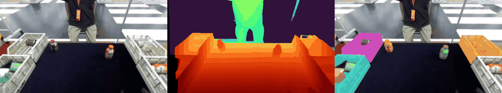
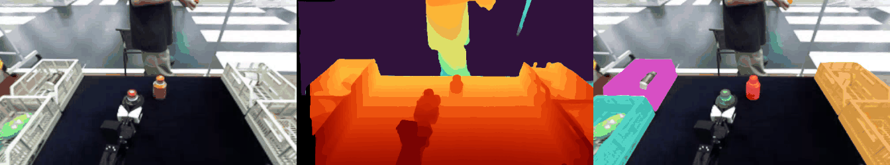
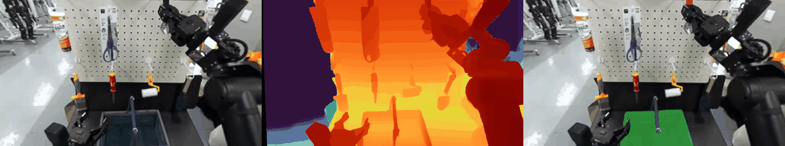
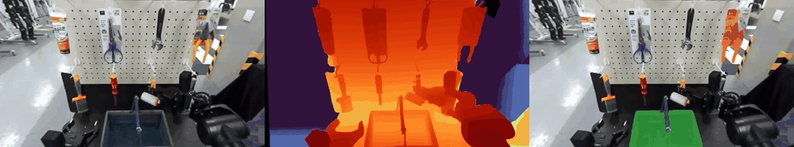
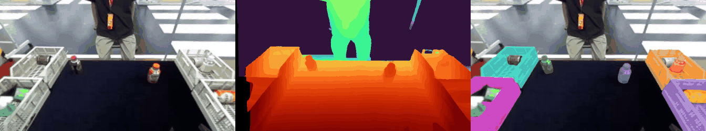
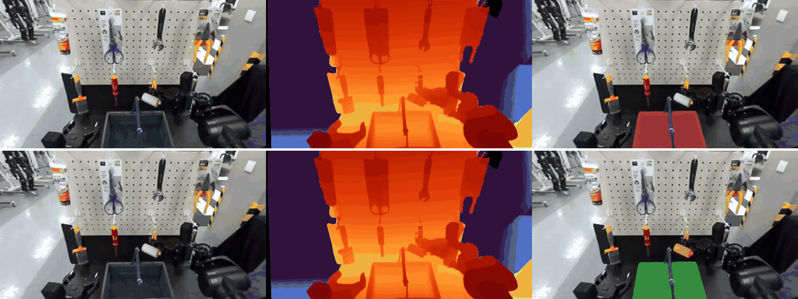

# E3-ST 결과 — 오프라인 스테레오 안정성 (계획 Task 16, E §5.10, D21 §3.1)

실행 2026-09-24 (UTC 17:30–18:15), 파드 `juhyoung-native-7a2a` GPU 1(H200) 한 장. 탐색 측정이라 **판정 문턱 없음**.
코드: `harvest/stereo/{data,pipeline}.py`, `harvest/cli_e3st.py`, 테스트 `tests/test_stereo_metrics.py`(3개 통과).
원자료(에피소드별 JSON, `summary.json`): 파드 `/data/juhyoung_qdd/out/e3st/`.

> **fx 정정 (2026-09-24 추가, 정본 §47)**: 1–7절의 깊이·거리·흔들림 mm 절대값과 술어 수치는 틀린 fx 272.1 px(센서 최대 102°)로 계산한 것이라 **대체됨(superseded)**. 올바른 값(ZED Mini VGA 85°, fx 367 px)으로 다시 계산한 수치는 **8절**을 쓴다. 1–7절은 기록으로 그대로 둔다(검출·에피소드·분할기 비교 결론은 8절에서 유지 확인).

## 1. 데이터 확인 (Step 1, HF `meta/info.json` 직접 확인)

| 항목 | Task_0001 CoffeeClassification | Task_0002 OrderPicking |
|---|---|---|
| **실제 저장소 이름** | `ROBOTIS/Task_0001_CoffeeClassification_lerobot` | `ROBOTIS/Task_0002_OrderPicking_lerobot` |
| 형식 / 로봇 | LeRobot v2.1 / `ffw_bg2_rev4_custom` | LeRobot v2.1 / `ffw_bg2_rev4` |
| 에피소드 / 프레임 | 718 / 125,746 | 857 / 85,474 |
| fps | 10 | 10 |
| 머리 스테레오 키 | `observation.images.cam_head`(왼쪽), `observation.images.cam_head_right` | 같음 |
| 머리 해상도 | 376×672 (H×W) | 376×672 |
| 손목 | `cam_wrist_left/right` 424×240 (shape [424,240]) | 240×424 |
| 코덱 | libx264, yuv420p (손실 압축 mp4) | 같음 |
| 상태 차원 | 16 (팔 7×2 + 그리퍼 2, **머리 관절 없음**) | 19 (+`head_joint1/2`, `lift_joint`) |
| 에피소드 길이 (최소/중앙/최대) | 33 / 142 / 778 프레임 | 36 / 98 / 300 |
| 과제 문장 | "Place bottles in color-matching boxes: red→top left, …" (3개 index, 문장 동일) | "Put the <물체> into the crate." 등 11종 |
| **라이선스** | **표기 없음 [미확인]** (README 없음, 태그 `region:us`뿐) | **apache-2.0** (README·태그) |
| 게이트 | 없음 | 없음 |
| 보정값(기선·내부 행렬) | 데이터에 없음 | 데이터에 없음 |

- 계획서의 이름(`…_CoffeeClassification`, 접미사 없음)은 HF에 없다(401). 실제 이름에 `_lerobot`이 붙는다.
- **Task_0002는 857편 중 657편만 `cam_head_right`가 있다**(에피소드 617–816 등 200편은 오른쪽·손목 영상 없음, `total_videos` 2,828 = 657×4 + 200과 일치). D21 §1.4 표의 "스테레오 쌍 857편"은 정정 필요.
- 라이선스: Task_0002는 사용 가능. Task_0001은 명시 라이선스가 없어 [미확인]이지만 공개·비게이트이고, 여기서는 내부 측정만 하고 재배포하지 않으므로 **보류하지 않고 진행**했다. 논문·공개 자료에 Task_0001 프레임을 싣기 전에는 ROBOTIS에 확인이 필요하다 [결정 필요].
- 영상 확인: 왼쪽/오른쪽이 뒤바뀌지 않았다(오른쪽 영상에서 물체가 왼쪽으로 이동). 두 스트림의 프레임 수 일치.

### 사용한 에피소드 (과제별 20편, 최대 300프레임 = 30 s)
- T1: 가능한 718편에서 등간격 20편 — 0, 38, 75, 113, 151, 189, 226, 264, 302, 340, 377, 415, 453, 491, 528, 566, 604, 642, 679, 717.
- T2: 오른쪽 영상이 있고 과제가 "Put the …"인 380편에서 등간격 20편 — 0, 50, 70, 90, 110, 150, 170, 190, 210, 250, 269, 289, 309, 329, 349, 408, 428, 616, 836, 856. ("Grasp the handle"·"Place the crate"는 두 물체 술어가 없어 뺐다.)
- 받은 양: 에피소드별 parquet + 머리 좌우 mp4만, 145 MB.

## 2. 모델과 판본 (Step 4)

| 단계 | 모델 | 출처 | 판본 | 신뢰도 |
|---|---|---|---|---|
| 스테레오 | **Fast-FoundationStereo**, 연구 체크포인트 `23-36-37`(가장 정확한 판), valid_iters 8, max_disp 192 | NVlabs 공식 저장소(CVPR 2026) | 커밋 `476f4249561f7c79ca707326954f9255643412a6`(2026-09-11), 1,498★. 가중치는 README의 공식 Google Drive 링크 | HIGH |
| 분할(추적) | **SAM 2.1 hiera-large** (비디오 예측기) | Meta 공식 `facebookresearch/sam2` | 커밋 `2b90b9f5ceec907a1c18123530e92e794ad901a4`, 19,916★, 체크포인트 `sam2.1_hiera_large.pt` sha256 `2647878d…d318` | HIGH |
| 문장→상자 | **Grounding DINO base** | IDEA-Research 공식(`IDEA-Research/GroundingDINO` 10,620★, ECCV 2024), HF `IDEA-Research/grounding-dino-base` rev `12bdfa31…` (transformers 4.57.6) | — | 기간 밖, 기초 문헌 |

- **SAM 3.1 / SAM 3는 쓰지 못했다.** HF `facebook/sam3.1`·`facebook/sam3` 모두 게이트(`gated: manual`, 토큰 없이 401)다. 규칙대로 토큰 경로는 멈추고 **Meta 공식 SAM 2.1로 대체**했다. SAM 2.1은 문장 프롬프트가 없어서, 첫 프레임에서 Grounding DINO로 상자를 얻고 SAM 2.1이 그 상자를 영상 전체로 추적한다. 즉 결과의 분할 단계는 계획의 "SAM 3.1"이 아니라 **"Grounding DINO + SAM 2.1"** 이다.
- 환경: 전용 venv `/data/juhyoung_qdd/venv_e3st`(Python 3.12, torch 2.6.0+cu124, FFS README 판본 그대로).
- 실행상 우회 3가지(모델 수치에는 영향 없음 [추정]): (1) 파드에 C 컴파일러가 없어 triton 커널을 못 만든다 → FFS의 순수 PyTorch 비용 부피 경로(`optimize_build_volume='pytorch1'`, 공식 데모 기본값)만 쓰고 `TORCHDYNAMO_DISABLE=1`로 torch.compile 끔. (2) `open3d`는 점구름 저장용으로만 import되어 빈 모듈로 대체. (3) SAM 2 CUDA 후처리 확장(구멍 메우기)은 빌드하지 않았다(공식 안내상 결과에 거의 영향 없음).
- FFS 추론 시간: H200, 376×672, fp16, PyTorch 경로 **프레임당 중앙값 34 ms**.

## 3. 절차 (Step 5)

1. 좌우 프레임 → FFS 시차 `d` → 깊이 `z = fx·B/d`.
   - **보정값 [가정]**: 기선 B = 63 mm(ZED Mini 공칭), `fx = (672/2)/tan(102°/2) = 272.1 px`, 주점 = 영상 중심, 왜곡 없음(정류된 영상으로 가정). **[대체됨 → 8절: fx 367 px(VGA 85°)]**
   - 무효 깊이: `d ≤ 0.5 px`, 오른쪽 영상에 안 보이는 화소(`u − d < 0`), 범위 밖(z < 0.1 m 또는 > 9 m, ZED Mini 사양).
2. 물체 프롬프트(과제 문장에서):
   - T1: `"bottle"`(최대 4개), `"box"`(최대 4개). 실제 물체는 흰 바구니지만 과제 문장 명사 "box"를 그대로 썼다.
   - T2: 과제 문장의 색+명사 구(예: `"black wrench"`, `"yellow paint brush"`, `"tool with the wooden handle"`) 1개 + `"crate"` 1개. 명사만(`"paint brush"`)으로는 다른 공구가 더 높은 점수로 잡혀서(ep90 시험) 색을 붙였다 — 계획("명사")에서 벗어난 점.
   - 상자 문턱 0.25, 글자 문턱 0.2, NMS 0.5. 5프레임마다 검사해 모든 범주가 잡힌 첫 프레임부터 추적.
3. SAM 2.1로 그 상자들을 끝까지 추적 → 물체별 프레임별 마스크(물체 id 유지).
4. `centroid_3d`: 마스크를 5×5로 한 번 침식(경계 깊이 번짐 완화)한 뒤 유효 깊이 화소를 역투영, 성분별 중앙값.
5. 흔들림: 같은 물체의 연속 프레임 사이 3D 거리(mm). 두 묶음으로 본다.
   - **전체**: 계획 정의 그대로. 물체가 실제로 움직인 구간(집어 옮김, T2 머리 이동)도 포함된다.
   - **영상상 정지 구간**: 2D 마스크 중심 이동 < 1 px 이고 면적 변화 < 5 %인 연속 쌍만. 인식 앞단의 순수 잡음에 더 가깝다.
6. T1 술어(M1 등록부 정의를 카메라 좌표로 옮김, [가정]):
   - `near(a,b)`: 중심 거리, 들어가기 < 5 cm / 나가기 > 6 cm 히스테리시스(정본 §7). [정정 R7 10회차 N4, 정본 §74: 정본 §7·M1 :140의 들어가기는 **≤ 5 cm**(9회차에 코드도 `≤`로 맞춤), 애매 띠 (5, 6] cm; 정확히 5.000 cm에서만 다르고 이 실행의 값은 바뀌지 않음]
   - `above(a,b)`: "위" 방향 = 시작 프레임의 아래쪽 40 % 화소(물체 제외)로 RANSAC 평면(탁자·바닥) 법선, 평면이 수평에서 60° 넘게 기울면 카메라 −y. b의 수평 반폭 = b 점들의 수평 반경 90 % 분위. a가 그 반폭 안이고 더 높으면 참. 접촉 항은 뺐다(접촉 정보 없음).
   - 짝: T1 병 × 상자(에피소드당 최대 16쌍), T2 물체 × crate(1쌍). 한 물체라도 마스크가 없거나(면적 < 100 px) 깊이가 무효면 `None`.
   - `flip_rate`: `None`을 먼저 빼고 연속 쌍 중 값이 바뀐 비율.

## 4. 결과 (Step 6)

> fx 272.1 기준 수치 — mm·m 절대값과 술어 비율은 **대체됨**, 8절 참조.

### 4.1 3D 중심 흔들림 (mm, 연속 프레임 = 0.1 s 간격)

| | T1 CoffeeClassification | T2 OrderPicking |
|---|---|---|
| 처리 에피소드 / 프레임 | 20 / 3,220 | 19 / 2,503 (ep 250은 135프레임 내내 물체·`crate`가 함께 검출된 프레임이 없어 제외) |
| 추적 물체 수 | 115 (병 64, 상자 51) | 38 (물체 19, crate 19) |
| 물체까지 깊이 중앙값 | 0.57 m | 0.57 m |
| **전체 쌍: 중앙값 / p95** | **1.80 / 28.3** (n = 16,747) | **3.36 / 25.0** (n = 4,628) |
| **정지 구간: 중앙값 / p95** | **1.25 / 7.9** (n = 13,447) | **1.98 / 11.5** (n = 3,164) |
| 에피소드별 중앙값 범위(전체) | 0.83 – 4.04 | 0.75 – 6.68 |
| 에피소드별 중앙값 범위(정지) | 0.78 – 1.95 | 0.62 – 3.64 |
| 범주별 물체 중앙값(전체 / 정지) | 병 1.63 / 1.14, 상자 1.94 / 1.62 | 공구 3.59 / 1.57, crate 3.24 / 2.17 |

- 참고 계산(D21 §2.3 식): 0.57 m에서 시차 0.25 px 오차는 깊이 약 4.7 mm. 정지 구간 중앙값(1.3–2.0 mm)이 이보다 작은 것은 마스크 화소 중앙값이 화소 잡음을 평균하기 때문이다 [추정].
- 전체 p95(25–28 mm)는 대부분 실제 움직임(물체 집기, T2 머리 이동)과 마스크 경계 변화에서 온다. 정지 구간 p95는 8–11 mm.

### 4.2 술어 뒤집힘 비율

| | T1 | T2 |
|---|---|---|
| 술어 시계열 수(짝) | 158 | 19 |
| `near` 뒤집힘(전체) | 0.0011 (20,658쌍 중 23) | 0.0009 (2,310쌍 중 2) |
| `above` 뒤집힘(전체) | 0.0113 | 0.0281 |
| `near` 참 비율(평균) | 1.0 % | 0.2 % |
| `above` 참 비율(평균) | 5.5 % | 45.9 % |
| **값이 실제로 바뀐 시계열만**: `near` | 0.028 (5개 시계열, 821쌍 중 23) | 0.015 (1개, 136쌍 중 2) |
| **값이 실제로 바뀐 시계열만**: `above` | 0.037 (38개, 6,327쌍 중 234) | 0.038 (14개, 1,719쌍 중 65) |

- 전체 뒤집힘 비율은 대부분의 짝이 줄곧 거짓이라 낮게 나온다. 의미 있는 값은 "바뀐 시계열만" 줄이다: 10 fps에서 약 3–4 %, 즉 **값이 바뀌는 짝에서는 대략 2.5–3.5 s에 한 번 뒤집힌다**.
- `near`는 중심 사이 거리(병 중심 ↔ 바구니 중심)라서 병이 바구니 안에 들어가도 5 cm 안으로 거의 들어오지 않는다. 그래서 참이 드물다. 물체 크기를 고려한 거리(표면 거리)로 바꾸는 것이 M1 쪽 과제다 [제안].
- T2 `above` 참 비율 46 %는 공구가 걸린 판이 crate 위쪽에 있고 "위" 방향 추정이 거칠어서다 [추정]. 참값 확인은 안 했다.
- 뒤집힘 중 실제 사건(집어 올림·놓음)과 잡음을 나누지 않았다. 정답이 없으므로 이 비율은 상한으로 읽어야 한다.

### 4.3 무효 깊이 비율

| | T1 | T2 |
|---|---|---|
| 영상 전체 무효 화소 비율(평균) | 3.3 % | 2.2 % |
| 물체 마스크 안 무효 비율(평균 / 에피소드 중앙값의 중앙값) | 8.9 % / 0 % | 0 % / 0 % |

- 영상 전체 무효는 주로 왼쪽 가장자리(오른쪽 영상에 안 보이는 띠)다. T1 마스크 안 무효 8.9 %는 몇몇 에피소드의 바구니(가장자리에 걸림)에서 나온다 [추정].
- "위" 방향 추정: T1 20/20, T2 17/19가 RANSAC 평면, T2 2편은 카메라 −y로 대체.

### 4.4 예시 프레임 (왼쪽 영상 | 깊이(빨강 = 가까움, 0.3–1.5 m로 자름, 검정 = 무효) | 마스크)

| 파일 | 내용 |
|---|---|
| `e3st_t1_ep0.png` | T1 ep 0, 병 4 + 상자 3 추적 |
| `e3st_t1_ep38.png` | T1 ep 38, 집는 중 |
| `e3st_t2_ep0.png` | T2 ep 0 ("black wrench"), crate 마스크 |
| `e3st_t2_ep50.png` | T2 ep 50 ("yellow roller") |

- 예시에서 보이는 문제: T2 ep 0의 렌치는 이 프레임에서 그리퍼에 가려 마스크가 거의 없다. T2 ep 50의 "yellow roller" 마스크는 오른쪽 위 노란·검정 물체에 붙어 있어 **검출이 맞는 물체인지 확실하지 않다**. 검출·추적 정확도는 사람이 확인하지 않았다.

## 5. 한계

1. **정답 자세가 없다 → 정확도가 아니라 안정성만** 쟀다. 흔들림이 작아도 일정하게 틀릴 수 있다(보정 오차, 잘못 잡은 물체).
2. **mp4(libx264, yuv420p) 압축**이 좌우 정합을 해칠 수 있다 [가정]. FFS README는 무손실 PNG를 권한다. 압축 없는 입력과 비교하지 못했다.
3. **보정값은 공칭값 [가정]**: 기선 63 mm, HFOV 102° → fx 272 px, 주점 중앙. 실제 VGA 정류 영상의 fx가 다르면 깊이가 비례로 틀린다(흔들림 mm도 같은 비율로 바뀐다). 데이터에 보정값이 없다.
4. 분할이 계획의 SAM 3.1이 아니라 **Grounding DINO + SAM 2.1**이다(SAM 3 계열 게이트). 검출 오류·추적 이탈이 흔들림에 섞인다. 물체 id가 맞는지 검사하지 않았다.
5. T1 "box"는 실제로는 흰 바구니다. T2는 계획과 달리 색+명사 구를 프롬프트로 썼다.
6. 술어는 카메라 좌표에서 추정한 "위" 방향으로 계산했다(T1 데이터에는 머리 관절 값도 없다). M1 등록부의 `above`에서 접촉 항을 뺐다.
7. 표본: 과제별 20편, T1 에피소드 길이 편차가 크다(44–300 프레임). 에피소드 군집 통계(부트스트랩)는 하지 않았다(탐색 측정).

## 6. 해석 (탐색 자료, 판정 아님)

> fx 272.1 기준 해석 — 수치는 **대체됨**, 정정된 해석은 8.4절.

- M1 T1 문턱은 cm 단위다(`near` 5/6 cm, 히스테리시스 띠 1 cm). 정지 물체의 중심 흔들림은 **중앙값 1–2 mm, p95 8–11 mm**다. 중앙값은 문턱보다 한 자릿수 작지만, **p95는 히스테리시스 띠 폭(10 mm)과 비슷하다**. 경계 근처에서 가끔 뒤집힘이 생길 수 있는 수준이다.
- 값이 바뀌는 짝의 뒤집힘은 프레임당 3–4 %다. 실제 사건과 잡음을 가르려면 시간 필터(예: N 프레임 유지)나 표면 거리 기반 술어가 필요해 보인다 [제안].
- DC6로 올릴 것: (a) SAM 3.1 게이트 승인(사용자 HF 계정) 뒤 분할 단계만 바꿔 다시 잴지, (b) 공칭 보정 대신 실물 ZED Mini 보정값을 받을 수 있는지, (c) Task_0001 라이선스 확인.

## 7. 분할 단계 재실행 — SAM 3.1 (2026-09-24 추가, 위 1–6절은 이전 실행 그대로 둠)

SAM 3 계열 게이트 승인이 확인되어(HF `facebook/sam3.1`·`facebook/sam3` 접근 가능) **분할 단계만** SAM 3.1로 바꿔 다시 쟀다. 스테레오 깊이·에피소드·프레임·보정값(fx 272.1 px, 기선 63 mm)·지표 계산은 이전과 같다. 탐색 측정이라 판정 문턱은 없다.

### 7.1 모델·환경

| 항목 | 내용 |
|---|---|
| 코드 | Meta 공식 `facebookresearch/sam3` 커밋 `2345a4ad109ac29c569da749c91d84f10dc08c40`(2026-09-18), 11,776★ |
| 가중치 | HF `facebook/sam3.1` rev `daa63191845a41281374e725f4c9e51c7a824460`, `sam3.1_multiplex.pt`(3.5 GB) sha256 `0567debe…41cb6` |
| 예측기 | `build_sam3_multiplex_video_predictor`(SAM 3.1 Object Multiplex). 문장 프롬프트 → 매 프레임 검출 + 추적 |
| 환경 | 별도 venv `/data/juhyoung_qdd/venv_sam3`: Python 3.12.13, torch 2.10.0+cu128, torchvision 0.25.0(README 판본), **flash-attn-3 3.0.0 미리 빌드된 wheel(FA3 켬)**, numpy 1.26.4(sam3 요구 `<2`). FFS용 `venv_e3st`는 건드리지 않았다 |
| 깊이 | 이전 실행이 깊이를 저장하지 않아 `venv_e3st`에서 FFS를 같은 설정으로 다시 돌려 시차를 float32로 저장(`/data/juhyoung_qdd/out/e3st_disp`, 5.4 GB). 영상 전체 무효 비율이 이전과 같다(T1 3.33 %, T2 2.16 %). 예시 프레임의 깊이 그림도 이전과 같다 → 같은 깊이가 재현됨 |
| 속도 | 300프레임 에피소드 1편(범주 2개 = 전파 2번) 약 70–140 s, 전파 약 16–35 프레임/s(H200 1장, CPU 후처리가 병목) |

실행상 우회(모델 수치에는 영향 없음 [추정]):
1. sam3 현재 커밋의 `Sam3BasePredictor.start_session`이 `offload_state_to_cpu` 인자를 넘기는데, multiplex 모델의 `init_state`는 이 인자를 받지 않아 `TypeError`가 난다(상위 코드 결함). 우리 래퍼(`cli_e3st.Sam31`)에서 `init_state`가 받지 않는 인자만 걸러 넘긴다(기본값 False라 동작 같음). 저장소 코드는 고치지 않았다.
2. torch 2.10 import가 `PYTHONPYCACHEPREFIX`가 설정되어 있으면 `IndexError`로 죽어서, 이 venv에서만 그 변수를 끈다(`.pyc`는 `/data` 아래 소스 옆에 생김).
3. 파드에 C 컴파일러가 없어 triton 커널은 만들 수 없다. 이번 실행(문장 프롬프트만, 구멍 메우기 0)에서는 triton 경로를 타지 않아 오류 없이 끝났다.

### 7.2 절차 (이전과 다른 점만)

- 범주마다 세션을 초기화하고 **0번 프레임에 문장 프롬프트**를 넣은 뒤 끝까지 앞으로 전파. SAM 3.1 검출기는 매 프레임 돌기 때문에 나중에 나타난 물체도 추적에 추가된다.
- 프롬프트 문구는 이전과 같다: T1 `"bottle"`(최대 4), `"box"`(최대 4) / T2 과제 문장의 색+명사 구(최대 1) + `"crate"`(최대 1).
- 한 범주의 트랙이 최대 개수보다 많으면 **프레임별 점수의 합(지속 시간 × 신뢰도)** 이 큰 순으로 남긴다(`pipeline.rank_tracks`, 단위 테스트 있음). 면적 < 100 px 마스크는 버린다.
- `start`(평면 추정 프레임) = 모든 범주의 트랙이 처음으로 함께 보이는 프레임. 없으면 이전처럼 에피소드를 뺀다(`no detection`).
- 차이: GDINO+SAM 2.1은 `start`부터 앞으로만 추적했지만, SAM 3.1은 범주마다 따로 검출하므로 `start` 이전 프레임에도 마스크가 있다. 흔들림 쌍 수(n)가 달라지는 원인 중 하나다.
- 프롬프트가 안 먹는 문제(7.3) 때문에 보조 실행 2개를 더 했다(`--prompt-map`). **본 실행은 이전과 같은 프롬프트**이고, 보조 실행은 계획에서 벗어난 것이다.
  - 보조 A (T1): `"box"` → `"basket"`(실제 물체 명사).
  - 보조 B (T2): 색+명사 구 → 이전 코드의 명사 표(`T2_NOUNS`, 예: `"yellow roller"` → `"paint roller"`).

### 7.3 검출 결과 (에피소드 단위)

| | GDINO + SAM 2.1 (이전) | SAM 3.1 본 실행 (같은 프롬프트) | SAM 3.1 보조 |
|---|---|---|---|
| T1 처리 에피소드 | 20/20 | **0/20** — `"box"` 검출 0건(20편 모두). 병은 20편 모두 검출 | A `"basket"`: **19/20** (ep 566은 바구니 검출 없음) |
| T1 추적 물체 | 115 (병 64, 상자 51) | — | 139 (병 66, 바구니 73) |
| T2 처리 에피소드 | 19/20 (ep 250 제외) | **11/20** | B 명사: **14/20** |
| T2 빠진 에피소드 | 250 | 50·289 (yellow roller), 210·856 (yellow paint brush), 309·616 (red screwdriver), 70 (tool with the wooden handle), 428 (black wrench), 250 (yellow pliers: 물체와 crate가 함께 보인 프레임 없음) | 50·289 (paint roller), 210·856 (paint brush), 428 (wrench), 250 (pliers) |

- **T1 `"box"`**: SAM 3.1은 흰 플라스틱 바구니를 "box"로 받지 않는다(존재 토큰이 개념을 거부 [추정]). 탐침(ep 0·38·377의 첫 프레임)에서 `"container"`, `"bin"`도 0건, `"basket"`은 3–4개(점수 0.69–0.79), `"white basket"`은 3–4개(0.80–0.96). GDINO는 같은 바구니를 "box"로 잡았다(상자 문턱 0.25). 즉 **이전 실행의 "box" 검출은 틀린 명사에 대한 느슨한 매칭**이었다.
- **T2 ep 50 "yellow roller"**: 이전 GDINO 마스크는 오른쪽 위 노랑·검정 포장 물체에 붙어 있었다(4.4절에서 의심한 대로 **틀린 물체**). SAM 3.1은 `"yellow roller"`·`"paint roller"`·`"paint brush"` 모두 0건이고, `"roller"`로만 실제 롤러(흰 롤러)를 잡는다 — 그리퍼가 집어 든 52번 프레임부터 끝까지 52프레임(아래 그림 아래 줄). 실제 롤러가 노랗지 않아 색 구가 오히려 방해한다.
- SAM 3.1의 실패는 "틀린 물체를 잡음"이 아니라 "아무것도 안 잡음"으로 나타났다. 검출 정확도를 사람이 전수 확인하지는 않았다(예시 프레임만 확인).
- 이상값: 3–5프레임만 산 짧은 트랙의 `out_probs`에 큰 음수(에피소드 평균 −3,333, −1,999)가 나온다(모델 내부 표지값 [추정]). T1 ep 302·491·642의 병 트랙 몇 개와 **T2 ep 349의 물체 트랙(5프레임)** 이 이런 트랙인데, 다른 후보가 없어 그대로 남았다. T2 ep 269는 crate 트랙이 3프레임뿐이다. 짝 술어 기여는 작지만 T2 11편 표본에서는 무시할 수 없다.

### 7.4 수치 비교

> fx 272.1 기준 수치 — mm·m 절대값과 술어 비율은 **대체됨**, 8절 참조(분할기 사이 상대 비교는 8절에서도 같음).

같은 에피소드끼리 비교하려고 GDINO 쪽을 SAM 3.1이 처리한 에피소드만으로 다시 묶은 열을 함께 적었다(GDINO 원자료 JSON을 부분집합으로 재집계, 코드는 같은 `aggregate`).

**T1 CoffeeClassification** (본 실행은 0편이라 보조 A와 비교)

| | GDINO+SAM 2.1 (20편) | GDINO+SAM 2.1 (같은 19편) | SAM 3.1 `"basket"` (19편) |
|---|---|---|---|
| 추적 물체 / 술어 시계열 | 115 / 158 | 109 / 150 | 139 / 247 |
| 물체 깊이 중앙값 | 0.57 m | 0.57 m | 0.53 m |
| 흔들림 전체: 중앙값 / p95 (mm) | 1.80 / 28.3 (n 16,747) | 1.82 / 29.0 (n 16,249) | **1.72 / 24.9** (n 20,175) |
| 흔들림 정지: 중앙값 / p95 (mm) | 1.25 / 7.9 (n 13,447) | 1.25 / 7.8 (n 12,969) | **1.24 / 8.2** (n 16,444) |
| 에피소드별 중앙값 범위 전체 / 정지 (mm) | 0.83–4.04 / 0.78–1.95 | 0.83–4.04 / 0.78–1.95 | 0.91–3.61 / 0.81–1.85 |
| 범주별 물체 중앙값 전체/정지 (mm) | 병 1.63/1.14, 상자 1.94/1.62 | 병 1.72/1.13, 상자 1.94/1.62 | 병 1.47/1.18, 바구니 1.88/1.34 |
| `near` 뒤집힘 전체 | 0.0011 | 0.0012 | 0.0015 |
| `above` 뒤집힘 전체 | 0.0113 | 0.0117 | 0.0111 |
| `near` 바뀐 시계열만 | 0.028 (5개, 23/821) | 0.028 (5개) | 0.021 (11개, 51/2,393) |
| `above` 바뀐 시계열만 | 0.037 (38개, 234/6,327) | 0.037 (38개) | 0.037 (51개, 369/9,961) |
| `near` / `above` 참 비율 | 1.0 % / 5.5 % | 1.1 % / 5.8 % | 0.3 % / 3.3 % |
| 무효 깊이: 영상 / 마스크 평균 / 에피소드 중앙값 | 3.3 % / 8.9 % / 0 % | 3.4 % / 8.9 % / 0 % | 3.3 % / 9.8 % / 0 % |

**T2 OrderPicking**

| | GDINO+SAM 2.1 (19편) | GDINO+SAM 2.1 (같은 11편) | SAM 3.1 본 실행 색+명사 (11편) | GDINO+SAM 2.1 (같은 14편) | SAM 3.1 보조 B 명사 (14편) |
|---|---|---|---|---|---|
| 흔들림 전체: 중앙값 / p95 (mm) | 3.36 / 25.0 (n 4,628) | 3.59 / 26.2 (n 2,938) | **3.68 / 22.9** (n 2,408) | 3.28 / 24.9 (n 3,546) | 3.56 / 22.5 (n 2,838) |
| 흔들림 정지: 중앙값 / p95 (mm) | 1.98 / 11.5 (n 3,164) | 2.05 / 11.6 (n 1,973) | **2.15 / 12.1** (n 1,589) | 1.87 / 10.8 (n 2,438) | 1.94 / 11.8 (n 1,904) |
| 범주별 물체 중앙값 전체/정지 (mm) | 공구 3.59/1.57, crate 3.24/2.17 | 공구 3.93/1.65, crate 3.00/1.98 | 공구 5.61/1.44, crate 3.25/2.36 | — | 공구 5.18/1.49, crate 3.26/2.27 |
| `near` 뒤집힘 전체 | 0.0009 | 0.0014 | 0.0000 | 0.0011 | 0.0000 |
| `above` 뒤집힘 전체 | 0.0281 | 0.0266 | 0.0539 | 0.0254 | 0.0474 |
| `near` 바뀐 시계열만 | 0.015 (1개, 2/136) | 0.015 (1개) | — (바뀐 시계열 없음) | 0.015 (1개) | — |
| `above` 바뀐 시계열만 | 0.038 (14개, 65/1,719) | 0.036 (8개, 39/1,086) | **0.060** (8개, 54/900) | 0.035 (10개, 45/1,282) | 0.052 (9개, 54/1,031) |
| `above` 참 비율 | 45.9 % | 43.0 % | 42.7 % | 47.0 % | 42.6 % |
| 무효 깊이: 영상 / 마스크 평균 | 2.2 % / 0 % | 2.1 % / 0 % | 2.2 % / 0 % | 2.2 % / 0 % | 2.2 % / 0 % |

읽는 법:
- **정지 구간 흔들림은 분할기를 바꿔도 거의 같다**(T1 같은 19편 1.25 → 1.24 mm, T2 같은 11편 2.05 → 2.15 mm). 정지 물체의 중심 잡음은 분할기보다 스테레오 깊이와 마스크 중앙값 계산이 정한다 [추정]. p95도 8–12 mm로 같은 수준.
- 전체 p95는 SAM 3.1 쪽이 T1 29.0 → 24.9 mm, T2 26.2 → 22.9 mm로 조금 낮다. 추적 이탈·마스크 경계 튐이 조금 덜하다는 뜻일 수 있으나, 처리 프레임 구성이 달라(7.2 차이) 단정하지 않는다.
- T2 공구의 전체 흔들림 물체 중앙값은 SAM 3.1이 더 크다(3.93 → 5.61 mm). SAM 3.1은 집어 옮기는 공구를 따라가 움직이는 프레임이 더 들어가고, GDINO 쪽은 일부 에피소드에서 판에 걸린 다른(움직이지 않는) 물체를 잡았을 수 있다(ep 50이 그 예) [추정].
- T2 `above` 뒤집힘(바뀐 시계열만)은 0.036 → 0.060으로 올랐지만 시계열 8개, 11편 표본이고 ep 349 짧은 트랙 같은 이상값이 섞여 있다. T1은 0.037로 같다.
- T1 `near`·`above` 참 비율이 낮아진 것은 바구니 4개를 모두 잡아 짝이 늘었고(150 → 247) 늘어난 짝 대부분이 줄곧 거짓이기 때문이다.

### 7.5 예시 프레임 (왼쪽 영상 | 깊이 | 마스크, 이전 예시와 같은 프레임)

| 파일 | 내용 |
|---|---|
| `e3st_sam31_t1_ep0.png` | T1 ep 0, 150번 프레임, 보조 A(`"bottle"` + `"basket"`). 바구니 4개가 각각 한 덩어리로 잡힘. 이전 GDINO "box" 3개(`e3st_t1_ep0.png`)와 비교 |
| `e3st_sam31_t2_ep50.png` | T2 ep 50, 52번 프레임. 위 줄: 본 실행 `"yellow roller"` + `"crate"` → crate(빨강)만 잡히고 롤러 없음(에피소드 제외). 아래 줄: `"roller"` + `"crate"` → 그리퍼 옆 흰 롤러(빨강)를 맞게 잡음, crate는 초록. 이전 GDINO(`e3st_t2_ep50.png`)는 오른쪽 위 포장 물체를 잡았다 |

### 7.6 정리 (탐색 자료, 판정 아님)

1. 흔들림 수치(정지 구간 중앙값 1.2–2.2 mm, p95 8–12 mm)는 분할기와 거의 무관하다. 6절의 결론(p95가 `near` 히스테리시스 띠 10 mm와 비슷)은 그대로다.
2. 차이는 **검출 단계**에 있다. SAM 3.1은 틀린 물체를 덜 잡는 대신 명사가 실제 물체와 안 맞으면 아무것도 안 잡는다: 과제 문장 명사(`"box"`, 색+명사 구)로는 T1 0/20, T2 11/20만 처리됐다. 이전 GDINO 결과 중 적어도 T1 "box"와 T2 ep 50은 개념이 틀린 매칭이었다.
3. 과제 문장에서 프롬프트를 바로 뽑는 방식으로는 부족하다. 물체별 실제 명사 표(예: 바구니 = `"basket"`, 롤러 = `"roller"`)가 필요하다 [제안]. 이 표를 어느 자료로 정할지는 DC6에 올린다 [결정 필요]. → **해소(정본 §46, user-log 49 사용자 결정)**: 고정 명사 표 대신 Astra가 계획 때 장면 이미지를 보고 계약 `objects`에 검출용 이름 `detect_phrase`를 적어 준다(검출 0건이면 `id_uncertain` → 다음 하트비트 앞당김).
4. 한계: 5절의 한계(정답 자세 없음, mp4 압축, 공칭 보정값)는 그대로이고, 보조 실행 프롬프트는 에피소드 몇 편을 보고 고른 것이라 사후 선택이다.

원자료(파드): 본 실행 `/data/juhyoung_qdd/out/e3st_sam31/`, 보조 A `…/e3st_sam31_basket/`, 보조 B `…/e3st_sam31_noun/`, ep 50 그림 `…/e3st_sam31_ep50/`, 같은 에피소드 재집계 `…/cmp/`, 캐시된 시차 `…/e3st_disp/`. 각 폴더에 `summary.json`.
실행(파드, `source /data/juhyoung_qdd/sam31_env.sh` 뒤): `python -m harvest.cli_e3st run --seg sam31 --fa3 --depth-cache /data/juhyoung_qdd/out/e3st_disp --out /data/juhyoung_qdd/out/e3st_sam31 --ref-out /data/juhyoung_qdd/out/e3st` → `aggregate --out …`. 깊이 캐시는 `venv_e3st`에서 `python -m harvest.cli_e3st depth --depth-cache /data/juhyoung_qdd/out/e3st_disp`.

## 8. fx 정정(85°, fx 367) 재계산 (2026-09-24 추가, 정본 §47)

### 8.1 무엇을 바꿨나

- **정정 근거**: 정본 §47 — ZED Mini VGA 672×376 모드의 수평 화각은 **85°**, `fx = fy = 367 px`(제조사 모드별 사양; 실물 로봇 camera_info 실측 fx 364.0). 출처 `kairobahq/humanoid-challenge-env` `scripts/FFW_SG2_REAL_cameras.py`(`HEAD_FX = 367.0`). 1–7절이 쓴 102°(→ fx 272.0874 px, 문서 표기 272.1)는 센서 최대 화각이라 VGA 모드 값이 아니다.
- 그대로인 것: 기선 B = 63 mm, **주점 = 영상 중심 (336, 188)**(코드가 원래 이렇게 쓴다: `intrinsics_from_fx`, 데이터에 보정값 없음), 왜곡 없음, 무효 규칙(d ≤ 0.5 px, u − d < 0, z < 0.1 m 또는 > 9 m), 에피소드·프롬프트·지표 계산.
- **FFS는 다시 돌리지 않았다.** 캐시 `/data/juhyoung_qdd/out/e3st_disp`는 **깊이가 아니라 시차(px, float32, `disp` 300×376×672)** 를 저장하고 있어(파일 확인) 비율 보정 없이 `z = fx·B/d`를 새 fx로 다시 계산했다.
- **분할도 새로 판단하지 않았다.** 이전 실행은 마스크를 저장하지 않았으므로 같은 명령으로 분할을 한 번 더 돌려 마스크를 캐시(`--mask-cache`)에 저장하면서 fx 272.1로 계산했고, 그 마스크를 그대로 써서 fx 367로 다시 계산했다(GDINO+SAM 2.1 본 실행, SAM 3.1 본 실행·보조 A·보조 B 모두, 같은 에피소드).
- **재현 확인**: fx 272.1 재실행은 원래 결과와 에피소드별 처리/제외가 모두 같고, 흔들림 쌍 수도 모두 같다(GDINO 21,375쌍, SAM 3.1 보조 A 20,175, 본 실행 2,408, 보조 B 2,838). 값 차이는 최대 0.05 mm이고 이는 원래 fx 272.0874 대 272.1(상대 4.6×10⁻⁵) 차이에서 온다. 즉 마스크가 재현됐고, 아래 차이는 **fx 하나만 바꾼 효과**다. (원래 값을 정확히 재현하려면 `--fx 272.0874`.)
- 코드: `harvest/cli_e3st.py`에 `--fx`(기본 367.0 = `HEAD_FX`, 이전 값은 `--fx 272.0874`)와 `--mask-cache` 추가, `harvest/stereo/pipeline.py`에 `intrinsics_from_fx`. 단위 테스트 `tests/test_stereo_metrics.py`에 4개 추가(기본 fx 367·옵션, K 주점, fx 바꿀 때 z만 fx 비례·x/y 불변, 마스크 캐시 왕복).

**미리 알아 둘 점 — 흔들림은 1.35배가 아니다.** 역투영에서 `z = fx·B/d`는 fx에 비례하지만 `x = (u − cx)·z/fx = (u − cx)·B/d`(y도 같음)는 **fx와 무관**하다. 그래서 깊이는 정확히 367/272.0874 = **1.349배**가 되지만, 3D 중심 사이 거리(흔들림, `near` 거리)는 z 성분만 커져 **약 1.15–1.30배**가 된다. 정본 §47의 "약 1.35배 커질 것"이라는 예상은 깊이에만 맞다. `above`의 "위" 방향(탁자 평면 법선)과 물체 반폭도 z 늘어남에 따라 바뀌어 술어 값도 달라진다.

### 8.2 옛 값(fx 272.1) 대 새 값(fx 367)

**GDINO + SAM 2.1 (1–4절 본 실행)**

| | T1 20편: 옛 | T1 20편: **새** | T2 19편: 옛 | T2 19편: **새** |
|---|---|---|---|---|
| 물체 깊이 중앙값 | 0.567 m | **0.765 m** | 0.569 m | **0.767 m** |
| 흔들림 전체 중앙값 / p95 (mm) | 1.80 / 28.3 | **2.09 / 31.3** | 3.36 / 25.0 | **3.95 / 28.6** |
| 흔들림 정지 중앙값 / p95 (mm) | 1.25 / 7.9 | **1.45 / 9.3** | 1.98 / 11.5 | **2.27 / 14.5** |
| (쌍 수 전체 / 정지, 둘 다 같음) | 16,747 / 13,447 | | 4,628 / 3,164 | |
| `near` 뒤집힘 전체 | 0.0011 | 0.0011 | 0.0009 | 0.0009 |
| `above` 뒤집힘 전체 | 0.0113 | 0.0148 | 0.0281 | 0.0203 |
| `near` 바뀐 시계열만 | 0.028 (5개, 23/821) | 0.028 (5개, 23/821) | 0.015 (1개, 2/136) | 0.015 (1개, 2/136) |
| `above` 바뀐 시계열만 | 0.037 (38개, 234/6,327) | **0.046** (38개, 305/6,692) | 0.038 (14개, 65/1,719) | **0.027** (14개, 47/1,719) |
| `near` / `above` 참 비율 | 1.0 % / 5.5 % | 0.9 % / 6.0 % | 0.2 % / 45.9 % | 0.2 % / 53.7 % |
| 무효 깊이: 영상 / 마스크 평균 / 에피소드 중앙값 | 3.3 % / 8.9 % / 0 % | 3.4 % / 8.9 % / 0 % | 2.2 % / 0 % / 0 % | 2.8 % / 0 % / 0 % |

**SAM 3.1 (7절)** — 본 실행 T1은 `"box"` 검출 0/20이라 수치 없음(fx와 무관, 그대로).

| | T1 보조 A `"basket"` 19편: 옛 | **새** | T2 본 실행 색+명사 11편: 옛 | **새** | T2 보조 B 명사 14편: 옛 | **새** |
|---|---|---|---|---|---|---|
| 물체 깊이 중앙값 | 0.531 m | **0.716 m** | 0.573 m | **0.772 m** | 0.556 m | **0.750 m** |
| 흔들림 전체 중앙값 / p95 (mm) | 1.72 / 24.9 | **1.98 / 27.4** | 3.68 / 22.9 | **4.38 / 25.8** | 3.56 / 22.5 | **4.16 / 25.2** |
| 흔들림 정지 중앙값 / p95 (mm) | 1.24 / 8.2 | **1.42 / 9.2** | 2.15 / 12.1 | **2.47 / 15.6** | 1.94 / 11.8 | **2.26 / 15.3** |
| (쌍 수 전체 / 정지, 둘 다 같음) | 20,175 / 16,444 | | 2,408 / 1,589 | | 2,838 / 1,904 | |
| `near` 뒤집힘 전체 | 0.0015 | 0.0013 | 0.0000 | 0.0000 | 0.0000 | 0.0000 |
| `above` 뒤집힘 전체 | 0.0111 | 0.0119 | 0.0539 | 0.0310 | 0.0474 | 0.0272 |
| `near` 바뀐 시계열만 | 0.021 (11개, 51/2,393) | 0.023 (8개, 43/1,850) | — | — | — | — |
| `above` 바뀐 시계열만 | 0.037 (51개, 369/9,961) | **0.040** (50개, 393/9,848) | 0.060 (8개, 54/900) | **0.038** (7개, 31/818) | 0.052 (9개, 54/1,031) | **0.033** (8개, 31/949) |
| `near` / `above` 참 비율 | 0.3 % / 3.3 % | 0.2 % / 3.5 % | 0 % / 42.7 % | 0 % / 51.1 % | 0 % / 42.6 % | 0 % / 56.3 % |
| 무효 깊이: 영상 / 마스크 평균 / 에피소드 중앙값 | 3.3 % / 9.8 % / 0 % | 3.4 % / 9.8 % / 0 % | 2.2 % / 0 % / 0 % | 2.8 % / 0 % / 0 % | 2.2 % / 0 % / 0 % | 2.8 % / 0 % / 0 % |

**같은 에피소드끼리 분할기 비교(7.4절 표의 GDINO 부분집합 열, 새 fx)** — 흔들림 전체 / 정지, 중앙값 / p95 (mm)

| | GDINO+SAM 2.1: 옛 → **새** | SAM 3.1: 옛 → **새** |
|---|---|---|
| T1 같은 19편 (SAM 3.1 = 보조 A) | 1.82 / 29.0, 1.25 / 7.8 → **2.10 / 32.0, 1.45 / 9.3** | 1.72 / 24.9, 1.24 / 8.2 → **1.98 / 27.4, 1.42 / 9.2** |
| T2 같은 11편 (SAM 3.1 = 본 실행) | 3.59 / 26.2, 2.05 / 11.6 → **4.19 / 29.8, 2.41 / 14.7** | 3.68 / 22.9, 2.15 / 12.1 → **4.38 / 25.8, 2.47 / 15.6** |
| T2 같은 14편 (SAM 3.1 = 보조 B) | 3.28 / 24.9, 1.87 / 10.8 → **3.86 / 27.8, 2.14 / 13.3** | 3.56 / 22.5, 1.94 / 11.8 → **4.16 / 25.2, 2.26 / 15.3** |

### 8.3 읽는 법

- 깊이는 모든 열에서 정확히 1.349배(0.53–0.58 m → 0.72–0.78 m). 흔들림 중앙값은 1.15–1.19배, 정지 p95는 T1 1.12–1.18배, T2 1.23–1.30배(T2는 물체가 더 멀고 깊이 방향 잡음 비중이 커서 [추정]).
- 영상 전체 무효 비율이 T2 2.2 → 2.8 %, T1 3.3 → 3.4 %로 오른 것은 z > 9 m 잘라내기 때문이다: 새 fx에서는 d < fx·B/9 = 2.57 px(이전 1.90 px)인 먼 배경 화소가 무효가 된다. 물체 마스크 안 무효 비율은 그대로다.
- `near`는 거의 그대로다(GDINO 바뀐 시계열 5개·1개, 뒤집힘 수까지 같음). 참이 원래 드물고(< 1 %), 거리가 z 성분만큼 늘어나 참 비율이 조금 줄었다.
- `above` 뒤집힘(바뀐 시계열만)은 T1에서 0.037 → 0.040–0.046로 오르고, T2에서 0.038–0.060 → 0.027–0.038로 내렸다. "위" 방향(RANSAC 탁자 법선)과 반폭이 z 늘어남으로 바뀐 결과다. 방향이 과제마다 반대라 fx에 대한 일관된 경향이라기보다 경계 근처 짝이 바뀐 것으로 읽는다 [추정]. 정답이 없으므로 여전히 상한이다.
- 분할기 비교 결론(7.6-1)은 그대로다: 같은 에피소드의 정지 중앙값 T1 1.45 ↔ 1.42 mm, T2 2.41 ↔ 2.47 mm.

### 8.4 결론이 바뀌나 (M1 T1 문턱 기준)

정지 흔들림 중앙값(1.4–2.5 mm)은 여전히 `near` 문턱(5/6 cm)보다 한 자릿수 이상 작아 결론은 그대로지만, 정지 p95는 8–12 mm → **9–16 mm**로 커져 "히스테리시스 띠 1 cm와 비슷"하던 것이 **T1은 띠 바로 아래(9.2–9.3 mm), T2는 띠를 넘는다(13–16 mm)** — 즉 6절의 경고(경계 근처 뒤집힘 가능)는 약해지지 않고 T2에서는 더 강해졌다.

원자료(파드 `/data/juhyoung_qdd/out/e3st_fx/`): `{gdino,sam31,sam31_basket,sam31_noun}_fx{272.1,367}/`(에피소드 JSON·`summary.json`·예시 그림), 마스크 캐시 `masks_*/`, 같은 에피소드 재집계 `cmp_fx{272.1,367}/`, 비교 `compare.json`·`compare.log`. 실행 스크립트 `/data/juhyoung_qdd/run_e3st_fx.sh <변형>`(분할 + fx 272.1 → 캐시 마스크로 fx 367), 비교 `/data/juhyoung_qdd/e3st_fx_compare.py`.
