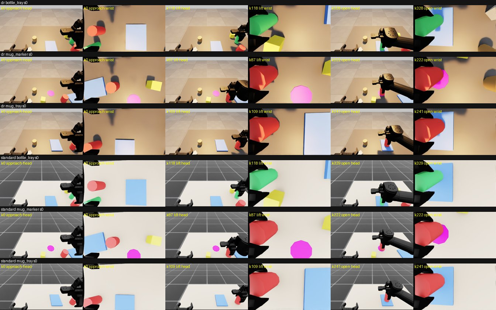

# R2 시뮬 데이터 생성기 — 30 Hz 기록·다과제·DR·LeRobot 내보내기·병렬 생성 (DEV 검증)

작성 2026-09-24 UTC(R7 2회차 K1 정정 — 처음엔 KST 날짜를 적었다), R2 구현 에이전트. 계획 `docs/superpowers/plans/2026-09-25-e2e-ready.md` 관문 R2. git 커밋 안 함. **큰 생성은 돌리지 않았다**(§8은 계획만).
근거: 정본 `00-interfaces.md` §34(D35 DR, random은 학습 금지), §47(로봇·카메라 복사), §48(CPU PhysX), §51–§63(특히 §57 머리 + 활성 손목, §58 융합, §59 이미지 배치, §61 확인 헤드, §62 우리 데이터 30 Hz), `r4_stageB.md` §5(R2 데이터 계약), `pool.md`, `random5.md`, `labels_v2.md`, `r1_perception.md`, `r5_closed_loop.md`.
파드 `p-test2/juhyoung-native-7a2a`, Isaac = `ir_run.sh IR_ROOT=cyclo`, **CPU PhysX, 렌더 GPU 0만(동시 ≤ 2 프로세스)**, GPU 1·2·3 안 씀, 다른 에이전트 프로세스 건드리지 않음. 시드 = **DEV 0–29만**(실제 사용 0–5). 모든 수치는 파이프라인 확인용 소규모 시험(§56) — 결과로 쓰지 않는다.

## 1. 결론

| 검증 항목 (사전 지시) | 결과 |
|---|---|
| DEV 소규모 생성: 시드 0–5 × 과제 3 × {standard, dr} × P0 = 36편 | **36편 생성, 구조 검사 36/36 통과, 성공(=학습 유효) 32/36**. mug_tray 12/12 · mug_marker 12/12 · bottle_tray 8/12 |
| 스키마 검사 `stageb_data.check_row(hz=30)` | **10,615행 전부 통과**(오류 0). R4 로더 `load_stageb`로 유효 32편 → 표본 9,256 · 결정 항목 4,690 적재 |
| 프레임 시트 `r2_frames.jpg`(< 300 KB) | **181 KB**, 직접 봄(§5) |
| 한 편 재생(기록한 action_exec, 물체 끝 자세 ≤ 5 mm) | **체인 재생 4/4 = 0.000 mm·관절 0.0 rad(비트 동일)**, 새 이력 재생 5/7 = 0.000 mm, 2/7 = 8.0 · 67.7 mm(PhysX 이력 의존, §4.3) |
| 처리량 | **프로세스당 편 17.6 s(≈ 205편/h)**, GPU 0에 2개 동시; 프로세스 시작 1회 160 s |
| 용량 | 원본(JPEG + jsonl + npz) **1.72 GB / 100편**, LeRobot 내보내기 **0.44 GB / 100편** |
| LeRobot v2.1 호환 | 내보내기 32편·9,288프레임·과제 3, **lerobot 0.3.3 `LeRobotDataset`로 읽힘**(영상 두 대 디코드, action 동일), 원본 JPEG 대비 PSNR ≥ 34.3 dB |
| random 금지 | `--variant random` → `ValueError`(생성 전 거부), TEST 시드 1000 → 거부(파드 CLI로 확인) |

## 2. 만든 것

### 2.1 30 Hz 기록 시각 (정확한 타이밍)
- 물리 dt 0.01 s(§37·§48 그대로)는 30 Hz로 나누어떨어지지 않는다 → 틱 k는 물리 서브스텝 **n_k = round(100k/30) = (10k+1)//3** 에 둔다(10k/3의 소수부는 0·1/3·2/3뿐이라 반올림 동점 없음). 틱 k의 명령은 **3·4·3 서브스텝(30/40/30 ms)** 동안 유지 → 3틱마다 정확히 100 ms, 기록 시각 t_k = n_k·10 ms는 이상적 k/30 s와 **0 또는 ±3.33 ms**(누적 없음). 300틱 = 정확히 10 s(테스트).
- 프레임 k = t_k의 상태(머리 672×376 + 우손목 424×240을 t_k에 렌더, JPEG q90, 원본 해상도), 행동 k = [t_k, t_{k+1})에 실제로 가해진 8-D 명령(7관절 위치 목표 rad + 그리퍼 패드 간격 목표 m). 마지막 프레임 K에는 행동이 없다(R4 행은 k < K만).
- 구현: env는 기존 decimation 5 그대로 두고 `snapshot.step_partial`로 3/4 서브스텝만 진행(풀과 같은 방식). env 자체 렌더는 끄고(`render_interval = 10^9`) 프레임마다 `capture()`로 렌더한다. 리셋 뒤 첫 프레임 전에 **렌더 8회 예열**(§4.4).
- 계획기(오라클 = 교사 S)는 30 Hz 틱마다 한 번 명령을 낸다: 속도는 초 단위 그대로(V·dt), 관절 스텝 제한 MAX_DQ(50 ms당 0.04 rad)는 dt 비례(30/40 ms → 0.024/0.032 rad), 쥠 디바운스 3스텝(20 Hz, 0.15 s) → 5틱(0.167 s). 기본값은 기존 20 Hz 동작 그대로(§4.5 회귀 확인).
- 결정 프레임 = 10틱마다(0.333 s 명목, 실제 간격 0.33/0.34/0.33 s; T_c = 0.33 s). `ds_id = ds{k//10}`.

### 2.2 기록 내용 (`harvest/datagen/gen.py record_episode` → `episode.finalize`)
- 프레임마다: 머리 + 우손목 RGB, 고유감각 `q`·`qd`·**`tau` = 팔 7관절 `applied_torque`(추가)**·`grip = [측정 패드 간격 m, 간격 속도 m/s(손가락 링크 속도로 계산)]`, 팔 관절 목표, 그리퍼 관절·토크, TCP, 전 물체 자세, 오라클 관측(obs.raw·술어·지지·근접 이력), FSM 단계, 텍스트 상태(`snapshot.text_state`, 과제별 계약 문장).
- 결정 프레임마다: **labels_v2** 답(과제 일반화, §3.2), `<folder>.labels_v2.jsonl`.
- 행마다: **aux.reg/aux.cls** = `perception/aux_labels.py`의 특권 기하를 R4 이름으로 사상(`g2tgt_*` = 대상−그리퍼, `g2goal_*` = labels_v2 Δ(소단계 목표까지 남은 변위), `tgt2place_*`, 술어 7개). 9,256행에서 회귀 null 0.
- **§61 확인 헤드 목표**(`verify`): 모든 프레임에 시험 술어 9개 참값(`truth`, E-M4b-meas 정의를 과제의 대상/놓을 곳으로 일반화) + 결정 프레임 k ≥ 10(과 마지막 프레임)에 `prev_step` = 직전 결정 스텝 [k−10, k) 단계의 `expected_after`(m4b.spec.EXPECT)가 **이 관측에서** 성립하는지(`holds`, 모르면 null)와 위반 목록. 헤드는 실행 **뒤** 관측을 보고 판정하므로 라벨을 그 관측 프레임에 붙였다. DEV 906회 확인, 기대 술어 2,380개 중 위반 78(명목 편에서도 단계가 스텝 안에서 바뀔 때 생김 — 예: descend로 시작한 스텝이 close로 넘어가면 `holding_t`·`gripper_open` 기대와 어긋남. 라벨은 참값 그대로 두고 판정 규칙은 소비자 몫).
- R4 계약 행(`<folder>.stageb.jsonl`, 키 (seed, kind, k)): `hz = 30`, `H = 15`, `arm = "right"`, `skill_id`(pick = approach…lift / place = carry…done), `phase_id`(FSM 단계), `proprio`, `action_exec = action_script`(잔차 없음, 교사 S), `valid`(끝 뒤 채움 = 마지막 행동 반복·0), `aux`, 추가 필드 `task`·`variant`·`decision`·`verify`.
- 파일 배치(폴더 = `<out>/<variant>/<task>/<kind>/`): `ep<seed>.jsonl`(프레임마다 풀 형식 줄 — R4 결합 대상, `oracle = null`), `ep<seed>.npz`(30 Hz 배열), `ep<seed>.meta.json`(마지막에 씀 = 완료 표지), `img/ep<seed>/f####_<cam>.jpg`, `rows/ep<seed>.{stageb,labels_v2}.jsonl`(에피소드별; 로더가 `ep*.jsonl`을 훑으므로 하위 폴더) → `check`가 유효 편만 모아 `<folder>.stageb.jsonl`·`<folder>.labels_v2.jsonl`(로더 형제 파일)로 합친다.

### 2.3 다과제 (`harvest/sim/tasks.py`)
| 과제 | 지시문 | 대상 → 놓을 곳 | DEV P0 성공 (std / dr) |
|---|---|---|---|
| `mug_tray`(기존) | Put the red mug on the blue tray. | o3 → o5 | 6/6 · 6/6 |
| `bottle_tray`(새 물체) | Put the green bottle on the blue tray. | o8(원기둥 r 2.5 cm) → o5 | 4/6 · 4/6 |
| `mug_marker`(새 놓을 곳) | Put the red mug on the magenta marker. | o3 → o11(탁상 표적 원판, 반지름 5 cm) | 6/6 · 6/6 |
| `box_marker`(실험용, 생성 목록 제외) | Put the yellow box on the magenta marker. | o9(직육면체, 면 정렬 파지 요) → o11 | 0/3 (standard, 옛 판) |

- **배치**: mug_tray는 `scene.sample_layout(seed)` 그대로(표준 풀·DEV와 동일). 새 과제는 (seed, 과제)로 따로 뽑음: 대상·놓을 곳 모두 우팔 탑다운 작업 영역(머그·트레이와 같은 규칙, 거리 ≥ 16 cm), 머그 o3는 대상이 아닐 때도 늘 탁상(방해물), 나머지 물체는 각 1/2 확률로 방해물 띠에, P2 물체 o10은 주차. DR 방해물 keep-out은 과제의 대상→놓을 곳 경로로(`randomize.placement_ok(path=)`). DEV 0–29 × 과제 전부에서 P2 등장 자리가 있음(테스트).
- **표적 o11**: 충돌체·강체·접촉 센서가 없는 **시각 전용** 원판(주차, 리셋 때 USD 자세만 이동 → 물리 무영향). 접촉은 가상: 물체의 **가장 낮은 점**(기울기 반영)이 탁상 4 mm 안이고 중심이 표적 중심 4 cm 안이면 `in_contact(a,o11)` → 기존 술어 `on(a,o11)`, 계획기 놓기 조건, 성공 술어가 그대로 작동.
- **계획기·술어·섭동·라벨 일반화**: `OraclePlanner`는 env.task에서 대상/놓을 곳을 읽고(높이·조이기 폭·직육면체 면 정렬 파지 yaw), `success_from_history(tgt, place)`, P1은 과제 대상 이동·P2는 과제 경로 옆, labels_v2(`task` 필드, 없으면 mug→tray), 텍스트 상태 계약 문장(`tasks.stages`). **모든 기본값은 기존 mug→tray 동작**(§4.5).
- **box_marker를 뺀 이유(체계적 원인 추적)**: 3/3이 lift에서 실패. 기록을 보면 50 mm 상자에 패드 간격이 64 mm로 닫히고(원기둥은 50 mm에 57.7 mm) 상자가 손가락 사이에서 돌고 기울며(seed 1: yaw −153° → −128°, 기울기 29°) 팔 IK가 따라가다 궤적이 크게 벗어났다. 복사한 RH-P12-RN(보조 손가락 강성 2)의 평면 파지 조정이 따로 필요하다 → 실험용으로 등록만 두고 `--tasks all`에서 제외. 대신 잘 조정된 머그 파지로 **새 놓을 곳 종류(탁상 표적)** 과제를 넣었다.

### 2.4 변형
- `--variant standard|dr`만 생성. **random은 `check_train_variant`가 생성 전 거부**(D35), 기존 `cli_pool` 거부도 유지. 한 프로세스 = 한 변형(env 장면이 변형별), 과제·시드는 에피소드마다 바뀜. 같은 시드의 standard/dr는 배치가 같다(짝 비교 가능, 프레임 시트에서 확인).

### 2.5 병렬 생성기·재개·검증 (`queue.py`·`validate.py`)
- 항목 = (variant, task, kind, seed). 여러 프로세스가 같은 목록을 돌며 `<out>/_queue/<item>.lock`을 `O_CREAT|O_EXCL`로 만든 쪽만 실행(Lustre 원자적). 완료 = `ep<seed>.meta.json` 존재 → 재시작 시 건너뜀(재개). `--stale-s`(기본 1,800 s)보다 오래된 미완료 잠금은 인수(죽은 워커). 시드 우선 순서라 중단해도 과제·변형이 고르게 남는다.
- 편마다 검사(`validate_episode`): 프레임 번호 연속·30 Hz 격자(±1 µs), 두 카메라 JPEG 전 프레임 존재·원본 크기(SOF 헤더), 행 = 비종료 프레임마다 1개·전부 `check_row(hz=30)`, labels_v2 = 결정 프레임과 정확히 일치, 확인 목표 존재, npz 길이·유한, 유지 서브스텝 합 = 에피소드 길이, (경고) 첫 프레임 렌더 과도. `valid_for_training = 구조 통과 ∧ 성공` — 실패 편은 지우지 않고 표시만(합본·LeRobot에서 제외, 실패 데이터로 재사용 가능).
- 워커 체인 로그 `<out>/_workers/<variant>_<host>_<pid>_<utc>.jsonl`: 그 프로세스가 만든 편의 순서(체인 재생용, §4.3).

### 2.6 LeRobot v2.1 변환기 (`lerobot_export.py`, 파드 `venv_e3st`: pyarrow + PyAV)
- ROBOTIS AI Worker 공개 데이터(§63)와 같은 구조·명명: `meta/info.json`(codebase_version v2.1, robot_type `ffw_sg2`, fps 30), `tasks.jsonl`, `episodes.jsonl`, `episodes_stats.jsonl`(이미지 통계 (3,1,1) 형식 포함), 우리 추가 `r2_episodes.jsonl`(episode_index → variant/task/kind/seed/원본 폴더), `data/chunk-000/episode_*.parquet`, `videos/chunk-000/observation.images.cam_head|cam_wrist_right/episode_*.mp4`(libx264 yuv420p, g 2, crf 18 — ROBOTIS와 같은 코덱).
- 열: `observation.state` [7관절 + 패드 간격], `observation.velocity`, `observation.effort` [팔 applied_torque 7 + 그리퍼 관절 토크], `action` = action_exec, `action_script`, `sim_time`(실제 틱 시각), `phase_id`, `skill_id`, `decision`, `next.done`, 표준 열. **`timestamp = frame_index / 30`**(LeRobot이 영상과 맞추는 값; 실제 시각과 0/±3.3 ms 차는 `sim_time`에).
- 검증: pyarrow·PyAV로 행 수·timestamp·영상 프레임 수·프레임 시각(허용 1e-4 s)·크기·원본 JPEG 대비 PSNR·npz 행동 일치 + **lerobot 0.3.3(v2.1 마지막 판) `LeRobotDataset(root=…)`로 실제 적재**(`/data/harvest/r2/pylib_lerobot`에 `--no-deps`로만 설치, venv 무변경).

## 3. 수정한 기존 코드 (모두 기본값 = 기존 동작)
- `sim/scene.py`: o11 표적(시각 전용 prim, 주차), `task` 인자·`set_seed(seed, task="mug_tray")`, `PRESENT_IDS`, 표적 자세 조회, DR 경로 전달.
- `sim/planner.py`: 대상/놓을 곳 일반화, `dt`·`hold_debounce` 속성(기본 = env.step_dt·3), 면 정렬 yaw, `success_keys`·`place_metrics`.
- `sim/perturb.py`: P1·P2가 과제 대상/경로 사용, 사건에 재생용 `obj`·`pose` 기록. `sim/oracle_state.py`: 표적 가상 접촉. `sim/snapshot.py`: 텍스트 상태의 과제 계약 문장·이름. `sim/randomize.py`: keep-out 경로 인자. `labels_v2.py`: 과제 일반화(대상·놓을 곳·높이·종료 술어).

## 4. 검증 세부

### 4.1 DEV 36편 (최종판, 파드 시계 21:49–21:57 UTC)
| | 편 | 성공(=유효) | 프레임 | R4 행 | labels_v2 결정 프레임 |
|---|---|---|---|---|---|
| standard | 18 | 16 | 5,231 | 5,213 | 531 |
| dr | 18 | 16 | 5,420 | 5,402 | 550 |
| 합 | 36 | **32** | 10,651 | 10,615 | 1,081 (유효 편 → 결정 항목 4,690) |

- 실패 4편(모두 bottle_tray): standard s2 `release`(놓은 뒤 병이 넘어짐), s3 `approach_ik`(descend 도달 오차 6.9 mm > 6 mm), dr s1·s2 `release`. 병은 쥔 채 20–24° 기울어(파지점이 위쪽) 놓을 때 넘어진다. 결과가 선행 이력에 따라 달라진다(옛 판에서는 s3·s4 실패). → 큰 생성 전 병 파지 조정 권장(§8).
- 유효 편 한 편 평균 296프레임(9.8 s 시뮬), 결정 프레임 약 29개.
- labels_v2 분포(유효 편): target o3 388 · o5 266 · o8 140 · **o11 144**, phase continue 694 · next 237 · hold 7, mag xlarge 558 · large 200 · medium 85 · small 55 · tiny 40. 로더의 DecCall 보기 목록에 새 대상 o8·o11이 들어가고 정답이 보기 안에 있음(LabelsV2 소스 검사 통과).
- 부가 확인 P1/P2(standard, 시드 0–1, 과제 3 = 12편, 과제별 선행 실행 도입 전 판): 성공 10/12, 사건이 과제 대상(P1: o3/o8)·과제 경로 옆(P2: o10)에 정확히 걸림.

### 4.2 R4 계약·로더
- 10,615행 전부 `check_row(hz=30)` 통과, 30 Hz 아닌 hz로 검사하면 거부(테스트).
- 파드 `venv_train`에서 `load_stageb(<folder>, dev_val_seeds={5})`로 6폴더 → 표본 9,256(val 1,698), 결정 항목 4,690(질문 5개), 문맥 이미지 표지 `head camera:` → `right wrist camera (active arm):`(§59 배치). `ActionNorm.fit`, 어휘(skill pick/place, phase 9개) 정상.

### 4.3 재생 (기록한 action_exec만으로, 계획기 없이)
| 재생 | 이력 | 결과 |
|---|---|---|
| standard mug_tray s0 (스모크) | 새 이력(warmup + 선행 실행) | 0.000 mm, 관절 0.0 |
| dr bottle_tray s1 (옛 판) | 새 이력 | 0.000 mm |
| standard mug_marker s3 (옛 판) | 새 이력 | 0.000 mm |
| standard mug_tray P2 s1 (사건 쓰기 포함) | 새 이력 | 0.000 mm |
| standard bottle_tray P2 s0 (과제 선행 실행 도입 뒤) | 새 이력 | 0.000 mm |
| standard bottle_tray P2 s0 (도입 전, 직전 편에서 병이 탁상 밖으로 떨어짐) | 새 이력 | **67.7 mm**, 101프레임(쥐기 시작)부터 갈라짐 |
| standard mug_tray s4 (최종판) | 새 이력 | **8.0 mm**, 138프레임부터 |
| standard mug_tray s4 (최종판) | **체인**(같은 프로세스의 앞 12편 재구성) | **0.000 mm, 관절 0.0** |
| dr bottle_tray s4 / dr mug_marker s5 (최종판) | 체인(앞 13 / 17편) | **0.000 mm / 0.000 mm** |

- 해석: 기록은 정확하다(같은 PhysX 이력을 만들면 비트 동일). 새 이력 재생이 틀어지는 것은 **PhysX가 리셋 너머로 들고 가는 이력**(pool.md §2의 쌍별 접촉 자료 문제) 때문이다. pool.md의 고정 선행 실행(머그 과제, carry에서 끊음)은 머그만 쓰는 이력에서 검증된 것이라, 병을 만지거나 떨어뜨린 편 뒤에는 부족했다. 조치: (1) 과제별 두 번째 선행 실행(같은 과제 DEV 0, carry에서 끊음) — 병 P2 사례를 0.000 mm로 되돌림, (2) 그래도 남는 경우(mug_tray s4)를 위해 **체인 재생**(`replay --chain`: 워커 체인 로그대로 앞 편들을 선행 실행 + 기록 행동으로 다시 돌린 뒤 대상 편 재생)으로 어떤 편이든 정확 재현. 결과 라벨(재실행 복원 방식의 labeler)을 R2 데이터 위에 돌리려면 체인 방식이나 프로세스당 한 편 규칙이 필요하다.

### 4.4 첫 프레임 렌더 과도 (프레임에서 발견, 고침)
- 옛 판 시트에서 dr mug_tray s1의 k0 머리캠이 뿌옇게 보였다. 전수 측정: dr에서 **새 시드의 첫 편(mug_tray s1–s5)** 만 k0→k1 머리캠 평균 차 9–39 회색조(움직임만 있을 때 1.7–3.7), 4프레임에 걸쳐 수렴 — 새 재질·HDR·조명 적용 직후 렌더러 노출/누적 적응. 같은 시드의 다음 과제와 standard는 정상.
- 조치: 리셋 뒤 k0 전에 렌더 8회(물리 스텝 없음 — 궤적 동일 확인: 최종판 성공·프레임 수가 앞 판과 같음). 최종판 36편 최대 k0→k1 차 **2.89**. 검사기에 경고 항목(> 8) 추가.

### 4.5 기존 동작 회귀
- 공용 모듈을 고친 뒤 기존 20 Hz 경로(`run_dev dev --variant standard --kind P0 --seeds 0-9`)가 이전 random5 판과 **10/10 비트 동일**(단계 시각·파지 상대 위치·놓인 거리 전부 같음).
- 로컬 `cd D:/qdd && python -m pytest -q` 전부 통과(새 테스트: `tests/sim/test_tasks_logic.py` 과제·배치·keep-out·P2 자리·면 정렬·가상 접촉·기운 물체 최저점, `tests/test_labels_v2_tasks.py`, `tests/datagen/` 30 Hz 격자·청크·aux 사상·확인 목표·R4 행·finalize→validate→merge→`load_stageb` 종단·LeRobot 열·큐 잠금/재개/인수·시드/random 거부). 파드 사본에서도 해당 테스트 통과.

## 5. 프레임 확인 — `r2_frames.jpg` (181 KB)



행 = {dr, standard} × {bottle_tray, mug_marker, mug_tray}, 시드 0(여섯 편 모두 성공), 열 = 시작(k0) / 쥐고 든 순간(첫 lift) / 놓는 순간(첫 open) × (머리 | 우손목). 직접 보고 확인한 것:
- 모든 행에서 lift 열의 우손목캠에 대상(초록 병 / 빨간 머그)이 손가락 사이에 있고, open 열에서 대상이 놓을 곳 위(병·머그 → 파란 트레이, 머그 → 자홍 표적 원판)에 있다. 머리캠 open 열에서도 같은 위치.
- mug_marker: 자홍 표적이 노란 상자·초록 병(방해물)과 뚜렷이 구분된다(옛 주황 표적은 밝은 standard 장면에서 노란색으로 보여 상자와 헷갈렸다 → 색 변경).
- dr: 베이지 카펫 탁자, 따뜻한 키 조명, 뒤쪽 황갈색 원기둥 방해물, HDR 배경이 standard와 다르고 물체 배치는 같다(짝). dr 조명에서 트레이가 흰색에 가깝게 과노출(random5.md에서 이미 기록된 것).
- 머리캠은 팔이 오른쪽을 가리지만 탁상 작업 영역이 보이고, 손목캠 k0에서 대상·놓을 곳이 보인다.

## 6. 처리량·용량 (DEV 최종판, GPU 0에 프로세스 2개 동시, 파드 load 60–70/128코어)
- 편당 벽시계 **17.1 s**(평균, 기록 14.6 s + 선행 실행 2.5 s) + 파일 쓰기·검사 ≈ 0.5 s → **≈ 17.6 s/편 = 약 205편/h/프로세스**. 시뮬 9.8 s/편 → 기록 중 RTF ≈ 0.67. 프로세스 시작(앱 기동 + warmup) 1회 ≈ 160 s.
- 기록 시간 분해(편 예시): 렌더 ≈ 60 %(2카메라 ≈ 40–50 ms/프레임), JPEG 인코딩 ≈ 17 %, 물리 ≈ 17 %, 계획기 ≈ 4 %.
- 원본 **17.2 MB/편 → 1.72 GB/100편**(대부분 JPEG). LeRobot **4.4 MB/편 → 0.44 GB/100편**, 변환 4.1 s/편(CPU 1프로세스).

## 7. 재현 명령
```
# 파드: 코드 사본 /data/harvest/code_r2, 실행기 /data/harvest/r2/run.sh (ir_run.sh IR_ROOT=cyclo, CUDA_VISIBLE_DEVICES=0, HOME/TMPDIR/캐시 전부 /data/harvest)
cd /data/harvest/r2
./run.sh dev3_std gen --out /data/harvest/r2/dev --variant standard --tasks all --kinds P0 --seeds 0-5   # 여러 개 띄워도 됨(잠금 공유)
./run.sh dev3_dr  gen --out /data/harvest/r2/dev --variant dr       --tasks all --kinds P0 --seeds 0-5
./run.sh rp replay --chain --out /data/harvest/r2/dev --variant standard --task mug_tray --kind P0 --seed 4
# 순수 단계 (venv_e3st, PYTHONPATH=/data/harvest/code_r2[:/data/harvest/r2/pylib_lerobot])
python -m harvest.datagen.gen check --out /data/harvest/r2/dev          # 검사 + 합본 + check.json
python -m harvest.datagen.gen sheet --out /data/harvest/r2/dev --dst /data/harvest/r2/r2_frames.jpg --seed 0
python -m harvest.datagen.lerobot_export export --src /data/harvest/r2/dev --dst /data/harvest/r2/dev_lerobot
python -m harvest.datagen.lerobot_export verify --src /data/harvest/r2/dev --dst /data/harvest/r2/dev_lerobot
```

## 8. 단계 B 학습용 대량 생성 계획 (실행하지 않음 — 사용자/정본 확인 필요 → 정본 §66에서 확정, 생성은 S-E2E 이후)
- **시드 범위(새로 필요)**: `R2_TRAIN_SEEDS = 10000–59999`를 [제안]으로 코드에 두었다(CAL 500–549·TEST 1000–1149·TEST-P5 1300–1329·POOL 2000–2119·randomize 논리 시험 500–699와 겹치지 않음, 테스트). `--confirm-train` 없이는 거부. 분할 = 시드 % 20 == 0 → `eval`(5 %), 나머지 `fit`(단계 A/B 로더의 train/val). 정본에 시드 범위 한 줄을 넣은 뒤 연다. → **정정(R7 3회차 L2)**: 정본 §66이 R2_TRAIN = 10000–59999를 확정했다(더는 [제안] 아님). 시험 시드는 커밋 b4a58ce에서 3000–3199로 옮겼다 — 500–549는 CAL이라 '500–699'는 틀린 서술이었다.
- **제안 N = 6,000편**: 시드 10000–10999(1,000개) × 과제 3 × {standard, dr}; 섭동은 시드 띠로 P0 10000–10599 · P1 10600–10799 · P2 10800–10999(명령 세 번). 예상 유효 ≈ 5,300편(DEV P0 32/36, P1·P2 10/12 기준) ≈ **157만 프레임 = R4 표본**, 결정 항목 ≈ 78만(유효 편당 147).
- **시간**: 6,000 × 17.6 s ≈ 29 프로세스·시간 → GPU 0에 2개면 **약 15 h**, GPU 1(계획서 배분: Isaac 렌더, ≤ 3)까지 4개면 **약 7–8 h**(렌더 경합으로 다소 늘 수 있음). 먼저 1시간 파일럿(≈ 400편) 뒤 `check`로 성공률·경고를 보고 본 생성.
- **용량**: 원본 ≈ 103 GB + LeRobot ≈ 26 GB(`/data` 여유 34 TB). 변환 1프로세스 ≈ 6.8 h → (variant, task)별 6개 데이터셋으로 나눠 병렬(≈ 1.1 h) 권장.
- **그 전에 할 것**: (1) bottle_tray 성공률 8/12 — 파지 높이/조이기 조정 또는 수율 감수 결정, (2) box_marker(직육면체) 파지 조정 뒤 과제 추가 여부, (3) 결과 기반 라벨(재실행 복원)을 R2 데이터에 붙일 계획이면 체인 재생 또는 "프로세스당 한 편" 규칙, (4) 텍스트 상태 머리줄 `f<N>`은 기존 풀과 같은 20 Hz 단위 번호(t/0.05)라 30 Hz 프레임 번호와 다르다 — 프롬프트 판본을 바꿀지 결정(바꾸면 단계 A와 바이트 일치가 깨짐). → **처리(정본 §66)**: (1) 병 수율 약 67 % 감수·실패 편 제외, (2) box_marker 제외(실험용 등록만), (3) 결과 기반 라벨은 거부권 용도(§65)라 필수 아님 — 붙일 때는 체인 재생, (4) `f<N>` 20 Hz 번호 유지(단계 A 바이트 일치), 시간은 `t=` 초.

## 9. 한계·주의
- 교사는 오라클(특권 상태) 스크립트 계획기다. 이미지는 렌더 참값(인식 잡음 없음). §56대로 모든 수치는 파이프라인 확인용.
- 새 이력 재생은 이력 의존(§4.3) — 체인 재생으로만 비트 재현 보장.
- `verify` 위반 78건은 단계 경계에서 생기는 명목 편의 기대 불일치를 포함한다(라벨은 참값 그대로).
- box_marker 미완(§2.3). random 5축은 평가 전용이라 이 데이터에 없다.
- 옛 판 산출물은 지우지 않고 `/data/harvest/r2/superseded/`에 이유와 함께 두었다(`README.txt`).

## 10. 파일
- 새 코드: `harvest/sim/tasks.py`, `harvest/datagen/{__init__,timing,rows,episode,validate,queue,gen,lerobot_export}.py`
- 수정: `harvest/sim/{scene,planner,perturb,oracle_state,snapshot,randomize}.py`, `harvest/labels_v2.py`
- 테스트: `tests/sim/test_tasks_logic.py`, `tests/test_labels_v2_tasks.py`, `tests/datagen/{__init__,test_timing_rows,test_episode_files,test_gen_guards}.py`
- 문서: 이 파일, `r2_frames.jpg`
- 파드(전부 `/data/harvest` 아래): 코드 `code_r2/`, `r2/run.sh`·`r2/logs/`, DEV `r2/dev/`(+ `_queue`, `_workers`, `check.json`), LeRobot `r2/dev_lerobot/`, 부가 `r2/dev_pert/`·`r2/dev_pert2/`·`r2/smoke*/`·`r2/try1/`(box 시험)·`r2/regress20hz/`, 옛 판 `r2/superseded/`, lerobot 검증용 `r2/pip/`·`r2/pylib_lerobot/`.
- **/data 밖**: 파드 없음(ir_run.sh 덮어씌우기 + HOME/TMPDIR/캐시 /data). 로컬은 `D:\qdd`와 임시 `D:\tools\scratch_qdd\r2\`·`pt_r2\`(pytest basetemp)만. C: 쓰지 않음.
