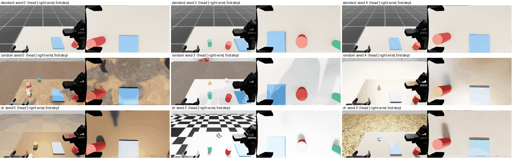

# random 5축 평가 장면 + 학습용 도메인 무작위화(DR) — v2 Isaac 장면

실행 2026-09-24 14:40–15:25 UTC(KST 23:40–00:25, 파드 `juhyoung-native-7a2a`, **GPU 1만**, CPU PhysX). 정본 근거: 00-interfaces §34(D35 — 학습 데이터에 DR을 넣는다, random 시험 장면은 학습에 쓰지 않는다), §47(로봇·카메라 = challenge-env 복사본), §48(CPU PhysX), §52 잠정 결정 2(random 5축을 우리 Isaac 장면에 구현), EVAL-evaluation-design.md §2.1(RoboDojo `_random` 정의: 탁자 위 방해물, 탁자 재질, 바닥 재질, 조명(종류·세기·색온도), HDR 배경, 배치는 seed로 고정).
**시드: DEV 0–29만** 사용(TEST 1000–1149 · TEST-P5 1300–1329 · POOL 2000–2119는 실행하지 않음. 순수 로직 테스트는 DEV 0–29와 예약되지 않은 500–699만 씀). **정정(R7 2회차)**: 500–549는 CAL이라 '예약되지 않은'은 틀린 서술이었다(시뮬 실행이 아닌 순수 로직 시험이라 CAL 오염은 없음). 시험 시드는 커밋 b4a58ce에서 3000–3199로 옮겼다.

## 1. 결론

- `make_env(seed, ..., variant='standard'|'random'|'dr')` 구현. **standard는 오늘 장면 그대로**(이번 코드로 돈 DEV 0–29 P0 30판이 이전 `t11_12_v2/final_cpu/dev_P0.jsonl`과 단계 시각·놓인 거리까지 30/30 동일).
- **random = TEST 풀**, **dr = TRAIN 풀**에서 5축을 시드로 결정적으로 뽑는다. 두 풀은 자산 파일·이름·색 값·수치 구간이 하나도 겹치지 않는다(테스트로 강제). 뽑은 값은 에피소드 메타데이터(`randomization`)에 전부 기록된다.
- 오라클 플래너(특권 상태) 성공률: **P0 standard 30/30 · random 30/30 · dr 30/30**, 추가로 P2 random 30/30 · dr 30/30. 방해물이 움직인 판 0(정착 뒤·에피소드 중 모두 0.0 mm). 예상대로 성공률은 standard와 같다.
- 프레임 시트 `random5_frames.png`(198 KB)를 직접 봤다: 조명·HDR 배경·탁자/바닥 재질이 눈에 띄게 바뀌고, 방해물이 탁자 위에 있다(§6).

## 2. 무엇을 만들었나 (코드)

| 파일 | 내용 |
|---|---|
| `harvest/sim/randomization_pools.json` (새) | TEST/TRAIN 풀(자산 경로·수치 구간·공통 설정). sha256 `842da6ad…`, 코드 digest `b0b016ed5b37dcef`(메타데이터 `pools_digest`) |
| `harvest/sim/randomize.py` (새) | 순수부: `sample_randomization`(축마다 독립 RNG `[seed, 31, variant, axis]`), `placement_ok`(keep-out), `distractor_geom`, `look_at_quat`, `validate_meta`, `check_train_variant`. Isaac부: 방해물 강체 cfg·스포너, 탁자 재질 스포너, 바닥판·키 조명 생성, 시드별 적용, 방해물 위치 보고 |
| `harvest/sim/scene.py` | `variant` 인자(기본 standard). random/dr일 때만: 방해물 강체 추가, 탁자 스폰 함수 교체(같은 cuboid·충돌·마찰·자세 + 자체 재질), 리셋 때 방해물 배치(한 번 쓰기), 리셋 전 시각 적용, 정착 뒤 방해물 위치 기록 |
| `harvest/sim/planner.py` | `run_episode` 결과에 `variant`·`randomization`·`rand_settle`·`rand_moved` 추가 (`randomization_meta`) |
| `harvest/cli_pool.py` | 스냅샷 에피소드 메타(`ep<seed>.meta.json`)에 같은 필드, `--variant` 인자. **pool 모드는 `random`을 거부**(`check_train_variant`, D35) |
| `harvest/sim/run_dev.py` | `dev --variant`, `r5frames`(프레임+RTF), `r5calib`(조명 기준 세기 보정) |
| `tests/sim/test_randomize_logic.py` (새, 24건) | 시드 결정성, 풀 분리(파일·이름·색·구간), 풀 안에서만 뽑힘·풀 전 항목 사용, keep-out(DEV 0–29 + 500–699(→ 3000–3199, 4줄 정정), random/dr), 메쉬 맞춤 크기, 메타 스키마·검증기, 학습용 random 거부, 조명 방향 |

로봇·카메라·게인·질량은 손대지 않았다(`_robot_cfg`·`_default_camera_cfgs` 무변경, `fix_root_link=True`만 기존대로). 물리 변경은 방해물 자기 충돌체뿐이다(아래 §7-3의 비트 동일성 메모 참고).

## 3. 5축과 풀

자산은 전부 **Isaac Sim 5.1.0 번들 파일**(cyclo rootfs의 `/isaac-sim/extscache/…`, 읽기 전용)이다. `/data/juhyoung_infra/isaac_assets`에는 `Isaac/Environments/Grid`만 있고 Nucleus 미러가 없어서 번들 안에서 골랐다(HDR 전체 탐색 결과 환경맵으로 쓸 수 있는 것이 4장뿐).

| 축 | random (TEST 풀) | dr (TRAIN 풀) |
|---|---|---|
| 탁자 재질 (OmniPBR, 텍스처는 월드 투영) | 마호가니 마루(`mahogany_floorboards.png`), 필드스톤(`Fieldstone_BaseColor.png`), 흰 라미네이트(색), 브러시드 스틸(색, metallic 0.9) | 나무 바닥(`wooden_floor.jpg`), 베이지 카펫, 벽돌(`brick.jpg`), 아노다이즈 알루미늄, 검은 라미네이트(색), 회색 플라스틱(색) |
| 바닥 재질 (8 × 8 m 시각 전용 판, 격자 바닥의 보이는 메쉬는 숨김·충돌 평면은 그대로) | 아스팔트(`set1superalbedo.TGA`), 스크래치 0, 슬레이트(색) | 낙엽, 물웅덩이, UV 격자, 스크래치 2, 체커보드, 황갈색(색) |
| HDR 배경 (돔 조명 텍스처, latlong) | `StinsonBeach.hdr`, `photo_studio_01_4k.hdr` | `CarLight_512x256.hdr`, `sunflowers.hdr` |
| 방해물 (1–3개) | 메쉬: YCB 크래커 상자(`003_cracker_box.usd`, 자체 텍스처), 스탠퍼드 버니(`bunny.usd`); 원시: 구(r 3.5 cm), 원뿔(r 3.5, h 8 cm) | 메쉬: 컵(`Cup.geom.usd`), 서빙 그릇(`serving_bowl.usd`), 농구화, 야구모자(`Worker/Props/Meshes`); 원시: 캡슐, 직육면체, 원기둥 |
| 방해물 색 (자체 재질 없는 것) | 주황, 흰색, 분홍, 청록 | 갈색, 회색, 검정, 하늘색, 올리브 |
| 조명 종류 | sphere · disk · rect · cylinder · distant (두 풀 공유) | 같음 |
| 키 조명 세기 배수 | [0.7,0.9] ∪ [1.1,1.3] ∪ [1.5,1.7] | [0.5,0.7] ∪ [0.9,1.1] ∪ [1.3,1.5] |
| 돔(HDR) 세기 배수 | 위와 같은 구간 | 위와 같은 구간 |
| 색온도 (키 조명) | 3300–3900 · 4500–5100 · 5700–6300 · 6900–7500 K | 2700–3300 · 3900–4500 · 5100–5700 · 6300–6900 K |
| 키 조명 방위각 (탁자 중심 기준, 0° = +x 앞) | [−90°, 0°] ∪ [90°, 180°] | [−180°, −90°] ∪ [0°, 90°] |

공통(두 풀 같음): 방해물 수 1–3, 키 조명 고도 35–75°, 거리 1.2–2.0 m(탁자 중심 (0.50, −0.10, 0.85)을 향함), 돔 회전 0–360°, 메쉬는 수평 최대 9 cm·높이 최대 10 cm로 맞춤, 방해물 질량 0.15 kg·마찰 0.8.

- **조명 종류는 공유**한다(자산이 아니라 종류가 5개뿐). 대신 세기·색온도·방위각은 **엇갈린 비중첩 구간**으로 나눴다 — test 값이 학습에서 나온 적이 없고, 범위 끝으로 몰지 않아 외삽만 재는 시험이 되지 않는다.
- **기준 세기 보정**(`run_dev r5calib`, 2026-09-24 UTC): 조명 하나만 켜고(나머지 0) 로그 세기 이분 탐색으로 머리캠 평균 밝기가 standard 조명(돔 2500, 색 0.9)과 같아지는 세기를 찾았다: sphere 4.6e6 · disk 1.15e6 · rect 1.0e6 · cylinder 1.5e6 · distant 3200, Stinson 3370 · studio 1320 · CarLight 1760 · sunflowers 3130. 실제 세기 = 기준 × 0.5(키·돔 각각) × 배수.
- 농구화·야구모자는 번들 재질이 번들에 없는 텍스처(`./T…`)를 가리켜서 풀 색으로 다시 칠한다(JSON `material_note`).

### 배치 (keep-out, planner·perturb 기하 재사용)
방해물 중심 (x, y)는 다음을 모두 만족할 때까지 다시 뽑는다(3000회, 실패 시 그 방해물 제외·`distractors_dropped` 기록 — DEV 0–29와 500–699에서 제외 0건(당시 실측; 시험 시드는 이후 3000–3199, 4줄 정정)):
1. 탁자 안(가장자리 1 cm + 반지름), 배치 상자 x 0.30–0.80, y −0.55–0.33.
2. **경로 + P2 스폰 띠 밖**: 머그→트레이 선분까지 거리 ≥ `P2_LATERAL_M[1]`(0.13) + o10 반지름 + 자기 반지름 + 2 cm. P1의 2 cm 이동도 이 띠 안이다.
3. 머그·트레이·o8·o9(standard 배치 그대로)와 반지름 합 + 3 cm, 먼저 놓인 방해물과 + 2 cm.
- 방해물 높이 ≤ 10 cm(운반 높이 TCP 20 cm, 기존 "모든 방해물 < 10 cm" 가정 유지). 뽑힌 방해물 수: random 1개 9판·2개 8판·3개 13판, dr 14·8·8판.

### 메타데이터 (`randomization`, 스키마 `qdd.randomization/v1`)
`schema, seed, variant, pool('test'|'train'|null), pools_digest, table_material{name, texture|color, …}, floor_material{…}, light{type, intensity, intensity_mult, color_temperature_k, azimuth_deg, elevation_deg, distance_m, pos, target, quat_wxyz, shape}, hdr{name, file, intensity, intensity_mult, rotation_deg}, distractors[{name, kind, xy, yaw, footprint_r, height, half_height, dims, color}]`. standard는 축 필드가 모두 null. 에피소드 결과에는 추가로 `variant`, `rand_settle`(정착 뒤 방해물의 샘플 위치 대비 mm), `rand_moved`(정착 뒤 → 에피소드 끝 이동 mm). `validate_meta()`로 검사.

## 4. 성공률 (오라클 플래너, 카메라 끔, CPU PhysX)

| 섭동 | standard | random | dr |
|---|---|---|---|
| **P0** | **30/30** | **30/30** | **30/30** |
| P2 (추가 확인) | 30/30 (이전 v2 결과) | 30/30 | 30/30 |

| 지표 (P0) | standard | random | dr |
|---|---|---|---|
| 시뮬 시간 중앙값 (최대) | 8.8 s (9.8) | 8.875 s (9.75) | 8.8 s (9.75) |
| 머그–트레이 중심 거리 중앙값 (최대) | 12.7 mm (28.2) | 12.3 mm (28.0) | 12.3 mm (28.1) |
| 트레이 밖 | 0 | 0 | 0 |
| 방해물 이동 (정착 / 에피소드) | — | 0 / 0판 (64개) | 0 / 0판 (54개) |
| **RTF 카메라 끔** 중앙값 (범위) | **4.09** (3.82–4.26) | **4.02** (3.83–4.19) | **4.12** (3.91–4.26) |
| **RTF 머리+우손목 렌더** 중앙값 (범위, 시드 0–4) | 1.18 (0.86–1.20) | 1.18 (0.85–1.40) | 1.17 (1.16–1.25) |

- P2: o10이 나타난 자리와 방해물 사이 최소 여유(반지름 뺀 거리) random 7.3 cm, dr 11.2 cm — keep-out이 P2 띠와 겹치지 않음을 실측으로도 확인.
- RTF는 파드 부하가 큰 상태(load 60–90, 다른 에이전트 Isaac 6개 동시 실행)에서 세 변형을 동시에 돌려 잰 값이다. 변형 사이 차이는 잡음 수준이다.
- 결과 원본(파드): `/data/harvest/out/random5/dev/dev_P0{,_random,_dr}.jsonl`, `dev_P2_{random,dr}.jsonl`, 프레임 실행 `/data/harvest/out/random5/fr3/`, 보정 `/data/harvest/out/random5/r5calib_{random,dr}.json`.

## 5. 성공률이 그대로인 이유와 짝 비교

오라클은 특권 상태만 쓰므로 시각 축은 영향이 없고, 방해물은 경로·P2 띠 밖에 있어 한 번도 닿지 않았다(`rand_moved` 전부 0). 같은 시드에서 standard와 비교하면 단계 시각이 완전히 같은 판이 random 16/30, dr 16/30이고 나머지는 시뮬 시간 −0.2~+0.25 s, 놓인 거리 ±10.5 mm 차이다. 방해물이 닿지 않는데도 궤적이 비트 단위로 같지 않은 것은 장면에 강체가 늘어 PhysX의 풀이 순서·부동소수가 달라지기 때문으로 본다(standard끼리는 이전 실행과 30/30 비트 동일). 성공/실패에는 영향이 없다.

## 6. 프레임 확인 — `random5_frames.png`



행 = standard / random / dr, 열 = 시드 0 · 3 · 4 × (머리캠 | 우손목캠), 첫 스텝. 직접 보고 확인한 것:
- **조명·HDR**: random 시드 3은 스튜디오 HDR(의자·흰 벽)이 머리캠 위쪽에 보이고, 시드 0은 아스팔트 바닥 위로 해변 HDR, dr 시드 0은 CarLight 스튜디오의 따뜻한 빛. 키 조명 그림자 방향과 색온도가 판마다 다르다(손목캠에서 그림자 위치가 다름).
- **재질**: 탁자 = 필드스톤(random 0), 흰 라미네이트(random 3), 브러시드 스틸(random 4, 금속 반사로 밝게), 검은 라미네이트(dr 0, 강한 조명에 갈색 톤), 알루미늄(dr 3), 베이지 카펫(dr 4). 바닥 = 아스팔트·체커보드(dr 3)·낙엽(dr 4) 등.
- **방해물**: random 0 크래커 상자·버니(분홍)·구(청록), random 3 원뿔·구(분홍), random 4 원뿔, dr 0 원기둥(+ 직육면체는 x 0.32로 화면 왼쪽 아래 가장자리), dr 3 농구화, dr 4 야구모자. standard의 o8·o9(초록 병·노란 상자)는 세 변형 모두 같은 자리(배치는 시드 고정).
- 머그(빨강)·트레이(파랑)는 모든 판에서 보인다. 단 standard 자체가 밝게 노출된 장면이라(standard 머리캠 평균 밝기 139, 우손목 207) 보정 목표를 standard에 맞춘 random/dr도 밝은 판(스틸 탁자, dr 3·4)에서 트레이가 하얗게 보일 만큼 과노출된다. 인식 실험(E3)에서 이 과노출이 문제가 되면 standard와 함께 노출을 다시 정해야 한다.

## 7. 부딪힌 문제 (재발 방지)

1. **실행 중 강체 prim의 재질 바인딩을 바꾸면 PhysX가 그 prim을 다시 읽어 USD 자세(주차 위치)로 되돌린다.** 첫 구현(시드마다 방해물에 색 재질을 다시 바인딩)에서 시드 0의 구·시드 1의 원뿔이 배치 직후 20스텝 안에 주차 자리(−3.6, 3.6)로 돌아갔다(`dbg_place.py`). → 시드마다 바뀌는 재질은 **스폰 때(물리 시작 전) 한 번만 바인딩**하고 이후에는 셰이더 입력(텍스처·색·거칠기·금속성)만 바꾼다. 탁자도 같은 이유로 자체 재질을 스폰 때 붙인다(스폰 함수만 교체, 크기·충돌·마찰·자세 동일).
2. **조명 prim을 보이지 않게 했다가 다시 보이게 하면 렌더러가 그 조명을 다시 켜지 않았다.** 첫 보정에서 키 조명 세기를 1e4→1e7로 바꿔도 밝기가 21→24로 거의 그대로였다. → 끄기는 세기 0으로만 한다(가시성 토글 제거). 고친 뒤 sphere 1e5→1e7에서 밝기 30→162.
3. **Mesh가 기본 prim인 USD를 Xform 타입 prim에 참조하면 형상이 사라진다**(농구화·모자 경계 상자가 비어 스케일 5e7). → 참조 받는 prim을 타입 없이 정의.
4. (참고) 메쉬 단위·위축: 버니(cm, Y-up)·컵(cm)은 참조 뒤 잰 경계 상자로 맞춤 배율을 정하므로 단위 자동 보정 여부와 무관하다(실측: 이 빌드는 `unitsResolve` 연산을 붙이지 않음, 버니는 코드에서 X축 +90° 회전).

## 8. 편차·한계

- **풀이 작다**: 번들에 쓸 만한 HDR이 4장뿐이라 풀마다 2장, 메쉬 방해물 test 2 · train 4. RoboDojo 원본 자산 규모와 다르다. Nucleus/공식 자산 팩을 파드에 들이면 JSON만 늘리면 된다(코드 변경 없음).
- **조명 종류 공유**(§3). 수치 구간은 분리.
- **random 장면 방해물은 경로·P2 띠 밖에만 놓인다**(지시된 keep-out). 그래서 가림은 주로 먼 쪽·왼쪽 띠에서만 생기고 경로를 막지 않는다 — 오라클 성공률이 그대로인 이유이자, 이 장면의 random이 "경로 위 방해"는 재지 않는다는 한계.
- **스냅샷 복원**(`snapshot.save_state`)은 `env.objects`(o3–o10)만 담고 random/dr 방해물은 담지 않는다. 방해물이 한 번도 움직이지 않아 지금은 영향이 없지만, dr 풀 생성에서 방해물이 움직이는 경우가 생기면 복원 대상에 넣어야 한다.
- 비트 동일성: random/dr은 standard와 같은 시드라도 궤적이 비트 단위로 같지 않다(§5).
- 과노출(§6)은 standard에서 물려받은 것이다.
- 파드 테스트 스위트(`pod_sync.sh`)는 돌리지 않았다: `/data/harvest/code`를 다른 에이전트 실행이 쓰고 있어 내 사본을 `/data/harvest/code_r5`에 따로 두었다. 로컬 `python -m pytest -q` 전부 통과.

## 9. 재현 명령

```
# 파드 (모든 파일 /data 아래, GPU 1, CPU PhysX)
cd /data/harvest/ir && CUDA_VISIBLE_DEVICES=1 IR_ROOT=cyclo IR_INST=<inst> ./ir_run.sh env HOME=/data/harvest/home \
  TMPDIR=/data/harvest/tmp XDG_CACHE_HOME=/data/harvest/cache WARP_CACHE_PATH=/data/harvest/cache/warp \
  PYTHONPATH=/data/harvest/code_r5 /isaac-sim/python.sh -m harvest.sim.run_dev dev --variant {standard|random|dr} \
  --kind P0 --seeds 0-29 --out /data/harvest/out/random5/dev
#   ... r5frames --variant V --seeds 0-4 --out /data/harvest/out/random5/fr3     (프레임 + 렌더 RTF)
#   ... r5calib  --variant {random|dr} --out /data/harvest/out/random5           (기준 세기 보정)
# DR 학습 데이터: python.sh -m harvest.cli_pool pool --variant dr ...  (random은 거부됨)
```

## 10. /data 밖에 쓴 것

- 파드: 없음. 모든 실행은 `ir_run.sh`(chroot `/tmp`·`~/.nvidia-omniverse`를 `/data/harvest/ir/kitcache/cyclo-<inst>`로 덮음) + `HOME`·`TMPDIR`·캐시를 `/data/harvest` 아래로 주고 돌렸다. 코드 사본 `/data/harvest/code_r5`, 점검 스크립트 `/data/harvest/random5/`, 결과 `/data/harvest/out/random5/`.
- 로컬: `D:\qdd`(코드·문서)와 임시 파일 `D:\tools\scratch_qdd\random5\`만. C: 쓰지 않음. 커밋하지 않음.
