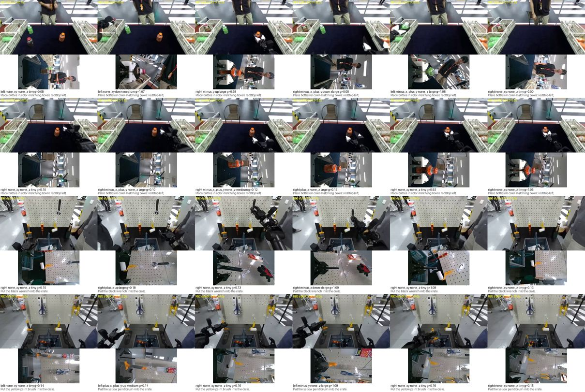

# S-E2E 데이터 준비 (ROBOTIS AI Worker 실물 공개 데이터 → 단계 B 행)

작성 2026-09-24 19:48 UTC 무렵(R7 3회차 L1 정정 — 처음엔 KST 날짜를 적었다), S-E2E 데이터 에이전트. git 커밋 안 함. **학습은 돌리지 않았다.** 근거: 계획 `docs/superpowers/plans/2026-09-25-e2e-ready.md`(S-E2E, user-log 61·62), 정본 §51·§52·§57–§59, 작업 중 코디네이터 지시로 **§62(user-log 66): S-E2E는 원래 10 Hz 그대로, 두 데이터셋 통째로** 반영. 데이터 계약은 `r4_stageB.md` §5.
이 문서의 수치는 데이터 점검 값이다. 이 데이터로 학습한 결과는 나중에 "소규모 시험"(§56)으로 표기한다.

## 1. 결론 요약
- **데이터 = HF `ROBOTIS/Task_0001_CoffeeClassification_lerobot`(RB1) + `ROBOTIS/Task_0002_OrderPicking_lerobot`(RB2) 전량**: 1,575편, 211,220프레임, 10 fps, 원본 **8.95 GB**(5.40 + 3.55, 파일 3,598 + 3,691개, 크기 전부 일치). 10 GB 안이라 선별 없이 전부 받았다(§62).
- **변환 결과**: 단계 B 행 42,813개(에피소드마다 0.5 s 간격, stride 5). 그중 머리 + 활성 손목 이미지가 모두 있는 **학습 가능 표본 39,283개**(RB1 25,433 + RB2 13,850; train 37,484 / val 1,799). 행동 청크 = 0.5 s = **5스텝 @ 10 Hz**(리샘플링 없음), 결정 라벨 창 0.33 s → **3스텝(0.30 s)**.
- **결정 라벨은 휴리스틱이다**(`se2e_heur_ee033@v1`): 이 데이터에는 typed 결정 라벨이 없다. 활성 팔 말단(URDF FK)의 다음 3스텝 실제 변위를 labels_v2와 같은 데드밴드(1 cm)·MAG 구간으로 이름 붙였다. "행동만" 모드(`labels=False`)도 있다.
- **점검**: 파켓 1,575/1,575, mp4 5,700개, 무작위 80편 전 프레임 디코드 통과. 이상 2건 처리 — (1) RB2 에피소드 617–816(200편)은 손목·머리 오른쪽 영상이 **없음**(머리 왼쪽만) → 기본 로더에서 빠짐, (2) RB2 ep 46은 영상 50프레임 대 행 300개 → 제외. RB1 손목 영상은 **세로(240×424)로 저장**돼 있어 시계 방향 90° 돌려 424×240으로 맞췄다(RB2·시뮬 손목과 같은 배치임을 프레임으로 확인).
- 파드 사용량 약 **12 GB**(원본 8.4 GiB + 변환 3.2 GiB), 전부 `/data/harvest/data/se2e` 아래. GPU 안 씀.

## 2. 데이터 선택과 신뢰도

HF API(파드, `/data/.hf_token`)로 ROBOTIS 조직 데이터셋 전체(7개)와 `ffw`·`ai_worker` 검색 결과를 봤다.

| 데이터셋 | 로봇 | 편 / 프레임 | fps | 카메라 | 상태·행동 | 크기 | 라이선스 | 좋아요 / 30일 내려받기 |
|---|---|---|---|---|---|---|---|---|
| **Task_0001_CoffeeClassification** (RB1) | `ffw_bg2_rev4_custom` | 718 / 125,746 | 10 | cam_head·cam_head_right 672×376, cam_wrist_left·right **240×424(세로)** | 16 = 팔 7 + 그리퍼 1, 양팔 | 5.40 GB | **카드 없음(미표기)** | 0 / 177 |
| **Task_0002_OrderPicking** (RB2) | `ffw_bg2_rev4` | 857 / 85,474 | 10 | 같은 4대(손목 424×240), 단 **657편만** 손목·머리 오른쪽 | 19 = 16 + head_joint1/2 + lift_joint | 3.55 GB | apache-2.0 | 0 / 97 |
| Task_0003 SeparateRecycling | `ffw_arm_only` | 268 | 15 | cam_left_head 1280×720 **하나** | 16 | 3.21 GB | 미표기 | 0 / 144 |
| Task_0004 PlaceAirbagIntoBox | `ffw_arm_only` | 198 | 15 | 머리 1대 | 16 | 1.96 GB | 미표기 | 0 / 237 |
| Task_0005 CartoningFoodProduct | `ffw_arm_only` | 1,316 | 15 | 머리 1대 | 16 | 7.12 GB | 미표기 | 0 / 243 |
| Task_0006 CookieScanning (+_MCAP) | `ffw_arm_only` | 21 | 15 | 머리 1대 | 16 | 0.58 GB | 미표기 | 0 / 111·135 |

- **고른 것 = RB1 + RB2**: 우리 실물·시뮬과 같은 기종(FFW-BG2 rev4, ZED Mini 머리 스테레오 + D405 손목 2대, §37·§43), §59 원본 해상도 그대로, 합계 8.95 GB. 과제: RB1 = 병을 색별 상자에 분류(과제 문장 1종, task_index 3개가 같은 문장), RB2 = 공구 11종을 상자에 담기·상자 잡기·놓기(문장 11종).
- **뺀 것**: Task_0003–0006은 손목캠이 없고(§57 입력 불가) 1280×720 머리캠 하나, 15 fps, 라이선스 미표기. `RobotisSW/*`·`Dongkkka/*` 등은 직원 개인·시험 업로드(이름이 `test`, `TEST123` 류)라 신뢰도 규칙으로 뺐다.
- **신뢰도**: 발행자 = 로봇 제조사 ROBOTIS 공식 HF 조직(Physical AI Tools + LeRobot으로 기록). 좋아요는 둘 다 0, 30일 내려받기 177·97 — 커뮤니티 반응은 작다. 같은 기종의 공개 실물 데이터는 이것뿐이라 계획의 1순위를 유지한다. FK용 URDF는 공식 저장소 `ROBOTIS-GIT/ai_worker`(187★, apache-2.0, 커밋 `897ef342`)의 `ffw_description/urdf/ffw_bg2_rev4_follower/ffw_bg2_follower.urdf`.
- **다른 공개 데이터와의 비교는 하지 않았다**: AI Worker 데이터가 10 GB 목표를 거의 채워(8.95 GB) "부족할 때만" 조건에 해당하지 않는다.
- **[확인 필요] RB1 라이선스**: 카드(README)가 없어 라이선스가 표기되지 않았다. 내부 연구 학습에는 쓰되, 논문·공개 산출물에 싣기 전 ROBOTIS에 확인하거나 RB2(apache-2.0)만으로 된 결과를 함께 둔다.
- 판본 고정: RB1 `60565d02…`, RB2 `7e54be90…`(HF 커밋 sha, `raw/<이름>.manifest.json`에 파일·크기 목록).

## 3. 내려받기와 무결성
- `/data/harvest/data/se2e/raw/<데이터셋>/`(LeRobot v2.1 구조 그대로). `snapshot_download`가 HF API 한도(5분에 요청 1,000회)에 걸려 멈춰, 파일별로 받고 429면 쉬는 스크립트(`/data/harvest/code_se2e/download2.py`, 3병렬)로 다시 받았다. 약 64분, 재시도 0회. 끝나고 파일 7,289개 크기 전부 일치.
- `tools/se2e_convert.py verify` 결과(`/data/harvest/data/se2e/verify.json`):

| 항목 | RB1 | RB2 |
|---|---|---|
| 파켓 / episodes.jsonl | 718 / 718 | 857 / 857 |
| 파켓 행 = episodes.jsonl 길이 | 전부 | 전부 |
| 스키마 | state·action float32 [16], timestamp·frame_index·episode_index·index·task_index | [19] (head 2 + lift 추가), 나머지 같음 |
| 타임스탬프 간격 | 모두 0.1 s ± 0.05 | 같음 |
| mp4 (head / head_right / wrist_l / wrist_r) | 718 / 718 / 718 / 718 | 857 / 657 / 657 / 657 |
| 코덱·크기 | h264, 머리 672×376, 손목 240×424 | h264, 머리 672×376, 손목 424×240 |
| 영상 프레임 수 = 파켓 행 (헤더) | 전부 | ep 46만 불일치(50 대 300) → 제외 |
| 무작위 40편 전 프레임 디코드 | 40/40 | 40/40 |
| 편 길이(프레임) | 33–778 | 36–300 |

- 손목 없는 RB2 편은 **617–816**(연속 200편). 손목 있는 편 = 0–616, 817–856.
- 값 범위(RB1·RB2 합): 팔 관절 −2.38 ~ 2.11 rad, 그리퍼 상태 0 ~ 1.22(관절값, 0 = 열림, 약 1.1 = 닫힘). 그리퍼 **행동**은 −1.16 ~ 1.27로 상태 범위를 넘는다(텔레옵 리더 값) — 정규화가 흡수하지만 한계 클립은 R4에서 정할 일. RB2 머리 관절은 거의 고정(head_joint1 ≈ 0.55 rad), 리프트 −0.1로 고정. RB1은 머리·리프트가 기록돼 있지 않다.

## 4. 변환 형식 (`<conv>/<kind>.stageb.jsonl`, R4 §5 계약 + §62)

한 행 = 한 에피소드의 프레임 k(k = 0, 5, 10, …; 0.5 s 간격이라 청크가 겹치지 않고 에피소드를 덮는다). `stageb_data.check_row(row, hz=10)`을 통과한다.

| 필드 | 값 | 비고 |
|---|---|---|
| `seed`, `kind`, `k` | 에피소드 번호, `RB1`/`RB2`, 프레임 번호 | 키 |
| `hz`, `H` | **10, 5** | §62: 리샘플링 없음, 0.5 s = 5스텝 |
| `arm`, `bimanual` | 활성 팔 `left`/`right`, 양팔 여부 | 휴리스틱(아래 5절) |
| `skill_id`, `phase_id` | `teleop`, `na` | 스크립트 스킬 없음 |
| `proprio` | `q`[7] rad, `qd`[7] rad/s(10 fps 상태의 중앙 차분), `tau`[7] = 0, `grip` = [그리퍼 관절값, 그 속도] | `proprio_mask.tau = 0`(토크 미기록). 그리퍼는 **관절값**(시뮬 계약은 폭 m) [→ 정정 2026-09-25 16:47 UTC, R7 22회차 N19/N21/N22: 이 설명은 옛 판 `se2e`·`se2e_t`에 해당한다. 정본 §83에 따라 `se2e_c1`부터는 인과 후방 차분(v[k] = (x[k] − x[k−1])·hz, v[0] = 0)] |
| `action_exec` = `action_script` | [5][8] 활성 팔 7관절 + 그리퍼, 기록된 행동 a[k..k+4] 그대로 | 텔레옵이라 둘이 같음 |
| `valid` | [5], 에피소드 끝 뒤 0(마지막 값 유지) | 전체 평균 0.98 |
| `action_full`, `state_full`, `names_full` | [5][16 or 19], [16 or 19], 이름 | 양팔 expert 선택지용 |
| `committed`, `labels_src`, `label_steps`, `label_window_s`, `ee_delta` | 휴리스틱 결정 3개, `se2e_heur_ee033@v1`, 3, 0.3, 말단 변위 m | 5절 |
| `aux` | `{"reg": {}, "cls": {}}` | 실물이라 특권 기하 없음 |
| `images` | `{"cam_head", "cam_wrist_left|right": "img/<kind>/ep<NNNNNN>/k<KKKK>_<cam>.jpg"}` | 머리 + 활성 손목(양팔이면 두 손목), 원본 해상도 JPEG q90. 없는 카메라는 키 없음 |
| `task`, `split`, `t_src`, `fps_src`, `img_rotate_cw` | 과제 문장, train/val(에피소드 해시 5 %), 원본 시각, 10, RB1 = 두 손목 | |

- **로더** `harvest/train/se2e_data.load_se2e(rows, image_root, labels=True, wrist=True)` → `stageb_data.make_sample` 형식 표본(`context` = 과제 문장 + 그리퍼 열림/닫힘 + 활성 팔 + D27 순서 이미지, `items` = 결정 질문 3개, `committed`). 필요한 카메라가 없는 행은 건너뛴다(`wrist=False`면 머리만으로 RB2 617–816도 들어감). `labels=False` = 행동만. 파드에서 전량 적재 확인: 누락 이미지 0, `ActionNorm.fit`·`build_vocabs` 정상(결정 어휘 21).
- 질문 id `se2e.<질문>@v1`, 보기 목록은 DecCall과 같은 `DIR_XY`·`DIR_Z`·`MAG`(NONE_ESCALATE 포함, 정답으로는 안 나옴). 질문 문장에 창 길이(0.30 s)를 적는다.
- 이미지 크기: 머리 672×376·손목 424×240이 이미 §59 원본 크기라 크기 변환은 없다. RB1 손목만 90° 회전.

## 5. 결정 라벨 유도 (휴리스틱) 와 활성 팔
- **정의**: FK(공식 URDF, `arm_base_link` 기준: x 앞, y 왼쪽, z 위, 리프트·머리와 무관) 로 활성 팔 `end_effector_{l,r}_link`(link7 아래 21.5 cm) 위치를 구하고 Δ = p(상태[k+3]) − p(상태[k]). `dir_xy`·`dir_z` = 성분 부호(데드밴드 1 cm), `mag_coarse` = |Δ|의 labels_v2 MAG 구간(경계 0.707/1.414/2.828/5.657 cm). 명령이 아니라 **측정 상태**로 쟀다(실제로 일어난 움직임).
- **뜻의 차이(중요)**: 이것은 "시연자가 다음 0.3 s에 실제로 움직인 방향·거리"다. 시뮬 labels_v2(§54, 단계 목표까지 **남은** 변위)와 뜻이 다르고, 옛 오라클(§53, 다음 0.33 s 명령 이동)에 가깝다. 단계 A 수치와 비교하지 않는다. `target`·`phase`는 만들 수 없어 없다.
- **활성 팔**: 다음 1 s의 두 말단 경로 길이 중 긴 쪽. 둘 다 2 cm 미만이면 `right`(기본). 둘 다 2 cm 이상이고 짧은 쪽이 긴 쪽의 절반 이상이면 `bimanual`(두 손목 이미지). 비율: RB1 right 54 %·left 34 %·양팔 12 %, RB2 right 43 %·left 56 %·양팔 1 %.
- **분포(전체 행)**:

| | dir_xy none_xy | dir_z none / up / down | mag tiny / small / medium / large / xlarge |
|---|---|---|---|
| RB1 (25,433) | 32.6 % (나머지 8방향 5–12 %씩) | 57.0 / 20.7 / 22.3 % | 20.0 / 10.3 / 17.1 / 30.7 / 22.0 % |
| RB2 (17,380) | 41.4 % (나머지 5–10 %씩) | 58.0 / 23.6 / 18.4 % | 24.7 / 12.1 / 26.5 / 30.0 / 6.6 % |

- **그럴듯함 확인**: 에피소드 첫 행은 `tiny`가 87 %(RB1)·90 %(RB2) — 시작 때 정지. 그리퍼를 막 닫은 직후(0.5 s 안에 +0.5)는 `none_z`가 93 %·98 % — 쥐는 동안 멈춤. 놓은 직후는 `up`이 32 %·50 %로 평균(21 %·25 %)보다 높다 — 놓고 들어 올림. 말단 위치 중앙값은 앞 0.33–0.51 m, 왼팔 y > 0·오른팔 y < 0, 어깨 아래 0.32–0.39 m로 자세와 맞다.
- **한계**: 1 cm 데드밴드는 10 Hz 3스텝 창에서 느린 동작을 `none`으로 몬다(none_z 57–58 %). 창을 바꾸면(`HORIZON_S`) 분포가 바뀐다 — 학습 전 사전 등록 대상.

## 6. 프레임 확인

`se2e_frames.jpg`(238 KB): 위 두 줄 = RB1 ep 5·400, 아래 두 줄 = RB2 ep 3·840. 칸마다 위 = 머리(왼쪽 눈), 아래 = 활성 손목, 글자 = 활성 팔·휴리스틱 결정·그리퍼 값·과제 문장. 봤을 때: 머리 영상에 과제 장면(병·색 상자 / 공구 벽·상자)이 보이고, 활성 팔 표시가 영상 속 움직이는 팔 쪽과 맞으며(오른팔 = 영상 오른쪽), 그리퍼 값이 닫힘(≈1.0–1.1)일 때 손목 영상에 물체가 손가락 사이에 있다. 네 경우 모두 손목 영상에서 손가락이 왼쪽에서 들어온다(RB1 회전 뒤, RB2 원본, 시뮬 `scene_v2_seed0_wrist.png`도 같은 배치).

## 7. 코드와 테스트 (로컬 `D:\qdd`)
- `harvest/train/se2e_data.py`(새): URDF 팔 사슬 읽기·FK, 보간·중앙 차분, 휴리스틱 라벨, 활성 팔, 에피소드 → 행, 결정 항목, 로더. [→ 정정 2026-09-25 16:47 UTC, R7 22회차 N19/N21/N22: 이 설명은 옛 판 `se2e`·`se2e_t`에 해당한다. 정본 §83에 따라 `se2e_c1`부터는 인과 후방 차분(v[k] = (x[k] − x[k−1])·hz, v[0] = 0)]
- `tools/se2e_convert.py`(새, 파드 실행): `verify`(스키마·개수·디코드·범위), `convert`(행 + JPEG, 16병렬, RB1 41 s·RB2 17 s), `sheet`(프레임 확인 그림).
- `harvest/train/stageb_data.py`(수정 2줄 뜻): `check_row(r, hz=HZ)`·`make_sample(..., hz=HZ)` — §62 "30 전용 거부 규칙을 데이터셋 설정으로". 기본값 30은 그대로라 우리 데이터 규칙은 바뀌지 않는다(10 Hz 행은 기본값에서 여전히 거부 — 테스트).
- `tests/train/test_se2e_data.py`(새, 12개): FK(0 자세·관절 1 회전·일괄), 사슬 없음 거부, 보간·채움, 속도, 라벨 구간·데드밴드, 활성 팔, 행 계약(hz 10·H 5·청크 = 기록 행동·끝 채움·기본 hz 거부), 팔 인덱스, 분할 결정성, 결정 항목 보기 이름, 로더(행동만 모드 포함), 카메라 없는 행 건너뜀.
- `cd D:/qdd && python -m pytest -q` 전체 통과.

## 8. 파일 위치
- 파드: `/data/harvest/data/se2e/` — `raw/`(원본 + manifest), `conv/RB1.stageb.jsonl`·`RB2.stageb.jsonl`·`*.stats.json`·`img/`, `verify.json`, `urdf/ffw_bg2_rev4_follower.urdf`·`ai_worker_commit.txt`, `hf_robotis_list.json`·`hf_robotis_info.json`, 로그. 코드 사본 `/data/harvest/code_se2e/`(repo 사본 + 내려받기·점검 스크립트).
- 다시 만들기: `cd /data/harvest/code_se2e/repo && /data/harvest/venv_e3st/bin/python tools/se2e_convert.py verify && … convert` (pyarrow·av가 있는 venv_e3st).
- /data 밖: 파드에는 없음(URDF 비교용으로 `/data/juhyoung_taskC/…/ffw_sg2.urdf`를 읽기만 함 — 팔 사슬이 BG2와 같음). 로컬 임시 파일은 `D:\tools\scratch_qdd\se2e\`.

## 9. 열린 문제 [결정 필요, R4·S-E2E 설계]

> **갱신(2026-09-25 00:33 UTC, R7 2회차 K5)**: 1–3은 커밋 b4a58ce로 해결됐다 — (1) 팔별 `ActionNorm` + 활성 팔 조건, (2) 그리퍼 `open01@v1`(시뮬 패드 폭·실물 관절값을 각각 [0,1]로 선형 사상; 둘 사이 비선형 차는 두 데이터를 한 모델에 섞을 때 재검토 — 정본 §67 보충), (3) tau 마스크 채널(proprio 27차원, 마스크된 채널은 정규화 통계에서 빠짐). 아래 1–3의 서술은 해결 전 기록이다. 4·5는 S-E2E 사전 등록에서 정한다.
1. **행동 차원**: 지금 `action_exec`은 활성 팔 8차원이라 `ActionNorm`이 왼팔·오른팔 값을 한 통계로 섞는다(두 팔은 관절 부호가 거울). 선택지 = 팔별 정규화 + 팔 조건 입력, 또는 `action_full` 16차원 양팔 expert. 모델 쪽 결정.
2. **그리퍼 단위**: 실물 = 관절값(0–1.1, 행동은 −1.2–1.3), 시뮬 계약 = 폭 m. 같은 모델에 섞을 때 변환식(RH-P12-RN 관절 → 폭) 필요 [미확인].
3. **토크 없음**: `tau` = 0으로 채웠다. 모델은 아직 `proprio_mask`를 읽지 않는다(정규화 뒤 상수 0).
4. **문맥 문장**: 실물에는 Astra 계약·단계 문장이 없어 `task: "…"` + 그리퍼 + 활성 팔만 쓴다(IMG 상태와 모양이 다름).
5. **라벨 창·데드밴드**: 5절 한계. 학습 전 판정 기준과 함께 사전 등록.
6. RB1 라이선스 확인(2절).
