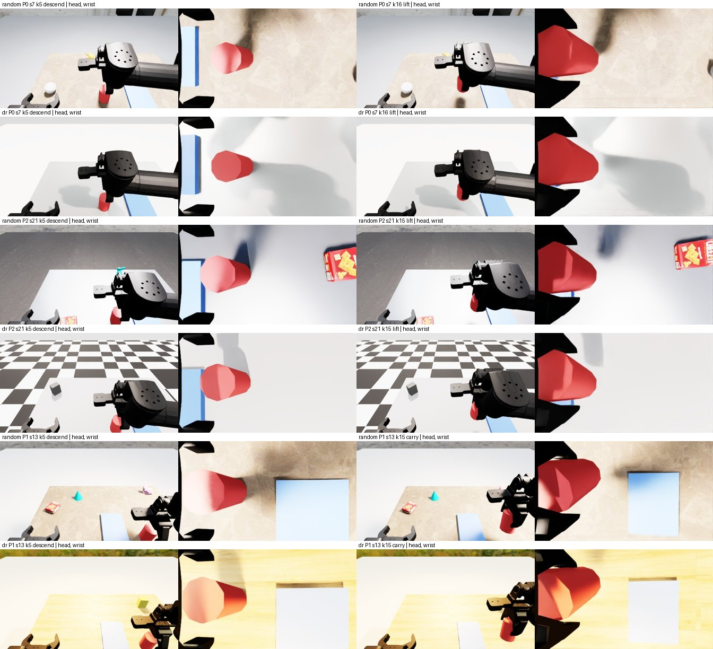

> **성격(정본 §56): 파이프라인 확인용 소규모 시험. 수치는 논문 결과로 쓰지 않는다.**

# 단계 A 일반화(RD)·이미지 기여 절제 — 영점 Qwen3-VL-4B 대 SFT (정본 §55 다음 (1)·(2))

## 사전 등록 (스냅샷 생성·모델 호출 전 고정, 2026-09-24T17:10:38Z 파드 `date -u`)

작업 지시문 요지(뜻을 바꾸지 않음) + 코드에 옮기는 방법. 데이터를 본 뒤 바꾸지 않는다. 바꾸면 "사후 변경"에 두 판 모두 적는다.
(이 시각 전에 한 일: 문서·코드 읽기, 파드 상태 확인(nvidia-smi: GPU 1·3 비어 있음, GPU 0 = 라벨러 에이전트), 이전 DEV 생성 시간 확인. 새 스냅샷·라벨·모델 호출은 아직 없음.)

### 데이터
- **standard** = 기존 `/data/harvest/data/jsel_dev/P{0,1,2}`(머리캠만) + `P*.labels_v2.jsonl` 그대로(새로 만들지 않음).
- **random·dr** = 새 DEV 스냅샷: `python.sh -m harvest.cli_pool dev --seeds 0-29 --kinds P{0,1,2} --variant {random|dr} --wrist`(v2 장면, `make_env(variant=…)`, CPU PhysX, Isaac 렌더 GPU 1, `ir_run.sh IR_ROOT=cyclo`, 동시 ≤ 3 프로세스). `--wrist` = 머리캠 + 우손목캠 저장(새 인자; 지정하지 않으면 지금처럼 머리캠만 — standard 생성과 같은 기본). 스냅샷 선택은 jsel_dev와 같은 `run_snapshot_episode` 일정 + **`oracle ≠ null`인 스냅샷 전부**(`jevl_acc.snapshots`; `oracle`은 선택에만 쓰고 정답으로 쓰지 않는다). 출력 `/data/harvest/data/gen_dev/{random,dr}/P{0,1,2}/`.
- 정답 = labels_v2(§54, S1 1 mm): `tools/labels_v2_eval.py --dev /data/harvest/data/gen_dev/<v> --step-cm 0.1 --write` → `<v>/P*.labels_v2.jsonl`. 같은 게이트(S1 텍스트 코드 규칙)도 보고한다 — 기하가 standard와 같으므로 ≥ 0.95가 예상값이고, 미달이어도 라벨 정의는 바꾸지 않고 기록만 한다.
- 시드: DEV 0–29만. CAL·TEST·TEST-P5·POOL은 만들지도 읽지도 않는다. 우손목 이미지는 저장만 하고 이번 채점 입력에는 쓰지 않는다(지시: 머리캠).

### 모델·호출
- 영점 `Qwen3-VL-4B-Instruct`(`/data/harvest/models/Qwen3-VL-4B-Instruct`, 포트 8311) 대 SFT 병합 `jevl-sftA`(`/data/harvest/ckpt/stageA/sftA_pool_v1/merged`, 포트 8312). 서빙 = `stageA_sft/serve3.sh`와 같은 옵션(vLLM 0.30.0, GPU 3, `VLLM_BATCH_INVARIANT=1`, 메모리 0.85, prefix caching, raw_logprobs, seed 0), 한 번에 한 서버.
- 호출 = `tools/jevl_e3lite.py acc --step-cm 0.1 --conds S1:img:fixed[,S1:txt:fixed] --conc 8`(stageA_sft와 같은 프롬프트: `jevl.SYSTEM` + S1 1 mm 텍스트 + 머리캠 JPEG, 보기 순서 고정, 재시도 3회 뒤 실패 = 오답). 모델마다 조건: standard {img, txt}, random {img, txt}, dr {img, txt}.
- **standard img도 이 세션에서 다시 부른다**(주 분석은 새 판). 기존 `stageA_sft/acc_*_S1_g0.1_img_fixed.jsonl`과 항목별 option_key 일치율·max |Δp|를 결정성 확인으로 보고한다.
- 채점 = stageA_sft와 같다: 게이트 5질문(dir_xy, dir_z, mag_coarse, target, phase), option_key(보기 집합 안 재정규화 확률 argmax, 동률 = 앞 보기)를 그 변형의 labels_v2와 비교, argmax NONE_ESCALATE·호출 실패 = 오답.

### 지표 (전부 판(kind, seed) 90개 단위 부트스트랩 10,000회, seed 0, 95 % 백분위)
- **A[model × variant]** = 그 변형의 모든 대상 스냅샷 × 5질문 합친 정답률 + CI. 질문별·섭동별도.
- **최빈 기준선[variant]** = 질문마다 **그 변형의** labels_v2 최빈 보기를 늘 고르는 규칙.
- **RD (주, 짝)** = A_standard − A_v(v ∈ {random, dr})를 **(seed, kind, k)가 두 변형 모두에 있는 스냅샷**의 항목만으로, 항목별 (정답_std − 정답_v) 평균. 각 변형 항목은 자기 변형 라벨로 채점. 짝 수(스냅샷·항목)와 짝 중 계획기 phase가 같은 비율·라벨이 같은 비율을 보고한다(궤적이 비트 단위로 같지 않음, random5.md §5).
- RD (보조, 짝 없음) = 전체 A_standard − 전체 A_v, 같은 판 재표집(두 변형에서 같은 판 id 묶음)으로 CI.
- **ΔRD = RD_SFT − RD_zero**(짝 항목, 항목별 (s_std − s_v) − (z_std − z_v)).
- 질문별 RD·ΔRD.
- **이미지 기여** = A_img − A_txt(같은 체크포인트, 같은 항목, 짝) — standard에서 SFT·영점 각각. 보조: random·dr에서도 같은 값, 그리고 **RD_txt**(텍스트만 조건의 RD) — 텍스트만 조건은 외관을 보지 않으므로 RD_txt는 상태·라벨 차이(비트 비동일 궤적)에서 오는 몫이다. RD_img − RD_txt(짝 항목) = 이미지 채널에서 오는 몫(참고).

### 사전 등록한 읽을거리 (프로젝트 합격/불합격이 아니라 발견으로 보고)
- **(i)** ΔRD = RD_SFT − RD_zero (random, dr 각각)와 CI — 사용자 핵심 주장 축: 학습이 standard→random 낙폭을 키우는가. 하한 > 0 → "SFT가 낙폭을 키웠다", 상한 < 0 → "줄였다", 0을 포함 → "차이를 보이지 못했다".
- **(ii)** SFT 이미지 기여 = A_SFT,img − A_SFT,txt (standard) 와 CI. 0을 포함하면 "이미지가 더하는 것을 보이지 못했다".
- **(iii)** A_SFT,random − 최빈_random (짝: 같은 항목) CI 하한 > 0 이면 "random에서도 최빈 기준선 위". dr도 같이 적는다.

### 주의 (결과와 함께 적는다)
- labels_v2는 S1 텍스트로 거의 결정된다(코드 규칙 ≥ 0.986) → 변형 사이 외관 차이는 **이미지 채널에만** 영향을 준다.
- random/dr은 외관(조명·HDR·재질·방해물)만 바꾸고 기하는 그대로다(계획기는 특권 상태, 라벨은 실제 자세) → 여기서 RD는 **이미지 채널 강건성만** 잰다. 실제 인식(M1)이 외관에 흔들려 상태 텍스트가 틀어지는 낙폭은 들어 있지 않다 → 실제 인식 기반 낙폭의 **하한**이다.
- DEV 한 번(시드 0–29 × P0–P2)이라 판 수 90 — CI가 판 단위.

### 실행 규칙
- GPU 1(Isaac), GPU 3(vLLM)만. GPU 0(라벨러 에이전트)·GPU 2는 쓰지 않고, 다른 프로세스를 건드리지 않는다. 모든 파일 `/data/harvest` 아래: 코드 사본 `/data/harvest/code_gen`, 스냅샷 `/data/harvest/data/gen_dev/`, 호출·보고 `/data/harvest/stageA_gen/`.
- 보고 도구 `tools/stagea_gen_report.py`(새, 순수 함수는 테스트 먼저).

---

## 결과 (2026-09-24T18:35Z 작성)

### 요약 — 사전 등록 읽을거리
| 읽을거리 | 값 [95 % CI] | 사전 규칙대로의 읽기 |
|---|---|---|
| **(i) ΔRD = RD_SFT − RD_zero, random** | **+0.0049 [+0.0004, +0.0093]** | 하한 > 0 → 형식상 "SFT가 낙폭을 키웠다". **단 두 RD 모두 0 이하** — SFT는 random에서 떨어지지 않았고(RD_SFT −0.0024 [−0.0051, +0.0003]), 영점이 random에서 오히려 올랐다(RD_zero −0.0073 [−0.0110, −0.0036], phase가 최빈 보기 쪽으로 쏠린 탓, 아래 3절). 크기 0.5 pt. |
| (i) ΔRD, dr | +0.0014 [−0.0034, +0.0062] | 0 포함 → 차이를 보이지 못했다 |
| **(ii) SFT 이미지 기여 A_img − A_txt (standard)** | **+0.0098 [+0.0071, +0.0126]** | 이미지가 약 1 pt 더한다(주로 mag +3.2 pt, dir_z +1.2 pt). 영점도 +0.0101 [+0.0068, +0.0134]로 같은 크기 — 둘의 차 −0.0003 [−0.0046, +0.0041] |
| **(iii) A_SFT,random − 최빈_random** | **+0.2921 [+0.2879, +0.2963]** | random에서도 최빈 기준선 위(dr +0.2931 [+0.2883, +0.2976]) |

→ **외관 무작위화(random 5축·dr)로 이미지 채널만 바뀌는 이 설정에서, SFT Jev-L은 standard → random·dr 낙폭이 없다**(0.930 → 0.931 · 0.932). 학습이 외관 강건성을 해쳤다는 증거는 없다. ΔRD(random)의 양수는 SFT가 떨어져서가 아니라 영점이 올라서 생긴 것이다.

### 1. 데이터
- 생성(17:16–17:31Z, GPU 1, 3 프로세스, CPU PhysX, `code_gen`): random P0/P1/P2 각 30/30 성공, dr P0 30/30 · **P1 28/30**(시드 10·29 grasp 실패) · P2 30/30. (standard `jsel_dev`는 P1 28/30, 시드 3·5 lift 실패 — 방해물 강체가 늘면 PhysX 풀이 순서가 달라져 궤적이 비트 단위로 같지 않다, random5.md §5.)
- 대상 스냅샷(`oracle ≠ null`): standard 2,387 · random **2,419** · dr **2,393** (× 5질문 = 11,935 · 12,095 · 11,965 항목). 호출 오류 0(모든 조건).
- labels_v2 게이트(S1 1 mm 코드 규칙, 판정 밖 확인): random dir_xy 0.9963 · dir_z 0.9897 · mag 0.9868 · target 1.0 · phase 0.9996, dr 0.9962 · 0.9891 · 0.9858 · 1.0 · 0.9996 — standard(0.9954/0.9908/0.9883/1.0/0.9992)와 같은 수준, 전부 ≥ 0.95. 최빈 기준선 5질문 평균 random 0.639 · dr 0.639(standard 0.640), 최빈 보기 세 변형 모두 같다(none_xy · down · xlarge · o3 · continue).
- **짝**: (seed, kind, k)가 둘 다 있는 스냅샷 random **2,381**/2,387(항목 11,905), dr **2,352**/2,387(항목 11,760; dr P1 실패 2판 차이). 짝 중 계획기 phase 같음 0.988 · 0.986, 라벨 같음 dir_xy 0.995/0.995 · dir_z 0.985/0.984 · mag 0.968/0.963 · target 0.999/0.998 · phase 0.985/0.984 (random/dr) — 짝이어도 상태가 mm 단위로 달라 라벨이 1.5–3.7 % 다르다. 그래서 텍스트만 조건의 RD(RD_txt)를 대조로 함께 적는다.

### 2. A (모델 × 변형 × 입력, 5질문 합친 정답률 [95 % CI])

| 모델 | 입력 | standard | random | dr |
|---|---|---|---|---|
| 영점 Qwen3-VL-4B | 머리캠+텍스트 | 0.4250 [0.4194, 0.4307] | 0.4304 [0.4253, 0.4355] | 0.4294 [0.4239, 0.4351] |
| 영점 | 텍스트만 | 0.4152 [0.4100, 0.4202] | 0.4140 [0.4095, 0.4187] | 0.4155 [0.4103, 0.4208] |
| **SFT** | 머리캠+텍스트 | **0.9297 [0.9259, 0.9334]** | **0.9313 [0.9272, 0.9352]** | **0.9324 [0.9283, 0.9362]** |
| SFT | 텍스트만 | 0.9199 [0.9159, 0.9236] | 0.9214 [0.9174, 0.9252] | 0.9214 [0.9174, 0.9251] |
| 최빈 기준선 (그 변형 라벨) | — | 0.6405 | 0.6391 | 0.6393 |

질문별(머리캠+텍스트; 영점 → SFT):

| 질문 | standard | random | dr | 최빈 (std/rnd/dr) |
|---|---|---|---|---|
| dir_xy | 0.135 → 0.993 | 0.133 → 0.989 | 0.131 → 0.990 | 0.742 / 0.742 / 0.741 |
| dir_z | 0.496 → 0.940 | 0.494 → 0.944 | 0.496 → 0.941 | 0.496 / 0.494 / 0.496 |
| mag_coarse | 0.123 → 0.729 | 0.120 → 0.734 | 0.118 → 0.740 | 0.604 / 0.604 / 0.601 |
| target | 0.619 → 1.000 | 0.616 → 1.000 | 0.615 → 1.000 | 0.617 / 0.613 / 0.614 |
| phase | 0.752 → 0.987 | **0.789** → 0.989 | **0.788** → 0.991 | 0.744 / 0.743 / 0.744 |

섭동별 SFT(img): standard P0 0.933 · P1 0.920 · P2 0.937 / random 0.936 · 0.921 · 0.938 / dr 0.937 · 0.923 · 0.937.
SFT − 최빈(짝, 질문별): random dir_xy +0.247 · dir_z +0.450 · mag +0.130 · target +0.387 · phase +0.246, 모두 하한 > 0(가장 작은 mag [+0.117, +0.143]). 영점 − 최빈은 세 변형 모두 −0.21 수준.

### 3. RD (짝, A_standard − A_v, 같은 모델) [95 % CI]

| | 영점 img | SFT img | **ΔRD img (SFT − 영점)** | 영점 txt | SFT txt | ΔRD txt |
|---|---|---|---|---|---|---|
| **random** (11,905항목) | −0.0073 [−0.0110, −0.0036] | −0.0024 [−0.0051, +0.0003] | **+0.0049 [+0.0004, +0.0093]** | −0.0011 [−0.0038, +0.0015] | −0.0022 [−0.0045, +0.0000] | −0.0011 [−0.0043, +0.0021] |
| **dr** (11,760항목) | −0.0053 [−0.0093, −0.0014] | −0.0039 [−0.0065, −0.0014] | +0.0014 [−0.0034, +0.0062] | −0.0008 [−0.0036, +0.0019] | −0.0026 [−0.0051, −0.0003] | −0.0019 [−0.0052, +0.0014] |

짝 없는 RD(전체 A 차, 같은 판 재표집, 보조): 영점 img random −0.0054 [−0.0095, −0.0010] · dr −0.0044 [−0.0096, +0.0009]; SFT img random −0.0016 [−0.0045, +0.0014] · dr −0.0027 [−0.0054, +0.0001] — 짝 판과 같은 결론.

질문별 RD(img, 짝):

| 질문 | 영점 random | SFT random | ΔRD random | 영점 dr | SFT dr | ΔRD dr |
|---|---|---|---|---|---|---|
| dir_xy | +0.001 | +0.003 [+0.000, +0.006] | +0.002 [−0.005, +0.009] | +0.004 | +0.002 | −0.002 [−0.011, +0.006] |
| dir_z | −0.002 | −0.005 [−0.011, +0.000] | −0.004 [−0.010, +0.002] | −0.002 | −0.004 | −0.002 [−0.008, +0.004] |
| mag_coarse | +0.003 | −0.008 [−0.018, +0.003] | −0.011 [−0.024, +0.003] | +0.005 | **−0.014 [−0.024, −0.004]** | **−0.019 [−0.033, −0.005]** |
| target | −0.001 | +0.000 | +0.001 [−0.002, +0.004] | +0.000 | +0.000 | −0.000 [−0.004, +0.003] |
| **phase** | **−0.037 [−0.054, −0.022]** | −0.002 [−0.005, +0.002] | **+0.036 [+0.021, +0.051]** | **−0.034 [−0.051, −0.018]** | −0.004 [−0.007, −0.001] | **+0.030 [+0.015, +0.047]** |

- **ΔRD(random) 양수의 출처 = 영점 phase**: 영점은 random·dr 머리캠을 보면 phase에서 `continue`를 더 고른다(standard 1,861 → random 2,066 · dr 2,001; 정답 `continue` 1,775 · 1,796 · 1,781) → 최빈 보기 쪽으로 쏠려 정답률 0.752 → 0.789 · 0.788. 이 쏠림은 이미지 채널에서 온다(영점 RD의 이미지 몫(RD_img − RD_txt) phase −0.032 [−0.047, −0.018], 텍스트만 RD phase −0.005 [−0.017, +0.006]). SFT는 phase에서 변형 영향이 없다(−0.002). 즉 "SFT가 낙폭을 키움"이 아니라 "영점의 phase 답이 외관에 흔들림(이 경우 우연히 좋은 쪽)".
- SFT mag는 dr에서 오히려 0.014 높다(짝) — SFT의 mag 선택이 dr에서 `large`를 조금 더 고른다(standard xlarge 1,729 · large 379 → dr 1,647 · 436; 정답 xlarge 1,439 · large 468). 개선 방향이지만 원인(외관 → mag 답)은 확인하지 않았다.
- 이미지 몫(RD_img − RD_txt, 짝 항목): 영점 random −0.0062 [−0.0100, −0.0024] · dr −0.0045 [−0.0085, −0.0005], **SFT random −0.0003 [−0.0030, +0.0026] · dr −0.0013 [−0.0036, +0.0010]** — SFT의 이미지 채널은 외관 변화에 흔들리지 않았다.

### 4. 이미지 기여 절제 (A_img − A_txt, 같은 체크포인트·같은 항목, 짝)

| 모델 | standard | random | dr |
|---|---|---|---|
| 영점 | +0.0101 [+0.0068, +0.0134] | +0.0162 [+0.0125, +0.0200] | +0.0139 [+0.0101, +0.0176] |
| **SFT** | **+0.0098 [+0.0071, +0.0126]** | +0.0099 [+0.0071, +0.0127] | +0.0110 [+0.0083, +0.0138] |

질문별(standard): SFT dir_xy +0.005 [+0.002, +0.009] · dir_z +0.012 [+0.007, +0.017] · **mag +0.032 [+0.021, +0.044]** · target 0 · phase −0.000; 영점 dir_xy +0.042 · dir_z 0 · mag +0.018 · target −0.015 · phase +0.005. SFT 이미지 기여 − 영점 이미지 기여(standard) = −0.0003 [−0.0046, +0.0041].
- SFT 텍스트만은 mag에서 xlarge 쏠림이 더 심하다(xlarge 1,828 대 이미지 판 1,729, 정답 1,441).
- **해석 한계**: SFT는 이미지가 있는 입력으로만 학습됐다. 텍스트만 입력은 학습 분포 밖이므로 이 1 pt는 "이미지 정보의 기여"와 "입력 모양이 학습 때와 달라진 손해"를 가르지 못한다. 영점도 같은 크기(+1 pt)라서, 이미지 토큰이 들어가는 것 자체의 효과일 가능성이 남는다(E3-lite 1 cm 조건에서는 영점 +0.0001이었다 — 조건이 다름). 가르려면 텍스트만으로 학습한 대조 모델이 필요하다.

### 5. 결정성 확인 (판정 밖, 사전 등록 보고 항목)
- 이 세션의 standard img 재호출 대 stageA_sft 판(같은 모델·옵션·코드, `VLLM_BATCH_INVARIANT=1`): option_key 일치 **영점 0.9937 · SFT 0.9983**(14,322행), max |Δp| 0.185 · 0.091. A는 3자리까지 같다(영점 0.4250 대 0.4256, SFT 0.9297 대 0.9297).
- 즉 **BI 켬이어도 서버 세션이 바뀌면 비트 단위로 같지 않다**(stageA_sft의 flip 0/20은 한 세션 안 반복). 원인은 확인하지 않았다(후보: prefix cache 적중 패턴 차이, 요청 순서·부하에 따른 스케줄 차이). 결론에는 영향이 없지만, 짝 비교는 **같은 세션 안의 호출끼리만** 했다(이 문서의 모든 짝이 그렇다).

### 6. 프레임 확인 — `stageA_generalize_frames.jpg`

행 = random P0 s7 · dr P0 s7 · random P2 s21 · dr P2 s21 · random P1 s13 · dr P1 s13, 열 = 앞쪽·중간 점수 대상 스냅샷의 (머리캠 | 우손목캠). 직접 보고 확인한 것:
- 외관이 변형마다 확실히 다르다: 탁자 = 필드스톤(random s7·s13), 흰 라미네이트(random s21), 회색·흰색(dr s7·s21), 나무 바닥 텍스처(dr s13); 바닥 = 체커보드(dr s21), 아스팔트(random s21); HDR 배경 = 흰 스튜디오(random), 초록 들판·강한 노란 빛(dr s13).
- 방해물이 탁자 위에 보인다: random s7 흰 원기둥·노란 물체, s21 크래커 상자(손목캠에도 보임)·청록 물체, s13 크래커 상자·청록 원뿔·분홍 버니; dr s21 회색 직육면체, s13 노란 상자.
- 머그(빨강)·트레이(파랑)는 모든 판의 머리캠·손목캠에서 보인다. 손목캠에 키 조명 그림자가 판마다 다른 방향으로 진하게 드리운다.
- 과노출(random5.md §6에서 물려받음): 밝은 판에서 트레이가 하늘색·흰색으로 바랜다. 머리캠은 로봇 팔이 머그 주변을 크게 가린다(standard도 같음).
- 우손목 이미지는 저장만 했고 이번 채점에는 쓰지 않았다(사전 등록).

### 7. 주의 (사전 등록 그대로)
- labels_v2는 S1 텍스트로 거의 결정된다(코드 규칙 ≥ 0.986) → 변형 사이 외관 차이는 이미지 채널로만 들어온다.
- random/dr은 외관만 바꾸고 기하는 그대로다(계획기 = 특권 상태, 라벨 = 실제 자세). 그래서 이 RD는 **이미지 채널 강건성만** 재며, 실제 인식(M1)이 외관 때문에 틀어져 상태 텍스트가 나빠지는 낙폭은 들어 있지 않다 → 실제 인식 기반 낙폭의 **하한**이다. 게다가 SFT 모델은 거의 텍스트로 답하므로(이미지 기여 ≈ 1 pt) 이미지가 흔들릴 여지 자체가 작다 — "SFT가 외관에 강건하다"보다 "SFT가 외관을 거의 쓰지 않는다"에 가깝게 읽어야 한다.
- 판 90개(DEV 한 번). 짝 스냅샷의 상태·라벨이 mm 단위로 달라(라벨 불일치 1.5–3.7 %) RD에 상태 잡음이 섞인다 — 텍스트만 RD(모두 |RD| ≤ 0.003)가 그 잡음 크기다.

### 사후 변경·사고 (시각 UTC)
1. 17:11Z 첫 생성 시작이 코드 사본에 `third_party/`가 빠져 import 실패(데이터 0편). 사본에 `code_sftA/third_party`를 복사, 내 프로세스만 PID로 정지, 빈 출력 폴더 삭제 뒤 17:16Z 같은 명령으로 재시작(로그 `failed_start1/`). 설정 변경 없음.
2. 17:32Z SFT 서버가 뜨지 못함 — GPU 3을 다른 에이전트(D27 벤치, `qwen4b-d27`)가 쓰고 있었다. 건드리지 않고 GPU 3이 60 s 연속 비기를 기다려(`post2.sh`) 18:05Z에 시작. 서빙 옵션은 사전 등록 그대로(메모리 0.85). (코디네이터 알림 "GPU 2도 vLLM에 써도 된다"는 받았을 때 이미 영점 서버까지 GPU 3에서 돌고 있어 쓰지 않았다.)
3. 그 밖의 변경 없음. 읽을거리 정의·채점은 사전 등록 그대로.

### 파일
- 로컬(D:\qdd, 커밋 안 함): `harvest/cli_pool.py`(dev 모드 `--wrist`: 머리캠 + 우손목캠 저장, 기본은 머리캠만), `harvest/analysis/stats.py`(`cluster_diff_ci`: 같은 판 id를 두 쪽에 함께 재표집하는 차이 CI), 새 `tools/stagea_gen_report.py`, 테스트 `tests/test_stats.py`(+1), 새 `tests/test_stagea_gen_report.py`(4). 전체 **324 passed, 2 skipped**(작업 중), 문서 작성 뒤 재실행 **410 passed, 7 skipped**(다른 에이전트가 그사이 추가한 테스트 포함). 프레임 `docs/stage3/results/stageA_generalize_frames.jpg`.
- 파드(`/data/harvest`): 코드 사본 `code_gen/`; 스냅샷 `data/gen_dev/{random,dr}/P{0,1,2}/`(머리캠+우손목캠, 288 MB) + `P*.labels_v2.jsonl`; `stageA_gen/`: `prereg_stageA_gen.md`(sha256 8ce75433…), `gen.sh`·`gen_*.log`, `labels_{random,dr}.json`(+`_mismatch.jsonl`), `{standard,random,dr}/acc_{Qwen3-VL-4B-Instruct,jevl-sftA}_S1_g0.1_{img,txt}_fixed.jsonl`(12개), `report.json`, `post.sh`·`post2.sh`·로그, `srv_*.log`, `sheet.py`·`frames_sheet.jpg`, `failed_start1/`, 이 문서 사본 `stageA_generalize.md`.
- `/data` 밖: 파드 없음(Isaac은 `ir_run.sh` 오버레이, 캐시·HOME·TMPDIR는 `/data/harvest`). 로컬 임시 파일은 `D:\tools\scratch_qdd\`만. vLLM 서버·Isaac 프로세스 모두 종료, GPU 1·3에 내 프로세스 없음. GPU 0·2는 쓰지 않았다.
